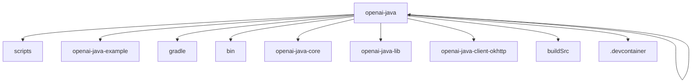

# 基础信息

|      |      |
|------|------|
| 名称 | openai-java |
| 编码语言 | .java |
| 代码路径 | openai-java |
| 概述说明 | Java示例展示如何通过OpenAI API实现数学求解、对话生成、内容审核及音频转录等功能，涵盖创建、监控、输出和清理等步骤。 |

# 说明

## 概述
该代码模块是一个基于Java的OpenAI API集成示例集合，展示了如何通过Java编程语言与OpenAI的各种功能进行交互。模块涵盖了从配置客户端、调用API、处理响应到资源管理的完整流程。示例代码包括同步和异步操作，支持多种OpenAI功能，如文本生成、对话生成、内容审核、音频转录、数学求解、文本嵌入等。通过环境变量配置，模块确保了敏感信息的安全性和灵活性，适用于不同应用场景的开发和测试。

## 主要业务场景
1. **文本生成与对话**：通过GPT-3.5和GPT-4模型生成文本、故事和对话内容，支持流式处理和异步调用，适用于聊天机器人、内容创作工具等场景。
2. **内容审核**：调用OpenAI的内容审核接口，对文本内容进行审核，适用于社交媒体、在线论坛等需要实时或近实时审核的场景。
3. **音频转录**：将音频文件转换为文本，适用于语音识别、会议记录等场景。
4. **数学求解**：创建数学助手，求解方程问题，适用于教育、科研等需要数学计算的场景。
5. **文本嵌入**：生成文本的数值向量表示，适用于自然语言处理任务，如语义分析、文本相似度计算等。
6. **自定义函数调用**：通过OpenAI API调用自定义函数，评估SDK质量，适用于开发过程中的性能评估和问题分析。
7. **多模态交互**：整合图片和文本，调用OpenAI API实现多模态交互，适用于需要处理多种数据类型的应用场景。
8. **身份认证**：通过Azure Entra ID进行身份认证，确保安全访问OpenAI API，适用于需要高安全性的应用场景。

该模块通过丰富的示例代码，展示了如何高效、安全地集成OpenAI API到Java应用程序中，适用于多种实际应用场景。

### 包内部结构视图

该流程图展示了`openai-java`项目的目录结构，其中`openai-java`作为根节点，包含了多个子目录和模块，如`scripts`、`openai-java-example`、`gradle`、`bin`、`openai-java-core`、`openai-java-lib`、`openai-java-client-okhttp`、`openai-java`、`buildSrc`和`.devcontainer`。这些子节点代表了项目中的不同功能模块和开发工具，清晰地展示了项目的层级关系和组织结构。

# 文件列表 File List

| 名称   | 类型  | 说明 |
|-------|------|-------------|
| [openai-java-example](openai-java-example/src/main/java/com/_module.md) | folder | Java示例展示如何通过OpenAI API实现数学求解、对话生成、内容审核及音频转录等功能，涵盖创建、监控、输出和清理等步骤。 |

