# 基础信息

|      |      |
|------|------|
| 名称 | com |
| 编码语言 | .java |
| 代码路径 | openai-java/openai-java-example/src/main/java/com |
| 包名 | openai-java.openai-java-example.src.main.java.com |
| 概述说明 | Java示例展示如何集成OpenAI API，涵盖数学助手、对话生成、内容审核、流式处理、异步调用等功能，实现高效自动化任务处理。 |

# 说明

## 概述
该代码模块是一个基于Java的OpenAI API集成示例集合，展示了如何通过Java代码与OpenAI服务进行交互，实现多种功能，包括文本生成、对话管理、内容审核、音频转录、图像处理等。模块中的每个示例都展示了不同的OpenAI API功能，并通过异步、流式处理等技术优化了性能和用户体验。该模块旨在为开发者提供清晰的参考，帮助他们快速集成OpenAI的强大功能到Java应用程序中。

## 主要业务场景
1. **数学问题解决**：通过创建专门的OpenAI助手，接收并解析数学问题，调用算法或模型进行计算，最终返回结果并清理资源。
2. **对话生成与管理**：实现多轮对话生成，支持连续对话和流式响应，适用于聊天机器人、客服系统等场景。
3. **内容审核**：调用OpenAI的内容审核功能，检测文本中的不当内容，确保平台内容的安全性和合规性。
4. **音频转录**：将音频文件转换为文本，适用于语音助手、会议记录等场景。
5. **图像处理与描述生成**：加载并编码图片，通过GPT-4生成与图片相关的描述或分析。
6. **文本生成与补全**：生成故事、文本补全，支持流式生成和异步处理，适用于内容创作和自动化文本生成。
7. **异步与流式处理**：通过异步调用和流式处理技术，优化大规模数据处理和实时响应场景，如智能客服、实时聊天系统等。
8. **身份认证与安全**：通过Azure Entra ID进行身份认证，确保与OpenAI API的交互安全可靠。
9. **模型管理与配置**：通过环境变量配置OpenAI客户端，灵活管理API密钥和模型列表，确保系统的高效性和可维护性。

该模块涵盖了多种OpenAI API的应用场景，适合需要集成自然语言处理、图像处理、音频处理等功能的Java应用程序开发者。

### 包内部结构视图

```mermaid
graph TD
    com --> openai
    openai --> example
    example --> AssistantExample.java
    example --> ModelListExample.java
    example --> ResponsesConversationExample.java
    example --> ModerationsExample.java
    example --> CompletionsStreamingExample.java
    example --> ResponsesStreamingAsyncExample.java
    example --> ResponsesExample.java
    example --> ResponsesStreamingExample.java
    example --> StructuredOutputsExample.java
    example --> CompletionsImageUrlExample.java
    example --> AudioTranscriptionsExample.java
    example --> CompletionsStreamingCancellationExample.java
    example --> FunctionCallingExample.java
    example --> CompletionsAsyncExample.java
    example --> ModerationsAsyncExample.java
    example --> CompletionsConversationAsyncExample.java
    example --> EmbeddingsAsyncExample.java
    example --> CompletionsStreamingAsyncExample.java
    example --> ResponsesAsyncExample.java
    example --> AssistantAsyncExample.java
    example --> AudioTranscriptionsAsyncExample.java
    example --> CompletionsStreamingCancellationAsyncExample.java
    example --> EmbeddingsExample.java
    example --> ModelListAsyncExample.java
    example --> CompletionsConversationExample.java
    example --> CompletionsExample.java
    example --> AzureEntraIdExample.java
    example --> Main.java
    example --> StructuredOutputsAsyncExample.java
    example --> FunctionCallingAsyncExample.java
```

该流程图展示了 `openai-java` 项目中 `com.openai.example` 包下的文件结构。`com` 是根节点，`openai` 是中间节点，`example` 是子节点，包含了多个与 OpenAI 相关的示例代码文件。每个文件都直接关联到 `example` 节点，展示了这些文件在项目中的层级关系。

# 文件列表 File List

| 名称   | 类型  | 说明 |
|-------|------|-------------|
| [openai](openai/_module.md) | package | Java示例展示如何集成OpenAI API，涵盖数学助手、对话生成、内容审核、流式处理、异步调用等功能，实现高效自动化任务处理。 |

