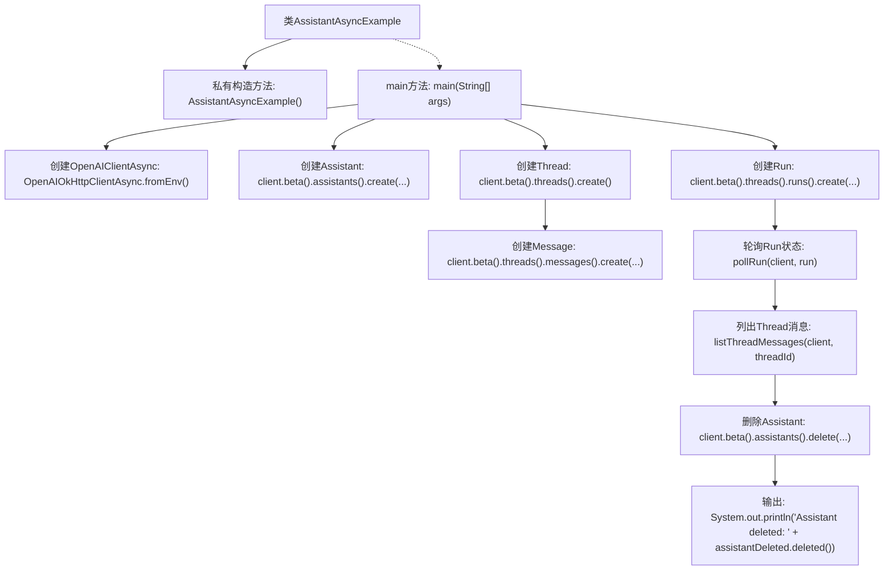

# 基础信息

|      |      |
|------|------|
| 名称 | AssistantAsyncExample |
| 编码语言 | .java |
| 代码路径 | openai-java/openai-java-example/src/main/java/com/openai/example/AssistantAsyncExample.java |
| 包名 | com.openai.example |
| 依赖项 | ['com.openai.client.OpenAIClientAsync', 'com.openai.client.okhttp.OpenAIOkHttpClientAsync', 'com.openai.models.ChatModel', 'com.openai.models.beta.assistants.Assistant', 'com.openai.models.beta.assistants.AssistantCreateParams', 'com.openai.models.beta.assistants.AssistantDeleteParams', 'com.openai.models.beta.assistants.CodeInterpreterTool', 'com.openai.models.beta.threads.messages.Message', 'com.openai.models.beta.threads.messages.MessageCreateParams', 'com.openai.models.beta.threads.messages.MessageListPageAsync', 'com.openai.models.beta.threads.messages.MessageListParams', 'com.openai.models.beta.threads.runs.Run', 'com.openai.models.beta.threads.runs.RunCreateParams', 'com.openai.models.beta.threads.runs.RunRetrieveParams', 'com.openai.models.beta.threads.runs.RunStatus', 'java.util.concurrent.CompletableFuture'] |
| 概述说明 | 异步API创建数学助手，解答方程后删除。 |

# 说明

该描述涉及使用异步API创建一个数学助手，该助手能够解答方程问题。创建完成后，助手会根据用户输入的方程进行计算并提供解答。任务完成后，系统会删除该助手以释放资源。整个过程展示了如何通过异步API实现数学助手的动态创建、使用和销毁，确保资源的高效管理和任务的顺利完成。

# 类列表 Class Summary

| 名称   | 类型  | 说明 |
|-------|------|-------------|
| AssistantAsyncExample | class | 使用异步API创建数学助手，解答方程并删除助手。 |

## 类 AssistantAsyncExample

|      |      |
|------|------|
| 访问范围 | public final |
| 类型 | class |
| 名称 | AssistantAsyncExample |
| 说明 | 使用异步API创建数学助手，解答方程并删除助手。 |

### UML类图

```mermaid
classDiagram
    class AssistantAsyncExample {
        -AssistantAsyncExample()
        +main(String[] args)
        -pollRun(OpenAIClientAsync client, Run run) CompletableFuture~Run~
        -listThreadMessages(OpenAIClientAsync client, String threadId) CompletableFuture~Void~
    }

    class OpenAIClientAsync {
        <<Interface>>
        +beta() BetaAsync
    }

    class BetaAsync {
        <<Interface>>
        +assistants() AssistantsAsync
        +threads() ThreadsAsync
    }

    class AssistantsAsync {
        <<Interface>>
        +create(AssistantCreateParams params) CompletableFuture~Assistant~
        +delete(AssistantDeleteParams params) CompletableFuture~AssistantDeleted~
    }

    class ThreadsAsync {
        <<Interface>>
        +create() CompletableFuture~Thread~
        +messages() MessagesAsync
        +runs() RunsAsync
    }

    class MessagesAsync {
        <<Interface>>
        +create(MessageCreateParams params) CompletableFuture~Message~
        +list(MessageListParams params) CompletableFuture~MessageListPageAsync~
    }

    class RunsAsync {
        <<Interface>>
        +create(RunCreateParams params) CompletableFuture~Run~
        +retrieve(RunRetrieveParams params) CompletableFuture~Run~
    }

    class MessageListPageAsync {
        <<Interface>>
        +autoPager() AutoPager~Message~
    }

    class AutoPager~T~ {
        <<Interface>>
        +forEach(Function~T, Boolean~ action, Executor executor) CompletableFuture~Void~
    }

    class Assistant {
        +id() String
    }

    class Thread {
        +id() String
    }

    class Message {
        +threadId() String
        +role() MessageCreateParams.Role
        +content() List~MessageContent~
    }

    class Run {
        +status() RunStatus
        +threadId() String
        +id() String
    }

    class AssistantDeleted {
        +deleted() Boolean
    }

    class MessageContent {
        +text() List~TextBlock~
    }

    class TextBlock {
        +text() TextValue
    }

    class TextValue {
        +value() String
    }

    class RunStatus {
        <<Enumeration>>
        QUEUED
        IN_PROGRESS
        COMPLETED
    }

    class MessageCreateParams {
        +builder() Builder
        class Builder {
            +threadId(String threadId) Builder
            +role(MessageCreateParams.Role role) Builder
            +content(String content) Builder
            +build() MessageCreateParams
        }
    }

    class RunCreateParams {
        +builder() Builder
        class Builder {
            +threadId(String threadId) Builder
            +assistantId(String assistantId) Builder
            +instructions(String instructions) Builder
            +build() RunCreateParams
        }
    }

    class RunRetrieveParams {
        +builder() Builder
        class Builder {
            +threadId(String threadId) Builder
            +runId(String runId) Builder
            +build() RunRetrieveParams
        }
    }

    class MessageListParams {
        +builder() Builder
        class Builder {
            +threadId(String threadId) Builder
            +order(MessageListParams.Order order) Builder
            +build() MessageListParams
        }
    }

    class AssistantCreateParams {
        +builder() Builder
        class Builder {
            +name(String name) Builder
            +instructions(String instructions) Builder
            +addTool(Tool tool) Builder
            +model(ChatModel model) Builder
            +build() AssistantCreateParams
        }
    }

    class AssistantDeleteParams {
        +builder() Builder
        class Builder {
            +assistantId(String assistantId) Builder
            +build() AssistantDeleteParams
        }
    }

    class Tool {
        <<Interface>>
    }

    class CodeInterpreterTool {
        +builder() Builder
        class Builder {
            +build() CodeInterpreterTool
        }
    }

    class ChatModel {
        <<Enumeration>>
        GPT_4O_MINI
    }

    AssistantAsyncExample --> OpenAIClientAsync : 依赖
    OpenAIClientAsync --> BetaAsync : 依赖
    BetaAsync --> AssistantsAsync : 依赖
    BetaAsync --> ThreadsAsync : 依赖
    ThreadsAsync --> MessagesAsync : 依赖
    ThreadsAsync --> RunsAsync : 依赖
    MessagesAsync --> MessageListPageAsync : 依赖
    MessageListPageAsync --> AutoPager~Message~ : 依赖
    AutoPager~Message~ --> Message : 依赖
    AssistantAsyncExample --> Assistant : 依赖
    AssistantAsyncExample --> Thread : 依赖
    AssistantAsyncExample --> Message : 依赖
    AssistantAsyncExample --> Run : 依赖
    AssistantAsyncExample --> AssistantDeleted : 依赖
    Message --> MessageContent : 依赖
    MessageContent --> TextBlock : 依赖
    TextBlock --> TextValue : 依赖
    Run --> RunStatus : 依赖
    MessageCreateParams --> Builder : 依赖
    RunCreateParams --> Builder : 依赖
    RunRetrieveParams --> Builder : 依赖
    MessageListParams --> Builder : 依赖
    AssistantCreateParams --> Builder : 依赖
    AssistantDeleteParams --> Builder : 依赖
    Tool --> CodeInterpreterTool : 依赖
    CodeInterpreterTool --> Builder : 依赖
    AssistantCreateParams --> ChatModel : 依赖
```

这段代码展示了一个异步助手示例，通过`OpenAIClientAsync`与OpenAI API进行交互。代码首先创建了一个数学助手的实例，然后在一个线程中创建消息并运行任务，最后轮询任务状态并列出线程中的消息。代码通过`CompletableFuture`实现了异步操作，并在任务完成后删除助手。类图展示了各个类及其依赖关系，包括异步客户端、助手、线程、消息、运行任务等组件。

### 内部方法调用关系图

```mermaid
graph TD
    A["类AssistantAsyncExample"]
    B["私有构造方法: AssistantAsyncExample()"]
    C["main方法: main(String[] args)"]
    D["创建OpenAIClientAsync: OpenAIOkHttpClientAsync.fromEnv()"]
    E["创建Assistant: client.beta().assistants().create(...)"]
    F["创建Thread: client.beta().threads().create()"]
    G["创建Message: client.beta().threads().messages().create(...)"]
    H["创建Run: client.beta().threads().runs().create(...)"]
    I["轮询Run状态: pollRun(client, run)"]
    J["列出Thread消息: listThreadMessages(client, threadId)"]
    K["删除Assistant: client.beta().assistants().delete(...)"]
    L["输出: System.out.println('Assistant deleted: ' + assistantDeleted.deleted())"]

    A --> B
    A -.-> C
    C --> D
    C --> E
    C --> F
    F --> G
    C --> H
    H --> I
    I --> J
    J --> K
    K --> L
```

该流程图描述了`AssistantAsyncExample`类的主要执行流程。程序首先通过环境变量配置`OpenAIClientAsync`，然后创建`Assistant`、`Thread`和`Message`。接着，程序创建`Run`并轮询其状态，直到`Run`完成。完成后，程序列出`Thread`中的消息并删除`Assistant`，最后输出删除结果。整个过程展示了异步调用和任务链式处理的典型模式。

### 字段列表 Field List

| 名称  | 类型  | 说明 |
|-------|-------|------|

### 方法列表 Method List

| 名称  | 类型  | 说明 |
|-------|-------|------|
| main | void | 创建异步OpenAI客户端，生成数学助手，处理用户方程求解请求，轮询运行状态并删除助手。 |
| pollRun | CompletableFuture<Run> | 异步轮询运行状态，若完成则返回，否则等待后继续轮询。 |
| listThreadMessages | CompletableFuture<Void> | 异步列出线程消息并逐条打印角色和内容。 |

