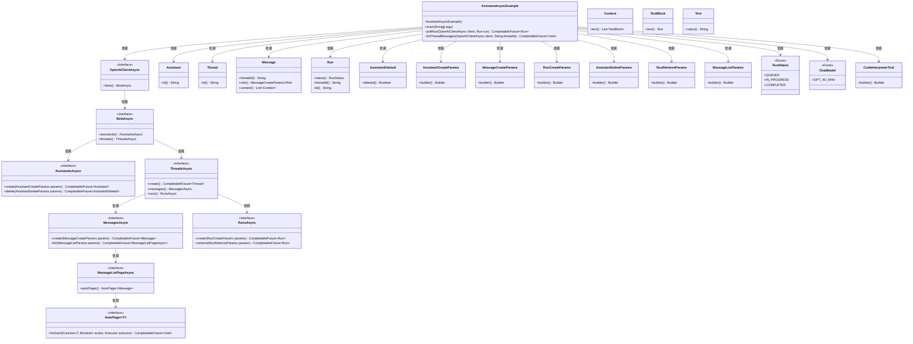

# 基础信息

|      |      |
|------|------|
| 名称 | AssistantAsyncExample |
| 编码语言 | .java |
| 代码路径 | openai-java/openai-java-example/src/main/java/com/openai/example/AssistantAsyncExample.java |
| 包名 | com.openai.example |
| 依赖项 | ['com.openai.client.OpenAIClientAsync', 'com.openai.client.okhttp.OpenAIOkHttpClientAsync', 'com.openai.models.ChatModel', 'com.openai.models.beta.assistants.Assistant', 'com.openai.models.beta.assistants.AssistantCreateParams', 'com.openai.models.beta.assistants.AssistantDeleteParams', 'com.openai.models.beta.assistants.CodeInterpreterTool', 'com.openai.models.beta.threads.messages.Message', 'com.openai.models.beta.threads.messages.MessageCreateParams', 'com.openai.models.beta.threads.messages.MessageListPageAsync', 'com.openai.models.beta.threads.messages.MessageListParams', 'com.openai.models.beta.threads.runs.Run', 'com.openai.models.beta.threads.runs.RunCreateParams', 'com.openai.models.beta.threads.runs.RunRetrieveParams', 'com.openai.models.beta.threads.runs.RunStatus', 'java.util.concurrent.CompletableFuture'] |
| 概述说明 | Java示例：创建数学助手，处理线程消息，轮询状态，删除助手。 |

# 说明

该内容描述了一个Java异步编程的示例，主要涉及创建一个数学助手，处理线程间的消息传递，轮询助手的运行状态，并在任务完成后删除该助手。整个过程展示了如何在Java中实现异步操作，包括线程管理、状态监控和资源清理。

# 类列表 Class Summary

| 名称   | 类型  | 说明 |
|-------|------|-------------|
| AssistantAsyncExample | class | Java异步示例：创建数学助手，处理线程消息，轮询运行状态，最后删除助手。 |

## 类 AssistantAsyncExample

|      |      |
|------|------|
| 访问范围 | public final |
| 类型 | class |
| 名称 | AssistantAsyncExample |
| 说明 | Java异步示例：创建数学助手，处理线程消息，轮询运行状态，最后删除助手。 |

### UML类图

**描述：**
该代码展示了一个异步助手示例，通过OpenAI客户端创建助手、线程和消息，并执行运行任务。代码涉及多个异步接口和类，如`OpenAIClientAsync`、`BetaAsync`、`AssistantsAsync`、`ThreadsAsync`等，用于管理助手、线程、消息和运行任务的状态。通过`CompletableFuture`实现异步操作，最终删除助手并输出结果。

### 内部方法调用关系图

这段代码展示了一个异步助手的工作流程，主要功能包括创建助手、线程、消息和运行任务，并轮询运行状态以确定任务是否完成。代码还实现了列出线程消息和删除助手的操作，最终输出助手是否成功删除的状态。整个过程通过CompletableFuture实现异步操作，确保任务按顺序执行并在完成后进行清理。

### 字段列表 Field List

| 名称  | 类型  | 说明 |
|-------|-------|------|

### 方法列表 Method List

| 名称  | 类型  | 说明 |
|-------|-------|------|
| pollRun | CompletableFuture<Run> | 异步轮询OpenAI运行状态，完成时返回结果。 |
| main | void | 创建AI助手，解答数学问题，并删除助手。 |
| listThreadMessages | CompletableFuture<Void> | 异步列出并打印指定线程消息内容，按升序排列。 |

