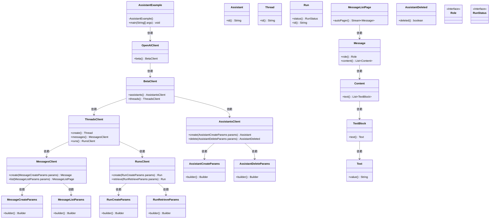
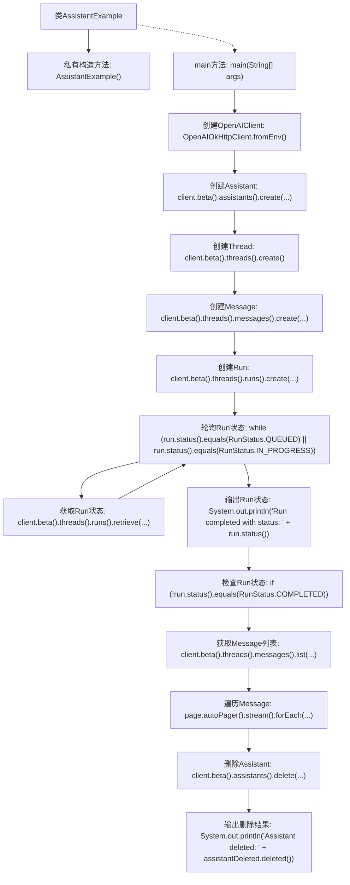

# 基础信息

|      |      |
|------|------|
| 名称 | AssistantExample |
| 编码语言 | .java |
| 代码路径 | openai-java/openai-java-example/src/main/java/com/openai/example/AssistantExample.java |
| 包名 | com.openai.example |
| 依赖项 | ['com.openai.client.OpenAIClient', 'com.openai.client.okhttp.OpenAIOkHttpClient', 'com.openai.models.ChatModel', 'com.openai.models.beta.assistants', 'com.openai.models.beta.threads.Thread', 'com.openai.models.beta.threads.messages.MessageCreateParams', 'com.openai.models.beta.threads.messages.MessageListPage', 'com.openai.models.beta.threads.messages.MessageListParams', 'com.openai.models.beta.threads.runs.Run', 'com.openai.models.beta.threads.runs.RunCreateParams', 'com.openai.models.beta.threads.runs.RunRetrieveParams', 'com.openai.models.beta.threads.runs.RunStatus'] |
| 概述说明 | Java代码实现OpenAI助手解决数学问题后删除。 |

# 说明

该内容描述了一个使用Java代码创建OpenAI助手的过程，该助手专门用于解决数学问题。首先，通过Java代码实现与OpenAI API的集成，创建一个能够处理数学问题的助手实例。助手的功能包括接收数学问题、解析问题、调用相应的算法或模型进行计算，并返回准确的结果。在完成数学问题的解决后，代码还包括删除助手的步骤，确保资源得到合理释放，避免内存泄漏或资源浪费。整个过程展示了如何高效地利用OpenAI API进行特定任务的自动化处理，并在任务完成后进行清理。

# 类列表 Class Summary

| 名称   | 类型  | 说明 |
|-------|------|-------------|
| AssistantExample | class | Java代码创建OpenAI助手，解决数学问题并删除助手。 |

## 类 AssistantExample

|      |      |
|------|------|
| 访问范围 | public final |
| 类型 | class |
| 名称 | AssistantExample |
| 说明 | Java代码创建OpenAI助手，解决数学问题并删除助手。 |

### UML类图

**描述**：该代码展示了一个使用OpenAI API创建和管理助手的示例。`AssistantExample`类通过`OpenAIClient`与OpenAI服务交互，创建助手、线程、消息和运行，并最终删除助手。代码中涉及多个参数类和客户端类，如`AssistantsClient`、`ThreadsClient`、`MessagesClient`和`RunsClient`，用于管理助手、线程、消息和运行的状态。整个过程通过链式调用实现，最终输出运行结果并删除助手。

### 内部方法调用关系图

这段代码展示了一个使用OpenAI API的示例程序，主要功能包括创建助手、创建线程、发送消息、轮询运行状态、获取消息列表以及删除助手。程序通过轮询机制检查运行状态，直到运行完成，然后输出消息内容并最终删除助手。整个过程展示了如何与OpenAI API进行交互，并处理异步任务的流程。

### 字段列表 Field List

| 名称  | 类型  | 说明 |
|-------|-------|------|

### 方法列表 Method List

| 名称  | 类型  | 说明 |
|-------|-------|------|
| main | void | 创建AI助手解答数学问题，处理用户请求并输出结果，最后删除助手。 |

