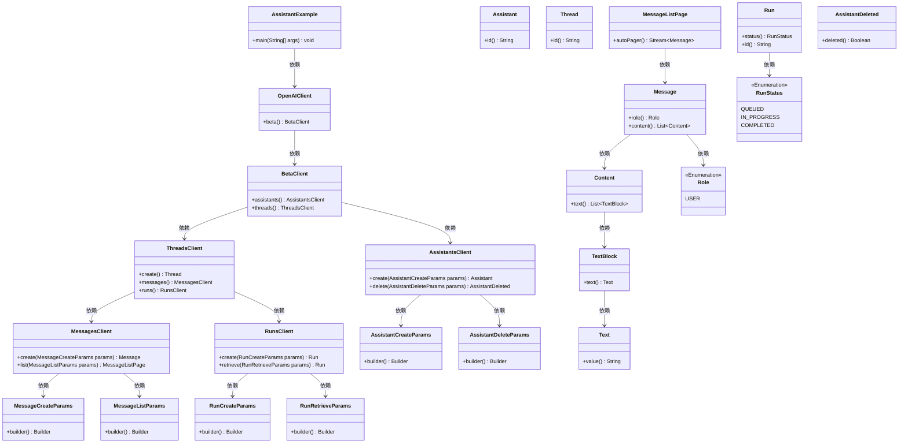
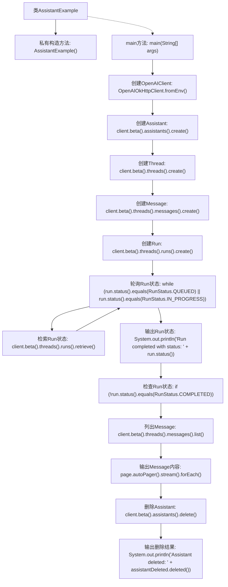

# 基础信息

|      |      |
|------|------|
| 名称 | AssistantExample |
| 编码语言 | .java |
| 代码路径 | openai-java/openai-java-example/src/main/java/com/openai/example/AssistantExample.java |
| 包名 | com.openai.example |
| 依赖项 | ['com.openai.client.OpenAIClient', 'com.openai.client.okhttp.OpenAIOkHttpClient', 'com.openai.models.ChatModel', 'com.openai.models.beta.assistants', 'com.openai.models.beta.threads.Thread', 'com.openai.models.beta.threads.messages.MessageCreateParams', 'com.openai.models.beta.threads.messages.MessageListPage', 'com.openai.models.beta.threads.messages.MessageListParams', 'com.openai.models.beta.threads.runs.Run', 'com.openai.models.beta.threads.runs.RunCreateParams', 'com.openai.models.beta.threads.runs.RunRetrieveParams', 'com.openai.models.beta.threads.runs.RunStatus'] |
| 概述说明 | Java代码创建数学助手，求解方程，轮询状态输出结果后删除。 |

# 说明

该描述涉及使用Java代码创建一个数学助手，该助手能够处理方程求解任务。代码通过轮询机制监控助手的运行状态，并在求解完成后输出结果。最后，代码会删除已创建的数学助手，以释放资源。整个过程展示了如何利用Java实现一个完整的数学求解流程，包括创建、监控、输出和清理等步骤。

# 类列表 Class Summary

| 名称   | 类型  | 说明 |
|-------|------|-------------|
| AssistantExample | class | Java代码创建数学助手，处理方程求解，轮询状态并输出结果，最后删除助手。 |

## 类 AssistantExample

|      |      |
|------|------|
| 访问范围 | public final |
| 类型 | class |
| 名称 | AssistantExample |
| 说明 | Java代码创建数学助手，处理方程求解，轮询状态并输出结果，最后删除助手。 |

### UML类图

```mermaid
classDiagram
    class AssistantExample {
        +main(String[] args) void
    }

    class OpenAIClient {
        +beta() BetaClient
    }

    class BetaClient {
        +assistants() AssistantsClient
        +threads() ThreadsClient
    }

    class AssistantsClient {
        +create(AssistantCreateParams params) Assistant
        +delete(AssistantDeleteParams params) AssistantDeleted
    }

    class ThreadsClient {
        +create() Thread
        +messages() MessagesClient
        +runs() RunsClient
    }

    class MessagesClient {
        +create(MessageCreateParams params) Message
        +list(MessageListParams params) MessageListPage
    }

    class RunsClient {
        +create(RunCreateParams params) Run
        +retrieve(RunRetrieveParams params) Run
    }

    class AssistantCreateParams {
        +builder() Builder
    }

    class AssistantDeleteParams {
        +builder() Builder
    }

    class MessageCreateParams {
        +builder() Builder
    }

    class RunCreateParams {
        +builder() Builder
    }

    class RunRetrieveParams {
        +builder() Builder
    }

    class MessageListParams {
        +builder() Builder
    }

    class Assistant {
        +id() String
    }

    class Thread {
        +id() String
    }

    class Message {
        +role() Role
        +content() List~Content~
    }

    class Content {
        +text() List~TextBlock~
    }

    class TextBlock {
        +text() Text
    }

    class Text {
        +value() String
    }

    class Run {
        +status() RunStatus
        +id() String
    }

    class MessageListPage {
        +autoPager() Stream~Message~
    }

    class AssistantDeleted {
        +deleted() Boolean
    }

    class RunStatus {
        <<Enumeration>>
        QUEUED
        IN_PROGRESS
        COMPLETED
    }

    class Role {
        <<Enumeration>>
        USER
    }

    AssistantExample --> OpenAIClient : 依赖
    OpenAIClient --> BetaClient : 依赖
    BetaClient --> AssistantsClient : 依赖
    BetaClient --> ThreadsClient : 依赖
    ThreadsClient --> MessagesClient : 依赖
    ThreadsClient --> RunsClient : 依赖
    MessagesClient --> MessageCreateParams : 依赖
    MessagesClient --> MessageListParams : 依赖
    RunsClient --> RunCreateParams : 依赖
    RunsClient --> RunRetrieveParams : 依赖
    AssistantsClient --> AssistantCreateParams : 依赖
    AssistantsClient --> AssistantDeleteParams : 依赖
    Message --> Content : 依赖
    Content --> TextBlock : 依赖
    TextBlock --> Text : 依赖
    MessageListPage --> Message : 依赖
    Run --> RunStatus : 依赖
    Message --> Role : 依赖
```

这段代码展示了一个使用OpenAI API的Java客户端示例，主要用于创建和管理助手、线程、消息和运行任务。代码通过调用OpenAIClient的API，创建了一个数学助手的实例，并在一个线程中处理用户的消息，最终输出结果并删除助手。类图展示了各个类之间的关系及其依赖关系，帮助理解代码的结构和功能。

### 内部方法调用关系图

```mermaid
graph TD
    A["类AssistantExample"]
    B["私有构造方法: AssistantExample()"]
    C["main方法: main(String[] args)"]
    D["创建OpenAIClient: OpenAIOkHttpClient.fromEnv()"]
    E["创建Assistant: client.beta().assistants().create()"]
    F["创建Thread: client.beta().threads().create()"]
    G["创建Message: client.beta().threads().messages().create()"]
    H["创建Run: client.beta().threads().runs().create()"]
    I["轮询Run状态: while (run.status().equals(RunStatus.QUEUED) || run.status().equals(RunStatus.IN_PROGRESS))"]
    J["检索Run状态: client.beta().threads().runs().retrieve()"]
    K["输出Run状态: System.out.println('Run completed with status: ' + run.status())"]
    L["检查Run状态: if (!run.status().equals(RunStatus.COMPLETED))"]
    M["列出Message: client.beta().threads().messages().list()"]
    N["输出Message内容: page.autoPager().stream().forEach()"]
    O["删除Assistant: client.beta().assistants().delete()"]
    P["输出删除结果: System.out.println('Assistant deleted: ' + assistantDeleted.deleted())"]

    A --> B
    A -.-> C
    C --> D
    D --> E
    E --> F
    F --> G
    G --> H
    H --> I
    I --> J
    J --> I
    I --> K
    K --> L
    L --> M
    M --> N
    N --> O
    O --> P
```

**描述：**
这段代码展示了一个名为 `AssistantExample` 的类，主要用于与OpenAI API进行交互。首先，它通过环境变量配置客户端，并创建一个名为“Math Tutor”的助手。随后，它创建一个线程并在其中发送消息，发起一个运行任务，并轮询该任务的状态直到完成。完成后，列出并输出所有消息内容，最后删除助手并输出删除结果。整个过程展示了如何通过API进行助手管理、消息处理和任务轮询。

### 字段列表 Field List

| 名称  | 类型  | 说明 |
|-------|-------|------|

### 方法列表 Method List

| 名称  | 类型  | 说明 |
|-------|-------|------|
| main | void | 创建数学助手，处理用户数学问题，轮询运行状态并输出结果，最后删除助手。 |

