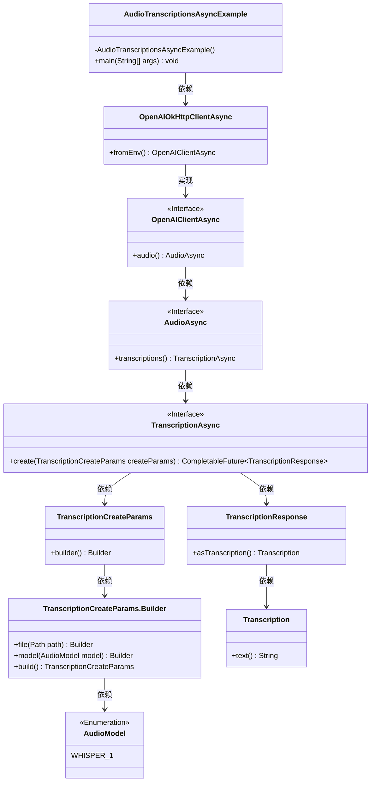
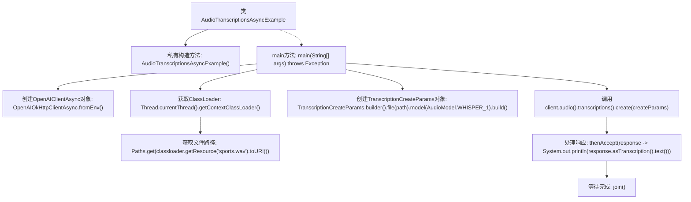

# 基础信息

|      |      |
|------|------|
| 名称 | AudioTranscriptionsAsyncExample |
| 编码语言 | .java |
| 代码路径 | openai-java/openai-java-example/src/main/java/com/openai/example/AudioTranscriptionsAsyncExample.java |
| 包名 | com.openai.example |
| 依赖项 | ['com.openai.client.OpenAIClientAsync', 'com.openai.client.okhttp.OpenAIOkHttpClientAsync', 'com.openai.models.audio.AudioModel', 'com.openai.models.audio.transcriptions.TranscriptionCreateParams', 'java.nio.file.Path', 'java.nio.file.Paths'] |
| 概述说明 | 使用OpenAI客户端将音频文件异步转录为文本。 |

# 说明

异步音频转录示例展示了如何使用OpenAI客户端处理音频文件并将其内容转换为文本。该过程涉及将音频文件上传至OpenAI平台，通过其内置的语音识别技术进行异步处理，最终生成转录文本。这种方法适用于需要高效处理大量音频数据的场景，能够显著提升转录速度和准确性。整个过程无需手动干预，自动化程度高，适合集成到各类应用系统中。

# 类列表 Class Summary

| 名称   | 类型  | 说明 |
|-------|------|-------------|
| AudioTranscriptionsAsyncExample | class | 异步音频转录示例：使用OpenAI客户端转录音频文件并输出文本。 |

## 类 AudioTranscriptionsAsyncExample

|      |      |
|------|------|
| 访问范围 | public final |
| 类型 | class |
| 名称 | AudioTranscriptionsAsyncExample |
| 说明 | 异步音频转录示例：使用OpenAI客户端转录音频文件并输出文本。 |

### UML类图

这段代码展示了一个异步音频转录的示例。`AudioTranscriptionsAsyncExample`类通过`OpenAIOkHttpClientAsync`创建`OpenAIClientAsync`实例，并配置音频文件路径和模型参数。`OpenAIClientAsync`接口依赖`AudioAsync`接口，后者进一步依赖`TranscriptionAsync`接口来处理转录请求。`TranscriptionCreateParams`类用于构建转录请求参数，`TranscriptionResponse`类则用于处理转录结果并提取文本。整个过程通过异步调用链实现，最终输出转录文本。

### 内部方法调用关系图

这段代码的流程图描述了`AudioTranscriptionsAsyncExample`类的执行流程。程序首先通过环境变量配置`OpenAIClientAsync`客户端，然后加载音频文件并构建转录参数。接着，程序调用异步API进行音频转录，并处理返回的转录结果，最后等待异步操作完成并输出转录文本。整个过程展示了从配置客户端到获取转录结果的完整流程。

### 字段列表 Field List

| 名称  | 类型  | 说明 |
|-------|-------|------|

### 方法列表 Method List

| 名称  | 类型  | 说明 |
|-------|-------|------|
| main | void | Java代码使用OpenAI客户端异步处理音频转录，通过环境变量配置API密钥。 |

