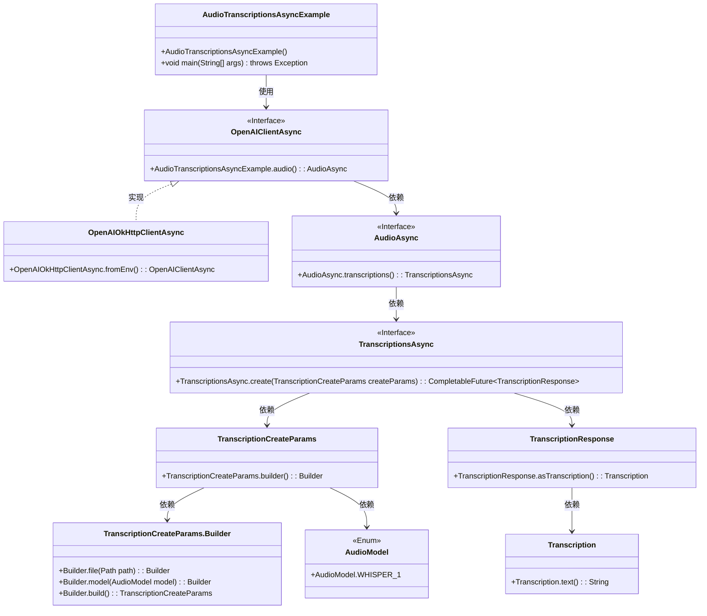
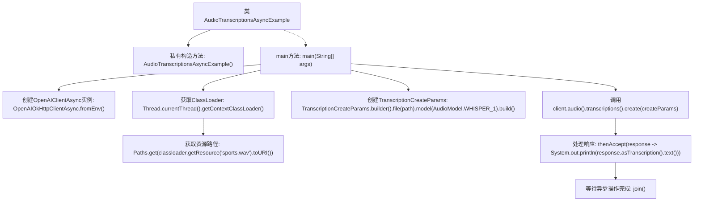

# 基础信息

|      |      |
|------|------|
| 名称 | AudioTranscriptionsAsyncExample |
| 编码语言 | .java |
| 代码路径 | openai-java/openai-java-example/src/main/java/com/openai/example/AudioTranscriptionsAsyncExample.java |
| 包名 | com.openai.example |
| 依赖项 | ['com.openai.client.OpenAIClientAsync', 'com.openai.client.okhttp.OpenAIOkHttpClientAsync', 'com.openai.models.audio.AudioModel', 'com.openai.models.audio.transcriptions.TranscriptionCreateParams', 'java.nio.file.Path', 'java.nio.file.Paths'] |
| 概述说明 | 使用OpenAI客户端异步转录WAV文件为文本。 |

# 说明

该示例展示了如何使用OpenAI客户端进行异步音频转录。首先，加载WAV格式的音频文件，然后通过OpenAI的API将音频内容转换为文本。整个过程采用异步处理方式，确保高效且不阻塞主线程。该方法适用于需要将音频数据快速转录为文本的场景，如语音识别、会议记录等。

# 类列表 Class Summary

| 名称   | 类型  | 说明 |
|-------|------|-------------|
| AudioTranscriptionsAsyncExample | class | 异步音频转录示例，使用OpenAI客户端，加载WAV文件并生成转录文本。 |

## 类 AudioTranscriptionsAsyncExample

|      |      |
|------|------|
| 访问范围 | public final |
| 类型 | class |
| 名称 | AudioTranscriptionsAsyncExample |
| 说明 | 异步音频转录示例，使用OpenAI客户端，加载WAV文件并生成转录文本。 |

### UML类图

```mermaid
classDiagram
    class AudioTranscriptionsAsyncExample {
        +AudioTranscriptionsAsyncExample()
        +void main(String[] args) throws Exception
    }
    class OpenAIClientAsync {
        <<Interface>>
        +AudioTranscriptionsAsyncExample.audio() : AudioAsync
    }
    class OpenAIOkHttpClientAsync {
        +OpenAIOkHttpClientAsync.fromEnv() : OpenAIClientAsync
    }
    class AudioAsync {
        <<Interface>>
        +AudioAsync.transcriptions() : TranscriptionsAsync
    }
    class TranscriptionsAsync {
        <<Interface>>
        +TranscriptionsAsync.create(TranscriptionCreateParams createParams) : CompletableFuture~TranscriptionResponse~
    }
    class TranscriptionCreateParams {
        +TranscriptionCreateParams.builder() : Builder
    }
    class TranscriptionCreateParams.Builder {
        +Builder.file(Path path) : Builder
        +Builder.model(AudioModel model) : Builder
        +Builder.build() : TranscriptionCreateParams
    }
    class TranscriptionResponse {
        +TranscriptionResponse.asTranscription() : Transcription
    }
    class Transcription {
        +Transcription.text() : String
    }
    class AudioModel {
        <<Enum>>
        +AudioModel.WHISPER_1
    }

    AudioTranscriptionsAsyncExample --> OpenAIClientAsync : 使用
    OpenAIClientAsync <|.. OpenAIOkHttpClientAsync : 实现
    OpenAIClientAsync --> AudioAsync : 依赖
    AudioAsync --> TranscriptionsAsync : 依赖
    TranscriptionsAsync --> TranscriptionCreateParams : 依赖
    TranscriptionCreateParams --> TranscriptionCreateParams.Builder : 依赖
    TranscriptionsAsync --> TranscriptionResponse : 依赖
    TranscriptionResponse --> Transcription : 依赖
    TranscriptionCreateParams --> AudioModel : 依赖
```

这段代码展示了一个异步音频转录的示例，使用OpenAI客户端进行音频文件的转录。代码通过环境变量配置客户端，加载音频文件，构建转录参数，并异步执行转录操作，最后输出转录文本。类图展示了各个类之间的依赖关系和实现细节，包括客户端、音频处理、转录参数和响应等模块。

### 内部方法调用关系图

```mermaid
graph TD
    A["类AudioTranscriptionsAsyncExample"]
    B["私有构造方法: AudioTranscriptionsAsyncExample()"]
    C["main方法: main(String[] args)"]
    D["创建OpenAIClientAsync实例: OpenAIOkHttpClientAsync.fromEnv()"]
    E["获取ClassLoader: Thread.currentThread().getContextClassLoader()"]
    F["获取资源路径: Paths.get(classloader.getResource('sports.wav').toURI())"]
    G["创建TranscriptionCreateParams: TranscriptionCreateParams.builder().file(path).model(AudioModel.WHISPER_1).build()"]
    H["调用client.audio().transcriptions().create(createParams)"]
    I["处理响应: thenAccept(response -> System.out.println(response.asTranscription().text()))"]
    J["等待异步操作完成: join()"]

    A --> B
    A -.-> C
    C --> D
    C --> E
    E --> F
    C --> G
    C --> H
    H --> I
    I --> J
```

这段代码展示了如何使用异步客户端进行音频转录。首先，它通过环境变量配置OpenAI客户端，然后加载音频文件并构建转录参数。接着，它调用异步API进行转录，并在完成后打印转录文本。整个过程通过`thenAccept`和`join`确保异步操作的完成和结果的输出。

### 字段列表 Field List

| 名称  | 类型  | 说明 |
|-------|-------|------|

### 方法列表 Method List

| 名称  | 类型  | 说明 |
|-------|-------|------|
| main | void | Java代码通过环境变量配置OpenAI客户端，异步转录音频文件并输出文本。 |

