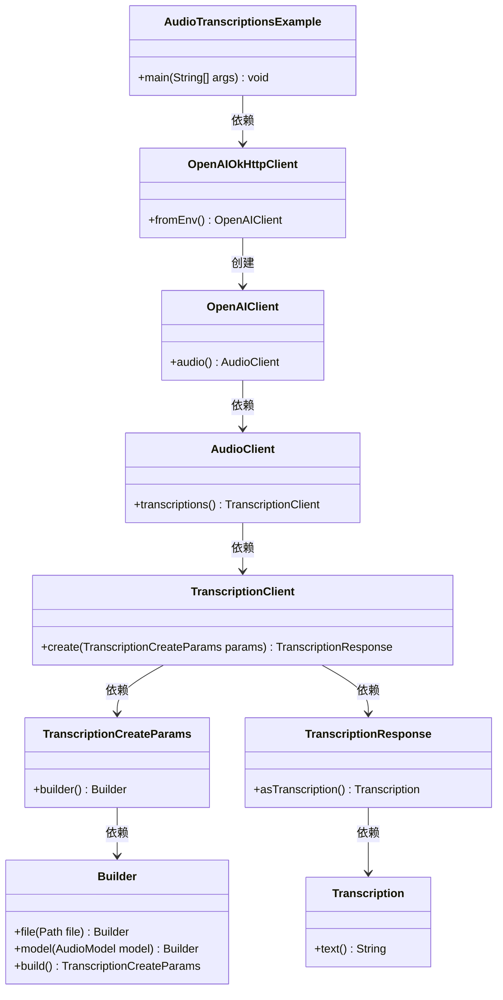
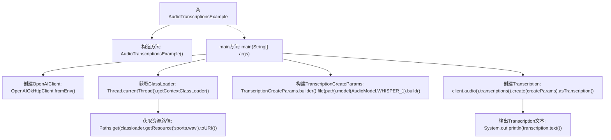

# 基础信息

|      |      |
|------|------|
| 名称 | AudioTranscriptionsExample |
| 编码语言 | .java |
| 代码路径 | openai-java/openai-java-example/src/main/java/com/openai/example/AudioTranscriptionsExample.java |
| 包名 | com.openai.example |
| 依赖项 | ['com.openai.client.OpenAIClient', 'com.openai.client.okhttp.OpenAIOkHttpClient', 'com.openai.models.audio.AudioModel', 'com.openai.models.audio.transcriptions.Transcription', 'com.openai.models.audio.transcriptions.TranscriptionCreateParams', 'java.nio.file.Path', 'java.nio.file.Paths'] |
| 概述说明 | Java示例：利用OpenAI API实现音频转文本。 |

# 说明

该示例展示了如何利用Java编程语言调用OpenAI API，将音频文件转换为文本。通过集成OpenAI的语音识别功能，开发者可以轻松实现音频转录任务。此过程涉及配置API密钥、加载音频文件、发送请求至OpenAI服务器，并接收返回的文本结果。该方法适用于需要将语音内容自动转换为文字的应用场景，如语音助手、会议记录等。

# 类列表 Class Summary

| 名称   | 类型  | 说明 |
|-------|------|-------------|
| AudioTranscriptionsExample | class | Java示例：使用OpenAI API将音频文件转录为文本。 |

## 类 AudioTranscriptionsExample

|      |      |
|------|------|
| 访问范围 | public final |
| 类型 | class |
| 名称 | AudioTranscriptionsExample |
| 说明 | Java示例：使用OpenAI API将音频文件转录为文本。 |

### UML类图

**描述：**
`AudioTranscriptionsExample` 类通过 `OpenAIOkHttpClient` 创建 `OpenAIClient` 实例，并使用该客户端处理音频转录任务。`OpenAIClient` 依赖 `AudioClient` 和 `TranscriptionClient` 来执行具体的转录操作。`TranscriptionCreateParams` 类通过 `Builder` 模式构建转录参数，最终生成 `Transcription` 对象并输出转录文本。整个流程展示了从客户端创建到音频转录的完整过程。

### 内部方法调用关系图

这段代码展示了一个音频转录的示例，通过OpenAI的API将音频文件转换为文本。首先，代码配置了OpenAI客户端，然后加载音频文件并构建转录参数，接着调用API进行转录，最后输出转录的文本。整个过程清晰地展示了从配置到转录的完整流程。

### 字段列表 Field List

| 名称  | 类型  | 说明 |
|-------|-------|------|

### 方法列表 Method List

| 名称  | 类型  | 说明 |
|-------|-------|------|
| main | void | Java代码使用OpenAI API转录音频文件，输出转录文本。 |

