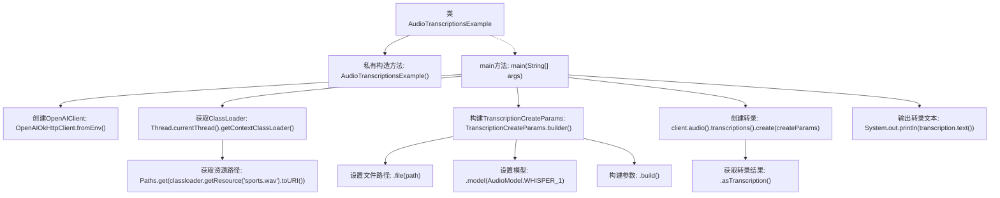

# 基础信息

|      |      |
|------|------|
| 名称 | AudioTranscriptionsExample |
| 编码语言 | .java |
| 代码路径 | openai-java/openai-java-example/src/main/java/com/openai/example/AudioTranscriptionsExample.java |
| 包名 | com.openai.example |
| 依赖项 | ['com.openai.client.OpenAIClient', 'com.openai.client.okhttp.OpenAIOkHttpClient', 'com.openai.models.audio.AudioModel', 'com.openai.models.audio.transcriptions.Transcription', 'com.openai.models.audio.transcriptions.TranscriptionCreateParams', 'java.nio.file.Path', 'java.nio.file.Paths'] |
| 概述说明 | Java示例：使用OpenAI API将音频转录为文本。 |

# 说明

该内容描述了一个使用Java编程语言通过OpenAI API将音频文件转录为文本的示例。该示例展示了如何利用OpenAI的强大功能，将音频数据转换为可读的文本格式，适用于需要将语音内容转换为文字的应用场景。通过调用OpenAI API，开发者可以轻松实现音频转录功能，提升应用程序的智能化水平。

# 类列表 Class Summary

| 名称   | 类型  | 说明 |
|-------|------|-------------|
| AudioTranscriptionsExample | class | Java示例：通过OpenAI API将音频文件转录为文本。 |

## 类 AudioTranscriptionsExample

|      |      |
|------|------|
| 访问范围 | public final |
| 类型 | class |
| 名称 | AudioTranscriptionsExample |
| 说明 | Java示例：通过OpenAI API将音频文件转录为文本。 |

### UML类图

```mermaid
classDiagram
    class AudioTranscriptionsExample {
        -AudioTranscriptionsExample()
        +main(String[] args) void
    }

    class OpenAIClient {
        <<Interface>>
        +audio() AudioService
    }

    class OpenAIOkHttpClient {
        +fromEnv() OpenAIClient
    }

    class AudioService {
        <<Interface>>
        +transcriptions() TranscriptionService
    }

    class TranscriptionService {
        <<Interface>>
        +create(TranscriptionCreateParams createParams) TranscriptionResult
    }

    class TranscriptionCreateParams {
        +builder() TranscriptionCreateParams$Builder
    }

    class TranscriptionCreateParams$Builder {
        +file(Path file) TranscriptionCreateParams$Builder
        +model(AudioModel model) TranscriptionCreateParams$Builder
        +build() TranscriptionCreateParams
    }

    class TranscriptionResult {
        +asTranscription() Transcription
    }

    class Transcription {
        +text() String
    }

    class Path {
        // Path class from java.nio.file
    }

    class AudioModel {
        // Enum representing audio models
    }

    AudioTranscriptionsExample --> OpenAIOkHttpClient : 依赖
    OpenAIOkHttpClient --> OpenAIClient : 实现
    OpenAIClient --> AudioService : 依赖
    AudioService --> TranscriptionService : 依赖
    TranscriptionService --> TranscriptionResult : 依赖
    TranscriptionResult --> Transcription : 依赖
    TranscriptionCreateParams$Builder --> TranscriptionCreateParams : 创建
```

**描述：**  
该代码展示了一个音频转录的示例，使用OpenAI客户端进行音频文件的转录。`AudioTranscriptionsExample`类通过`OpenAIClient`接口与OpenAI服务进行交互，配置音频文件的路径和模型，最终生成转录结果并输出文本。类图清晰地展示了各个类之间的关系，包括客户端、服务接口、参数构建器以及转录结果的处理流程。

### 内部方法调用关系图

```mermaid
graph TD
    A["类AudioTranscriptionsExample"]
    B["私有构造方法: AudioTranscriptionsExample()"]
    C["main方法: main(String[] args)"]
    D["创建OpenAIClient: OpenAIOkHttpClient.fromEnv()"]
    E["获取ClassLoader: Thread.currentThread().getContextClassLoader()"]
    F["获取资源路径: Paths.get(classloader.getResource('sports.wav').toURI())"]
    G["构建TranscriptionCreateParams: TranscriptionCreateParams.builder()"]
    H["设置文件路径: .file(path)"]
    I["设置模型: .model(AudioModel.WHISPER_1)"]
    J["构建参数: .build()"]
    K["创建转录: client.audio().transcriptions().create(createParams)"]
    L["获取转录结果: .asTranscription()"]
    M["输出转录文本: System.out.println(transcription.text())"]

    A --> B
    A -.-> C
    C --> D
    C --> E
    E --> F
    C --> G
    G --> H
    G --> I
    G --> J
    C --> K
    K --> L
    C --> M
```

这段代码展示了一个音频转录的示例程序。程序首先通过环境变量配置OpenAI客户端，然后加载本地音频文件并构建转录参数。接着，程序调用OpenAI API进行音频转录，并最终输出转录的文本。整个流程包括客户端配置、资源加载、参数构建、API调用和结果输出，展示了如何使用OpenAI API进行音频转录的完整过程。

### 字段列表 Field List

| 名称  | 类型  | 说明 |
|-------|-------|------|

### 方法列表 Method List

| 名称  | 类型  | 说明 |
|-------|-------|------|
| main | void | Java代码使用OpenAI客户端从音频文件生成文字转录。 |

