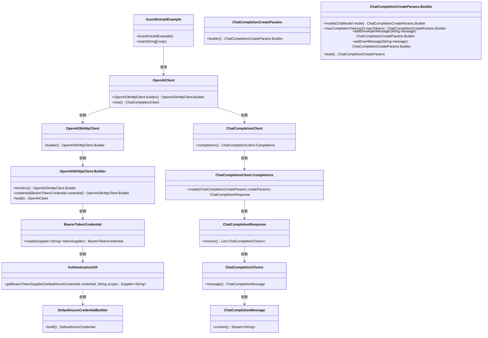
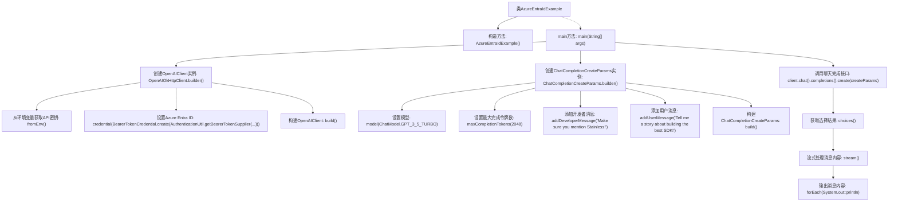

# 基础信息

|      |      |
|------|------|
| 名称 | AzureEntraIdExample |
| 编码语言 | .java |
| 代码路径 | openai-java/openai-java-example/src/main/java/com/openai/example/AzureEntraIdExample.java |
| 包名 | com.openai.example |
| 依赖项 | ['com.azure.identity.AuthenticationUtil', 'com.azure.identity.DefaultAzureCredentialBuilder', 'com.openai.client.OpenAIClient', 'com.openai.client.okhttp.OpenAIOkHttpClient', 'com.openai.credential.BearerTokenCredential', 'com.openai.models.ChatModel', 'com.openai.models.chat.completions.ChatCompletionCreateParams'] |
| 概述说明 | AzureEntraIdExample类通过Azure Entra ID认证调用OpenAI API生成聊天回复。 |

# 说明

AzureEntraIdExample类通过Azure Entra ID进行身份认证，实现对OpenAI API的调用，以生成聊天回复。该过程涉及使用Azure Entra ID的安全机制确保身份验证的合法性，并通过OpenAI API获取智能生成的聊天内容。这一方法结合了Azure的安全认证能力和OpenAI的先进自然语言处理技术，确保了系统的高效性和安全性。

# 类列表 Class Summary

| 名称   | 类型  | 说明 |
|-------|------|-------------|
| AzureEntraIdExample | class | AzureEntraIdExample类使用Azure Entra ID认证调用OpenAI API生成聊天回复。 |

## 类 AzureEntraIdExample

|      |      |
|------|------|
| 访问范围 | public final |
| 类型 | class |
| 名称 | AzureEntraIdExample |
| 说明 | AzureEntraIdExample类使用Azure Entra ID认证调用OpenAI API生成聊天回复。 |

### UML类图

这段代码展示了一个使用Azure Entra ID进行身份验证的OpenAI客户端示例。`AzureEntraIdExample`类通过`OpenAIClient`与OpenAI服务进行交互，构建了一个聊天完成请求，并处理响应。代码中涉及了多个类，包括`OpenAIOkHttpClient`、`BearerTokenCredential`、`AuthenticationUtil`等，用于处理身份验证和请求构建。最终，通过`ChatCompletionClient`发送请求并处理响应。

### 内部方法调用关系图

这段代码展示了如何使用Azure Entra ID和OpenAI API创建一个聊天完成请求。首先，代码通过环境变量获取API密钥，并设置Azure Entra ID进行身份验证。然后，它构建了一个聊天完成请求参数，包括模型、最大令牌数以及开发者和用户的消息。最后，代码调用OpenAI的聊天完成接口，处理并输出生成的聊天内容。

### 字段列表 Field List

| 名称  | 类型  | 说明 |
|-------|-------|------|

### 方法列表 Method List

| 名称  | 类型  | 说明 |
|-------|-------|------|
| main | void | 使用Azure OpenAI API创建GPT-3.5对话，生成关于最佳SDK的故事。 |

