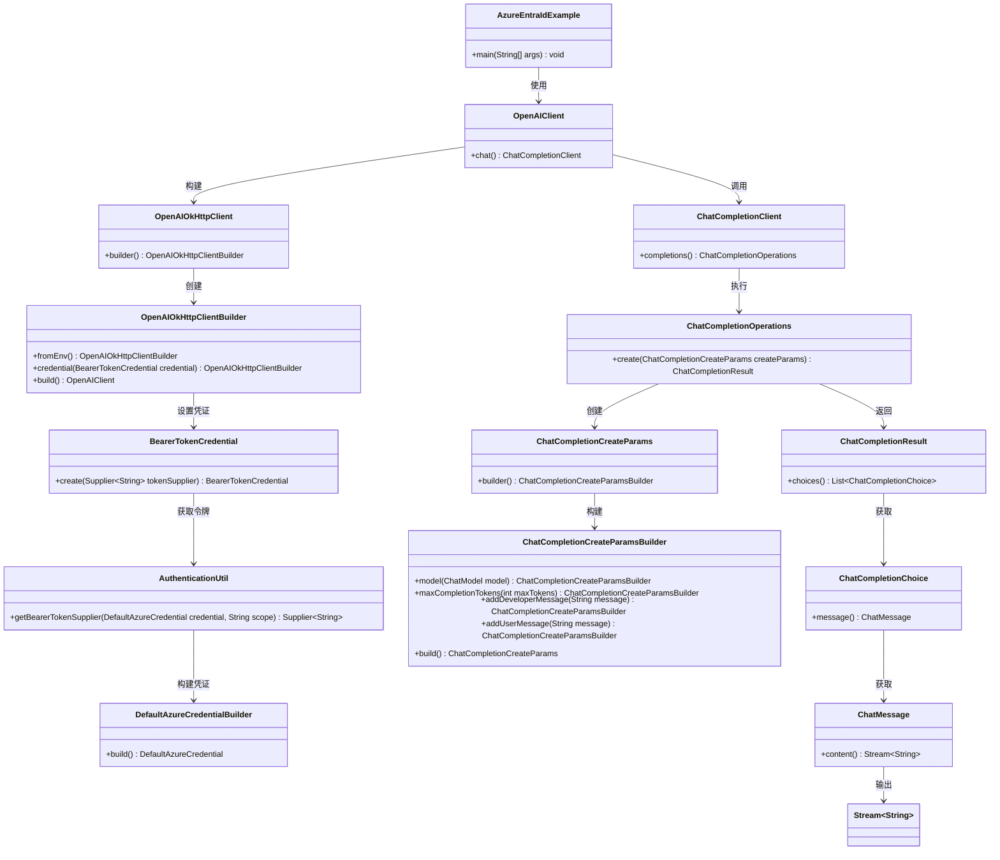
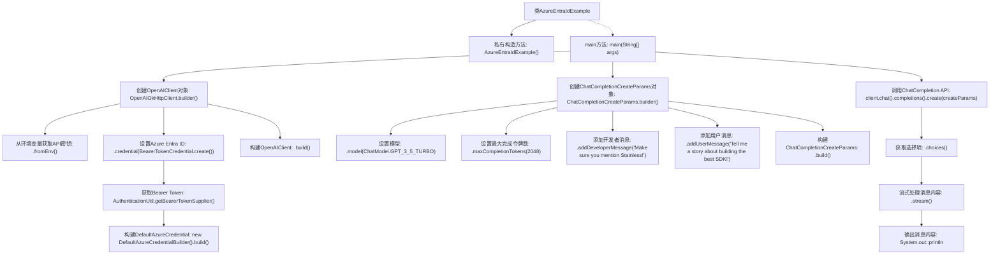

# 基础信息

|      |      |
|------|------|
| 名称 | AzureEntraIdExample |
| 编码语言 | .java |
| 代码路径 | openai-java/openai-java-example/src/main/java/com/openai/example/AzureEntraIdExample.java |
| 包名 | com.openai.example |
| 依赖项 | ['com.azure.identity.AuthenticationUtil', 'com.azure.identity.DefaultAzureCredentialBuilder', 'com.openai.client.OpenAIClient', 'com.openai.client.okhttp.OpenAIOkHttpClient', 'com.openai.credential.BearerTokenCredential', 'com.openai.models.ChatModel', 'com.openai.models.chat.completions.ChatCompletionCreateParams'] |
| 概述说明 | Java代码通过Azure Entra ID认证调用OpenAI API生成GPT-3.5对话。 |

# 说明

该内容描述了一个Java示例代码的使用场景，该代码通过Azure Entra ID进行身份认证，以调用OpenAI API并生成GPT-3.5的对话。Azure Entra ID是一种身份验证服务，确保安全访问OpenAI API。通过此认证流程，Java应用程序能够与GPT-3.5模型进行交互，生成自然语言对话。整个过程展示了如何将Azure身份验证与OpenAI API集成，以实现安全且高效的对话生成功能。

# 类列表 Class Summary

| 名称   | 类型  | 说明 |
|-------|------|-------------|
| AzureEntraIdExample | class | Java示例代码使用Azure Entra ID认证调用OpenAI API生成GPT-3.5对话。 |

## 类 AzureEntraIdExample

|      |      |
|------|------|
| 访问范围 | public final |
| 类型 | class |
| 名称 | AzureEntraIdExample |
| 说明 | Java示例代码使用Azure Entra ID认证调用OpenAI API生成GPT-3.5对话。 |

### UML类图

```mermaid
classDiagram
    class AzureEntraIdExample {
        +main(String[] args) void
    }

    class OpenAIClient {
        +chat() ChatCompletionClient
    }

    class OpenAIOkHttpClient {
        +builder() OpenAIOkHttpClientBuilder
    }

    class OpenAIOkHttpClientBuilder {
        +fromEnv() OpenAIOkHttpClientBuilder
        +credential(BearerTokenCredential credential) OpenAIOkHttpClientBuilder
        +build() OpenAIClient
    }

    class BearerTokenCredential {
        +create(Supplier~String~ tokenSupplier) BearerTokenCredential
    }

    class AuthenticationUtil {
        +getBearerTokenSupplier(DefaultAzureCredential credential, String scope) Supplier~String~
    }

    class DefaultAzureCredentialBuilder {
        +build() DefaultAzureCredential
    }

    class ChatCompletionClient {
        +completions() ChatCompletionOperations
    }

    class ChatCompletionOperations {
        +create(ChatCompletionCreateParams createParams) ChatCompletionResult
    }

    class ChatCompletionCreateParams {
        +builder() ChatCompletionCreateParamsBuilder
    }

    class ChatCompletionCreateParamsBuilder {
        +model(ChatModel model) ChatCompletionCreateParamsBuilder
        +maxCompletionTokens(int maxTokens) ChatCompletionCreateParamsBuilder
        +addDeveloperMessage(String message) ChatCompletionCreateParamsBuilder
        +addUserMessage(String message) ChatCompletionCreateParamsBuilder
        +build() ChatCompletionCreateParams
    }

    class ChatCompletionResult {
        +choices() List~ChatCompletionChoice~
    }

    class ChatCompletionChoice {
        +message() ChatMessage
    }

    class ChatMessage {
        +content() Stream~String~
    }

    AzureEntraIdExample --> OpenAIClient : 使用
    OpenAIClient --> OpenAIOkHttpClient : 构建
    OpenAIOkHttpClient --> OpenAIOkHttpClientBuilder : 创建
    OpenAIOkHttpClientBuilder --> BearerTokenCredential : 设置凭证
    BearerTokenCredential --> AuthenticationUtil : 获取令牌
    AuthenticationUtil --> DefaultAzureCredentialBuilder : 构建凭证
    OpenAIClient --> ChatCompletionClient : 调用
    ChatCompletionClient --> ChatCompletionOperations : 执行
    ChatCompletionOperations --> ChatCompletionCreateParams : 创建
    ChatCompletionCreateParams --> ChatCompletionCreateParamsBuilder : 构建
    ChatCompletionOperations --> ChatCompletionResult : 返回
    ChatCompletionResult --> ChatCompletionChoice : 获取
    ChatCompletionChoice --> ChatMessage : 获取
    ChatMessage --> Stream~String~ : 输出
```

这段代码展示了如何使用Azure Entra ID和OpenAI SDK进行聊天补全。`AzureEntraIdExample`类通过`OpenAIOkHttpClient`构建了一个`OpenAIClient`，并使用`BearerTokenCredential`进行身份验证。随后，它创建了一个聊天补全请求，并通过流式处理输出结果。代码中涉及多个类和接口，展示了从构建客户端到执行请求的完整流程。

### 内部方法调用关系图

```mermaid
graph TD
    A["类AzureEntraIdExample"]
    B["私有构造方法: AzureEntraIdExample()"]
    C["main方法: main(String[] args)"]
    D["创建OpenAIClient对象: OpenAIOkHttpClient.builder()"]
    E["从环境变量获取API密钥: .fromEnv()"]
    F["设置Azure Entra ID: .credential(BearerTokenCredential.create())"]
    G["获取Bearer Token: AuthenticationUtil.getBearerTokenSupplier()"]
    H["构建DefaultAzureCredential: new DefaultAzureCredentialBuilder().build()"]
    I["构建OpenAIClient: .build()"]
    J["创建ChatCompletionCreateParams对象: ChatCompletionCreateParams.builder()"]
    K["设置模型: .model(ChatModel.GPT_3_5_TURBO)"]
    L["设置最大完成令牌数: .maxCompletionTokens(2048)"]
    M["添加开发者消息: .addDeveloperMessage('Make sure you mention Stainless!')"]
    N["添加用户消息: .addUserMessage('Tell me a story about building the best SDK!')"]
    O["构建ChatCompletionCreateParams: .build()"]
    P["调用ChatCompletion API: client.chat().completions().create(createParams)"]
    Q["获取选择项: .choices()"]
    R["流式处理消息内容: .stream()"]
    S["输出消息内容: System.out::println"]

    A --> B
    A -.-> C
    C --> D
    D --> E
    D --> F
    F --> G
    G --> H
    D --> I
    C --> J
    J --> K
    J --> L
    J --> M
    J --> N
    J --> O
    C --> P
    P --> Q
    Q --> R
    R --> S
```

这段代码展示了一个使用Azure Entra ID和OpenAI API的示例程序。程序首先通过环境变量获取API密钥，并使用Azure Entra ID进行身份验证，然后构建一个OpenAIClient对象。接着，程序创建了一个ChatCompletionCreateParams对象，设置了模型、最大完成令牌数以及开发者和用户的消息。最后，程序调用ChatCompletion API，处理并输出生成的聊天内容。整个过程展示了如何通过Java代码与Azure和OpenAI服务进行交互。

### 字段列表 Field List

| 名称  | 类型  | 说明 |
|-------|-------|------|

### 方法列表 Method List

| 名称  | 类型  | 说明 |
|-------|-------|------|
| main | void | Java代码通过Azure OpenAI API调用GPT-3.5模型生成SDK故事。 |

