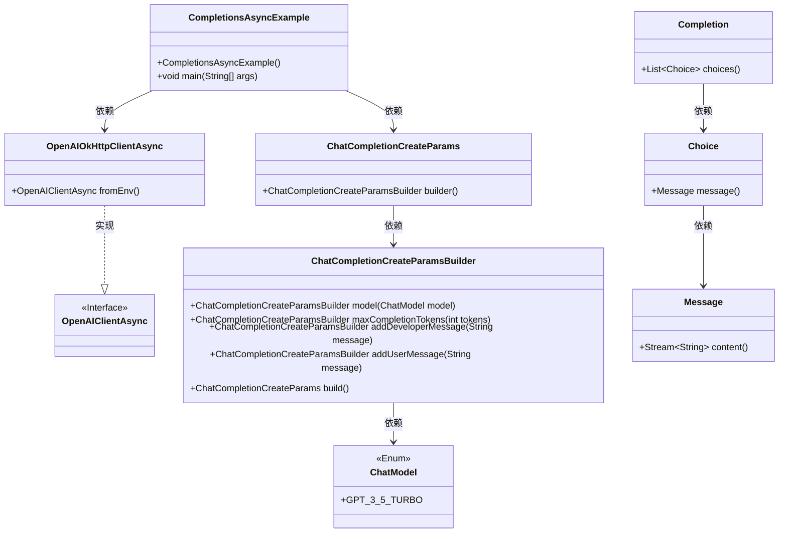
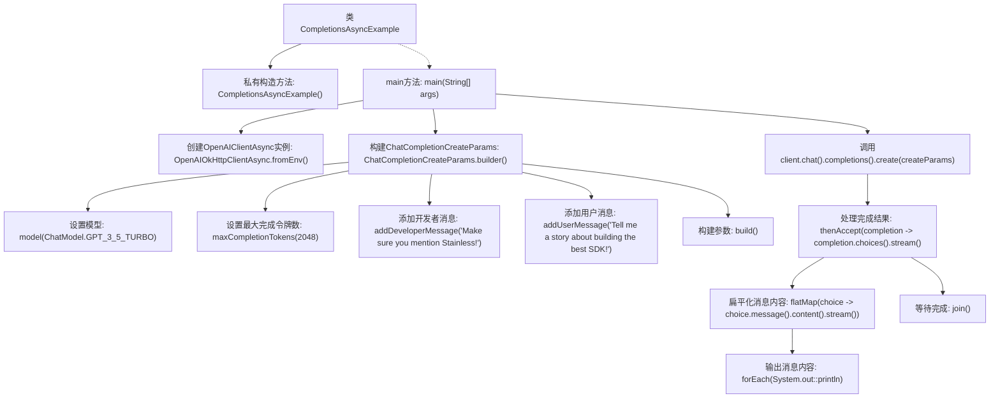

# 基础信息

|      |      |
|------|------|
| 名称 | CompletionsAsyncExample |
| 编码语言 | .java |
| 代码路径 | openai-java/openai-java-example/src/main/java/com/openai/example/CompletionsAsyncExample.java |
| 包名 | com.openai.example |
| 依赖项 | ['com.openai.client.OpenAIClientAsync', 'com.openai.client.okhttp.OpenAIOkHttpClientAsync', 'com.openai.models.ChatModel', 'com.openai.models.chat.completions.ChatCompletionCreateParams'] |
| 概述说明 | 异步调用OpenAI API生成聊天，配置客户端，请求GPT-3.5，输出至控制台。 |

# 说明

该内容描述了一个异步调用OpenAI API生成聊天完成的过程。首先，通过环境变量配置客户端，确保API密钥和其他必要参数正确设置。接着，请求使用GPT-3.5模型来生成聊天完成。最后，将生成的聊天结果输出到控制台，便于查看和调试。整个过程强调了异步调用的高效性和环境变量配置的灵活性。

# 类列表 Class Summary

| 名称   | 类型  | 说明 |
|-------|------|-------------|
| CompletionsAsyncExample | class | 异步调用OpenAI API生成聊天完成，使用环境变量配置客户端，请求GPT-3.5模型，输出结果到控制台。 |

## 类 CompletionsAsyncExample

|      |      |
|------|------|
| 访问范围 | public final |
| 类型 | class |
| 名称 | CompletionsAsyncExample |
| 说明 | 异步调用OpenAI API生成聊天完成，使用环境变量配置客户端，请求GPT-3.5模型，输出结果到控制台。 |

### UML类图

这段代码展示了一个异步的OpenAI聊天完成示例。`CompletionsAsyncExample`类通过`OpenAIOkHttpClientAsync`从环境变量中获取客户端配置，并使用`ChatCompletionCreateParamsBuilder`构建聊天完成请求参数。客户端通过`chat().completions().create()`方法异步发送请求，并在完成后打印出所有选择的内容。类图清晰地展示了各个类之间的关系和依赖，帮助理解代码的结构和流程。

### 内部方法调用关系图

这段代码展示了一个异步调用OpenAI API的示例。首先，通过环境变量配置OpenAI客户端，然后构建聊天完成请求参数，包括模型、最大令牌数以及开发者和用户的消息。接着，异步调用API并处理返回的完成结果，最终将消息内容输出到控制台。整个过程展示了如何通过异步编程模型与OpenAI API进行交互。

### 字段列表 Field List

| 名称  | 类型  | 说明 |
|-------|-------|------|

### 方法列表 Method List

| 名称  | 类型  | 说明 |
|-------|-------|------|
| main | void | Java代码配置OpenAI客户端，使用环境变量，创建聊天参数并请求GPT-3.5生成故事。 |

