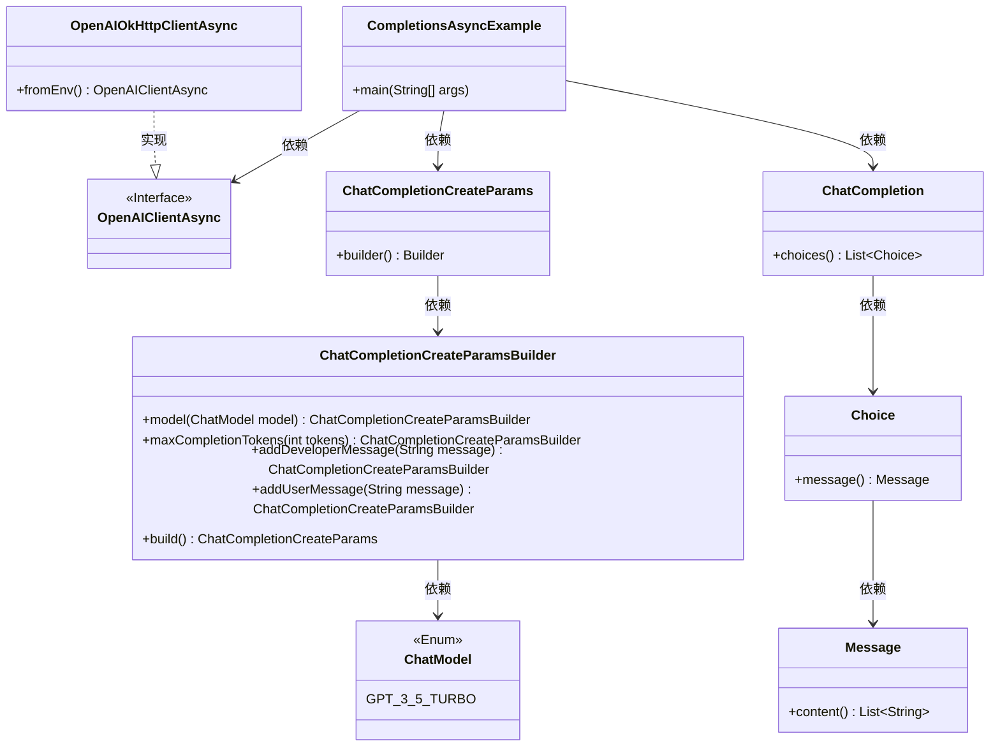
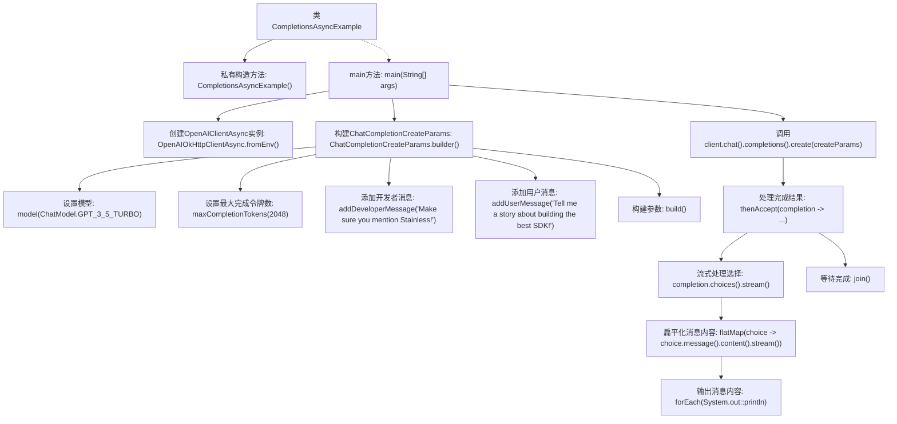

# 基础信息

|      |      |
|------|------|
| 名称 | CompletionsAsyncExample |
| 编码语言 | .java |
| 代码路径 | openai-java/openai-java-example/src/main/java/com/openai/example/CompletionsAsyncExample.java |
| 包名 | com.openai.example |
| 依赖项 | ['com.openai.client.OpenAIClientAsync', 'com.openai.client.okhttp.OpenAIOkHttpClientAsync', 'com.openai.models.ChatModel', 'com.openai.models.chat.completions.ChatCompletionCreateParams'] |
| 概述说明 | 异步调用OpenAI API生成聊天完成，通过环境变量配置客户端。 |

# 说明

该内容描述了一个示例，展示了如何通过异步调用的方式使用OpenAI API生成聊天完成。示例中使用了环境变量来配置客户端，确保API密钥和其他敏感信息的安全管理。这种方法提高了代码的可维护性和安全性，同时异步调用有助于提升程序的响应速度和效率。

# 类列表 Class Summary

| 名称   | 类型  | 说明 |
|-------|------|-------------|
| CompletionsAsyncExample | class | 异步调用OpenAI API生成聊天完成示例，使用环境变量配置客户端。 |

## 类 CompletionsAsyncExample

|      |      |
|------|------|
| 访问范围 | public final |
| 类型 | class |
| 名称 | CompletionsAsyncExample |
| 说明 | 异步调用OpenAI API生成聊天完成示例，使用环境变量配置客户端。 |

### UML类图

```mermaid
classDiagram
    class CompletionsAsyncExample {
        +main(String[] args)
    }
    class OpenAIClientAsync {
        <<Interface>>
    }
    class OpenAIOkHttpClientAsync {
        +fromEnv() OpenAIClientAsync
    }
    class ChatCompletionCreateParams {
        +builder() Builder
    }
    class ChatCompletionCreateParamsBuilder {
        +model(ChatModel model) ChatCompletionCreateParamsBuilder
        +maxCompletionTokens(int tokens) ChatCompletionCreateParamsBuilder
        +addDeveloperMessage(String message) ChatCompletionCreateParamsBuilder
        +addUserMessage(String message) ChatCompletionCreateParamsBuilder
        +build() ChatCompletionCreateParams
    }
    class ChatModel {
        <<Enum>>
        GPT_3_5_TURBO
    }
    class ChatCompletion {
        +choices() List~Choice~
    }
    class Choice {
        +message() Message
    }
    class Message {
        +content() List~String~
    }

    CompletionsAsyncExample --> OpenAIClientAsync : 依赖
    OpenAIOkHttpClientAsync ..|> OpenAIClientAsync : 实现
    CompletionsAsyncExample --> ChatCompletionCreateParams : 依赖
    ChatCompletionCreateParams --> ChatCompletionCreateParamsBuilder : 依赖
    ChatCompletionCreateParamsBuilder --> ChatModel : 依赖
    CompletionsAsyncExample --> ChatCompletion : 依赖
    ChatCompletion --> Choice : 依赖
    Choice --> Message : 依赖
```

这段代码展示了如何使用异步客户端与OpenAI API进行交互，生成聊天补全。`CompletionsAsyncExample`类通过`OpenAIClientAsync`接口与`OpenAIOkHttpClientAsync`实现类进行通信，构建`ChatCompletionCreateParams`对象来配置请求参数，并最终通过`ChatCompletion`、`Choice`和`Message`类处理并输出生成的补全内容。整个过程展示了从配置到请求再到结果处理的完整流程。

### 内部方法调用关系图

```mermaid
graph TD
    A["类CompletionsAsyncExample"]
    B["私有构造方法: CompletionsAsyncExample()"]
    C["main方法: main(String[] args)"]
    D["创建OpenAIClientAsync实例: OpenAIOkHttpClientAsync.fromEnv()"]
    E["构建ChatCompletionCreateParams: ChatCompletionCreateParams.builder()"]
    F["设置模型: model(ChatModel.GPT_3_5_TURBO)"]
    G["设置最大完成令牌数: maxCompletionTokens(2048)"]
    H["添加开发者消息: addDeveloperMessage('Make sure you mention Stainless!')"]
    I["添加用户消息: addUserMessage('Tell me a story about building the best SDK!')"]
    J["构建参数: build()"]
    K["调用client.chat().completions().create(createParams)"]
    L["处理完成结果: thenAccept(completion -> ...)"]
    M["流式处理选择: completion.choices().stream()"]
    N["扁平化消息内容: flatMap(choice -> choice.message().content().stream())"]
    O["输出消息内容: forEach(System.out::println)"]
    P["等待完成: join()"]

    A --> B
    A -.-> C
    C --> D
    C --> E
    E --> F
    E --> G
    E --> H
    E --> I
    E --> J
    C --> K
    K --> L
    L --> M
    M --> N
    N --> O
    L --> P
```

这段代码展示了一个异步的OpenAI客户端示例，用于生成聊天完成结果。首先，它通过环境变量配置客户端，然后构建聊天完成请求参数，包括模型、最大令牌数和开发者及用户消息。接着，它调用客户端的聊天完成方法，异步处理结果并输出消息内容，最后等待操作完成。

### 字段列表 Field List

| 名称  | 类型  | 说明 |
|-------|-------|------|

### 方法列表 Method List

| 名称  | 类型  | 说明 |
|-------|-------|------|
| main | void | Java代码通过环境变量配置OpenAI客户端，使用GPT-3.5模型生成故事，强调提及Stainless和最佳SDK。 |

