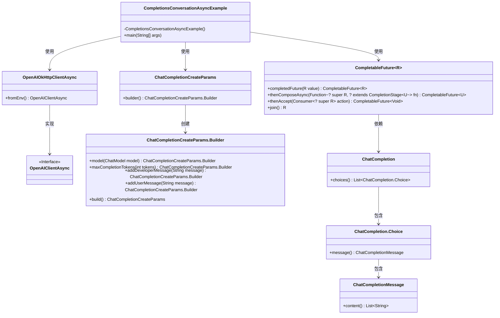
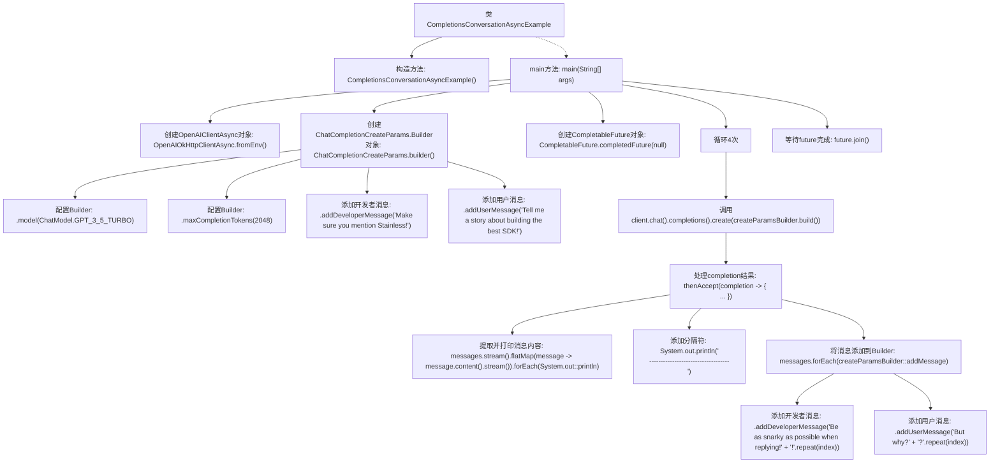

# 基础信息

|      |      |
|------|------|
| 名称 | CompletionsConversationAsyncExample |
| 编码语言 | .java |
| 代码路径 | openai-java/openai-java-example/src/main/java/com/openai/example/CompletionsConversationAsyncExample.java |
| 包名 | com.openai.example |
| 依赖项 | ['java.util.stream.Collectors.toList', 'com.openai.client.OpenAIClientAsync', 'com.openai.client.okhttp.OpenAIOkHttpClientAsync', 'com.openai.models.ChatModel', 'com.openai.models.chat.completions.ChatCompletion', 'com.openai.models.chat.completions.ChatCompletionCreateParams', 'com.openai.models.chat.completions.ChatCompletionMessage', 'java.util.List', 'java.util.concurrent.CompletableFuture'] |
| 概述说明 | Java代码示例，通过OpenAI API实现异步对话生成，支持多轮交互。 |

# 说明

该Java示例代码展示了如何使用OpenAI API进行异步对话生成，支持多轮交互。通过异步调用，程序能够高效处理对话请求，确保在生成回复时不会阻塞主线程。多轮交互功能允许用户与系统进行连续对话，系统能够根据上下文生成连贯的回复。该实现适用于需要自然语言处理和对话系统的应用场景，如聊天机器人、客服系统等。代码结构清晰，便于扩展和维护，适合开发者快速集成到现有项目中。

# 类列表 Class Summary

| 名称   | 类型  | 说明 |
|-------|------|-------------|
| CompletionsConversationAsyncExample | class | Java示例代码，使用OpenAI API异步生成对话，支持多轮交互。 |

## 类 CompletionsConversationAsyncExample

|      |      |
|------|------|
| 访问范围 | public final |
| 类型 | class |
| 名称 | CompletionsConversationAsyncExample |
| 说明 | Java示例代码，使用OpenAI API异步生成对话，支持多轮交互。 |

### UML类图

### 描述
这段代码展示了一个异步的对话生成示例，使用OpenAI的API来生成聊天补全。`CompletionsConversationAsyncExample`类通过`OpenAIOkHttpClientAsync`获取异步客户端，并使用`ChatCompletionCreateParams.Builder`构建聊天参数。通过`CompletableFuture`进行异步操作，生成并打印聊天补全结果，同时不断更新聊天参数以生成新的对话。整个流程展示了异步编程和OpenAI API的结合使用。

### 内部方法调用关系图

这段代码展示了如何使用异步方式与OpenAI的API进行对话。首先，代码通过环境变量配置OpenAI客户端，然后构建一个聊天请求参数对象，并通过循环多次发送请求。每次请求后，代码会处理返回的消息并将其打印到控制台，同时将消息添加到请求参数中以便下一次请求使用。最后，代码等待所有异步操作完成。

### 字段列表 Field List

| 名称  | 类型  | 说明 |
|-------|-------|------|

### 方法列表 Method List

| 名称  | 类型  | 说明 |
|-------|-------|------|
| main | void | Java代码示例，使用OpenAI API构建异步聊天客户端，生成故事并循环交互。 |

