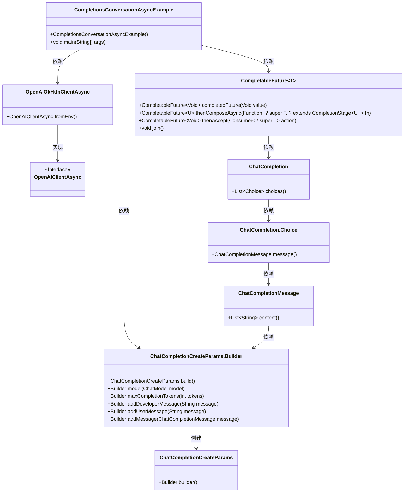
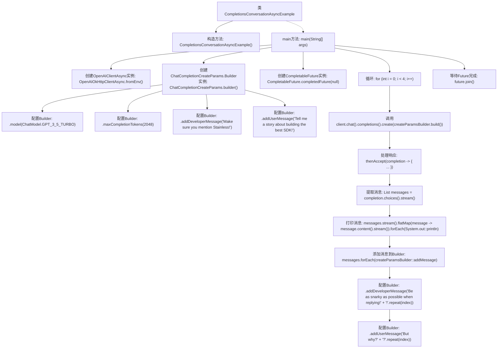

# 基础信息

|      |      |
|------|------|
| 名称 | CompletionsConversationAsyncExample |
| 编码语言 | .java |
| 代码路径 | openai-java/openai-java-example/src/main/java/com/openai/example/CompletionsConversationAsyncExample.java |
| 包名 | com.openai.example |
| 依赖项 | ['java.util.stream.Collectors.toList', 'com.openai.client.OpenAIClientAsync', 'com.openai.client.okhttp.OpenAIOkHttpClientAsync', 'com.openai.models.ChatModel', 'com.openai.models.chat.completions.ChatCompletion', 'com.openai.models.chat.completions.ChatCompletionCreateParams', 'com.openai.models.chat.completions.ChatCompletionMessage', 'java.util.List', 'java.util.concurrent.CompletableFuture'] |
| 概述说明 | Java示例展示异步对话生成，配置GPT-3.5模型并循环生成回复。 |

# 说明

该示例展示了如何使用Java语言调用OpenAI API进行异步对话生成。具体配置了GPT-3.5模型，并通过循环机制持续生成回复。整个过程涉及API的异步调用，确保高效处理对话请求，同时利用循环结构实现连续对话生成，适用于需要持续交互的应用场景。

# 类列表 Class Summary

| 名称   | 类型  | 说明 |
|-------|------|-------------|
| CompletionsConversationAsyncExample | class | Java示例展示使用OpenAI API进行异步对话生成，配置模型为GPT-3.5，并循环生成回复。 |

## 类 CompletionsConversationAsyncExample

|      |      |
|------|------|
| 访问范围 | public final |
| 类型 | class |
| 名称 | CompletionsConversationAsyncExample |
| 说明 | Java示例展示使用OpenAI API进行异步对话生成，配置模型为GPT-3.5，并循环生成回复。 |

### UML类图

```mermaid
classDiagram
    class CompletionsConversationAsyncExample {
        +CompletionsConversationAsyncExample()
        +void main(String[] args)
    }

    class OpenAIClientAsync {
        <<Interface>>
    }

    class OpenAIOkHttpClientAsync {
        +OpenAIClientAsync fromEnv()
    }

    class ChatCompletionCreateParams {
        +Builder builder()
    }

    class ChatCompletionCreateParams.Builder {
        +ChatCompletionCreateParams build()
        +Builder model(ChatModel model)
        +Builder maxCompletionTokens(int tokens)
        +Builder addDeveloperMessage(String message)
        +Builder addUserMessage(String message)
        +Builder addMessage(ChatCompletionMessage message)
    }

    class ChatCompletion {
        +List~Choice~ choices()
    }

    class ChatCompletion.Choice {
        +ChatCompletionMessage message()
    }

    class ChatCompletionMessage {
        +List~String~ content()
    }

    class CompletableFuture~T~ {
        +CompletableFuture~Void~ completedFuture(Void value)
        +CompletableFuture~U~ thenComposeAsync(Function~? super T, ? extends CompletionStage~U~~ fn)
        +CompletableFuture~Void~ thenAccept(Consumer~? super T~ action)
        +void join()
    }

    CompletionsConversationAsyncExample --> OpenAIOkHttpClientAsync : 依赖
    OpenAIOkHttpClientAsync --> OpenAIClientAsync : 实现
    CompletionsConversationAsyncExample --> ChatCompletionCreateParams.Builder : 依赖
    ChatCompletionCreateParams.Builder --> ChatCompletionCreateParams : 创建
    CompletionsConversationAsyncExample --> CompletableFuture~Void~ : 依赖
    CompletableFuture~Void~ --> ChatCompletion : 依赖
    ChatCompletion --> ChatCompletion.Choice : 依赖
    ChatCompletion.Choice --> ChatCompletionMessage : 依赖
    ChatCompletionMessage --> ChatCompletionCreateParams.Builder : 依赖
```

这段代码展示了一个异步对话生成的示例，使用了OpenAI的客户端库来创建和发送聊天请求。代码通过`CompletableFuture`实现了异步操作，并在每次请求后更新对话参数。`ChatCompletionCreateParams.Builder`用于构建和更新聊天请求参数，`ChatCompletion`和`ChatCompletionMessage`用于处理响应结果。整个过程通过循环不断更新对话内容，并在控制台输出结果。

### 内部方法调用关系图

```mermaid
graph TD
    A["类CompletionsConversationAsyncExample"]
    B["构造方法: CompletionsConversationAsyncExample()"]
    C["main方法: main(String[] args)"]
    D["创建OpenAIClientAsync实例: OpenAIOkHttpClientAsync.fromEnv()"]
    E["创建ChatCompletionCreateParams.Builder实例: ChatCompletionCreateParams.builder()"]
    F["配置Builder: .model(ChatModel.GPT_3_5_TURBO)"]
    G["配置Builder: .maxCompletionTokens(2048)"]
    H["配置Builder: .addDeveloperMessage('Make sure you mention Stainless!')"]
    I["配置Builder: .addUserMessage('Tell me a story about building the best SDK!')"]
    J["创建CompletableFuture<Void>实例: CompletableFuture.completedFuture(null)"]
    K["循环: for (int i = 0; i < 4; i++)"]
    L["调用client.chat().completions().create(createParamsBuilder.build())"]
    M["处理响应: thenAccept(completion -> { ... })"]
    N["提取消息: List<ChatCompletionMessage> messages = completion.choices().stream()"]
    O["打印消息: messages.stream().flatMap(message -> message.content().stream()).forEach(System.out::println)"]
    P["添加消息到Builder: messages.forEach(createParamsBuilder::addMessage)"]
    Q["配置Builder: .addDeveloperMessage('Be as snarky as possible when replying!' + '!'.repeat(index))"]
    R["配置Builder: .addUserMessage('But why?' + '?'.repeat(index))"]
    S["等待Future完成: future.join()"]

    A --> B
    A -.-> C
    C --> D
    C --> E
    E --> F
    E --> G
    E --> H
    E --> I
    C --> J
    C --> K
    K --> L
    L --> M
    M --> N
    N --> O
    O --> P
    P --> Q
    Q --> R
    C --> S
```

这段代码展示了如何使用异步方式与OpenAI API进行对话。代码首先配置了OpenAI客户端，然后构建了一个聊天请求参数，并通过循环多次发送请求并处理响应。每次响应后，代码会提取消息并打印，同时将消息添加到请求参数中以便下一次请求使用。最终，代码等待所有异步操作完成。

### 字段列表 Field List

| 名称  | 类型  | 说明 |
|-------|-------|------|

### 方法列表 Method List

| 名称  | 类型  | 说明 |
|-------|-------|------|
| main | void | Java代码使用OpenAI API异步生成故事，循环四次，每次输出并追加对话内容。 |

