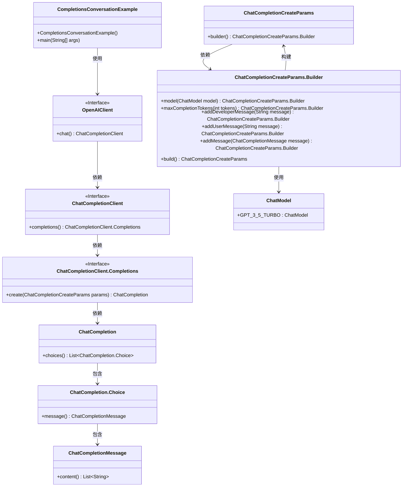
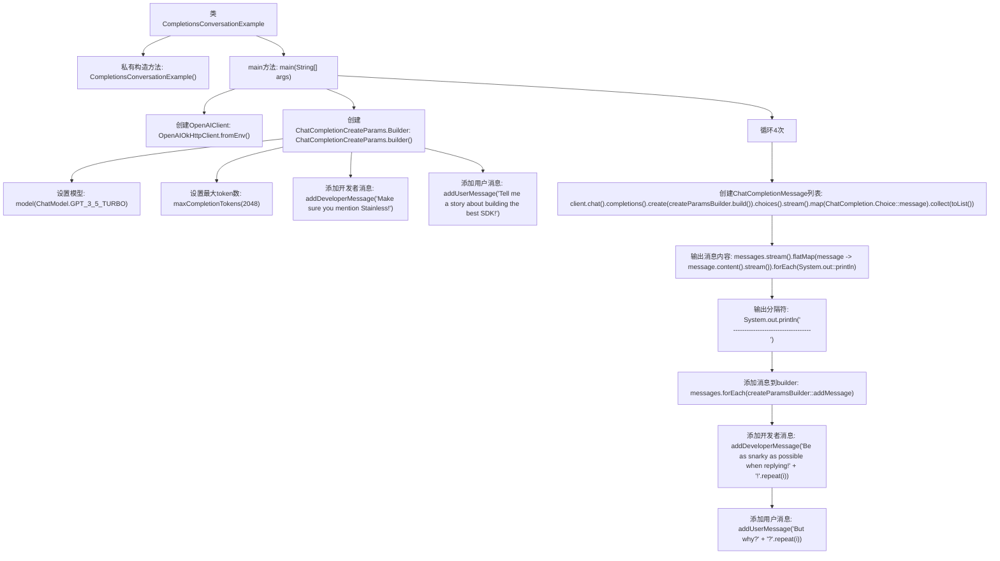

# 基础信息

|      |      |
|------|------|
| 名称 | CompletionsConversationExample |
| 编码语言 | .java |
| 代码路径 | openai-java/openai-java-example/src/main/java/com/openai/example/CompletionsConversationExample.java |
| 包名 | com.openai.example |
| 依赖项 | ['java.util.stream.Collectors.toList', 'com.openai.client.OpenAIClient', 'com.openai.client.okhttp.OpenAIOkHttpClient', 'com.openai.models.ChatModel', 'com.openai.models.chat.completions.ChatCompletion', 'com.openai.models.chat.completions.ChatCompletionCreateParams', 'com.openai.models.chat.completions.ChatCompletionMessage', 'java.util.List'] |
| 概述说明 | Java示例：使用OpenAI客户端循环生成并打印聊天回复。 |

# 说明

该示例展示了如何使用Java编写一个程序，通过OpenAI客户端构建聊天对话。程序的核心功能是循环生成并打印回复，实现了与OpenAI模型的交互。具体流程包括初始化OpenAI客户端，发送用户输入，接收模型生成的回复，并在控制台中打印输出。该示例适用于需要与AI模型进行持续对话的场景，展示了如何通过编程实现自动化对话生成。

# 类列表 Class Summary

| 名称   | 类型  | 说明 |
|-------|------|-------------|
| CompletionsConversationExample | class | Java示例：通过OpenAI客户端构建聊天对话，循环生成并打印回复。 |

## 类 CompletionsConversationExample

|      |      |
|------|------|
| 访问范围 | public final |
| 类型 | class |
| 名称 | CompletionsConversationExample |
| 说明 | Java示例：通过OpenAI客户端构建聊天对话，循环生成并打印回复。 |

### UML类图

这段代码展示了一个使用OpenAI API进行对话生成的示例。`CompletionsConversationExample`类通过`OpenAIClient`与OpenAI API进行交互，构建并发送对话请求。`ChatCompletionCreateParams.Builder`用于构建对话参数，并通过循环不断添加新的消息。每次请求后，系统会打印生成的回复，并在下一次请求中添加新的对话内容。整个过程展示了如何通过API进行多轮对话生成。

### 内部方法调用关系图

这段代码展示了如何使用OpenAI客户端进行对话生成。代码首先配置了OpenAI客户端，然后通过构建器模式创建了一个对话生成请求，并设置了模型和最大token数。接着，代码进入一个循环，每次循环都会生成新的对话消息并输出，同时将生成的消息添加到请求构建器中，以便在下一轮循环中使用。整个过程重复4次，每次都会添加不同的开发者消息和用户消息。

### 字段列表 Field List

| 名称  | 类型  | 说明 |
|-------|-------|------|

### 方法列表 Method List

| 名称  | 类型  | 说明 |
|-------|-------|------|
| main | void | Java代码通过环境变量配置OpenAI客户端，构建聊天参数并循环生成和输出聊天内容。 |

