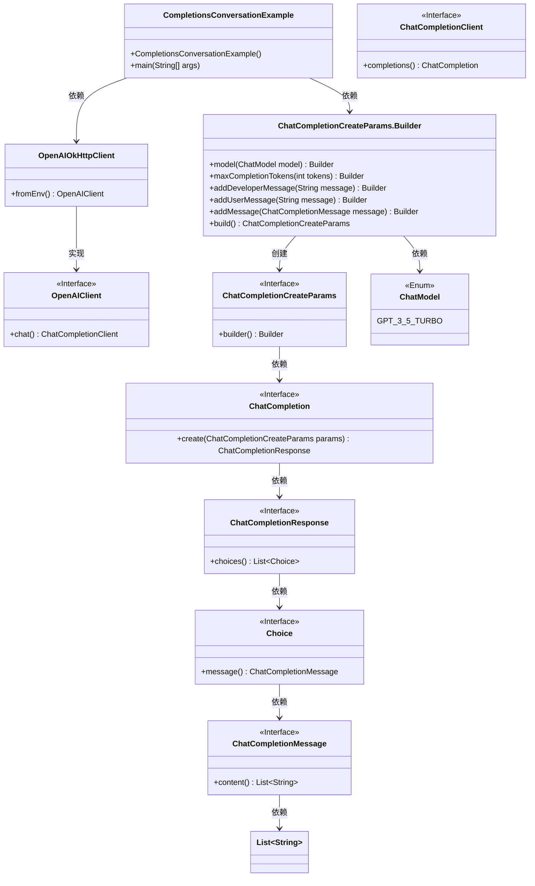
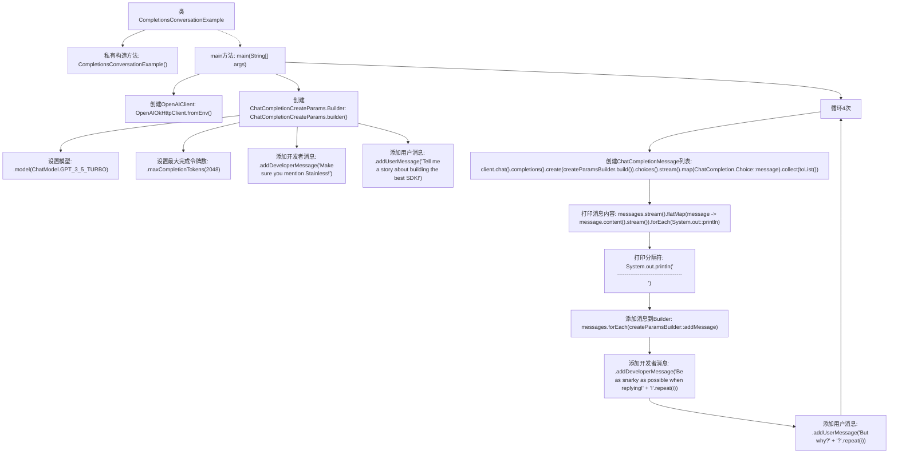

# 基础信息

|      |      |
|------|------|
| 名称 | CompletionsConversationExample |
| 编码语言 | .java |
| 代码路径 | openai-java/openai-java-example/src/main/java/com/openai/example/CompletionsConversationExample.java |
| 包名 | com.openai.example |
| 依赖项 | ['java.util.stream.Collectors.toList', 'com.openai.client.OpenAIClient', 'com.openai.client.okhttp.OpenAIOkHttpClient', 'com.openai.models.ChatModel', 'com.openai.models.chat.completions.ChatCompletion', 'com.openai.models.chat.completions.ChatCompletionCreateParams', 'com.openai.models.chat.completions.ChatCompletionMessage', 'java.util.List'] |
| 概述说明 | Java代码利用OpenAI API生成对话，支持环境变量配置，循环输出四次对话内容。 |

# 说明

该Java示例代码通过调用OpenAI API生成对话内容，支持通过环境变量进行配置，确保灵活性和安全性。代码设计为循环四次，每次循环都会输出生成的对话内容，从而实现多次对话生成的功能。整个过程旨在展示如何利用OpenAI API进行对话生成，并通过环境变量管理配置参数，适用于需要多次生成对话内容的场景。

# 类列表 Class Summary

| 名称   | 类型  | 说明 |
|-------|------|-------------|
| CompletionsConversationExample | class | Java示例代码使用OpenAI API生成对话，支持环境变量配置，循环四次输出对话内容。 |

## 类 CompletionsConversationExample

|      |      |
|------|------|
| 访问范围 | public final |
| 类型 | class |
| 名称 | CompletionsConversationExample |
| 说明 | Java示例代码使用OpenAI API生成对话，支持环境变量配置，循环四次输出对话内容。 |

### UML类图

```mermaid
classDiagram
    class CompletionsConversationExample {
        +CompletionsConversationExample()
        +main(String[] args)
    }

    class OpenAIClient {
        <<Interface>>
        +chat() ChatCompletionClient
    }

    class OpenAIOkHttpClient {
        +fromEnv() OpenAIClient
    }

    class ChatCompletionCreateParams {
        <<Interface>>
        +builder() Builder
    }

    class ChatCompletionCreateParams.Builder {
        +model(ChatModel model) Builder
        +maxCompletionTokens(int tokens) Builder
        +addDeveloperMessage(String message) Builder
        +addUserMessage(String message) Builder
        +addMessage(ChatCompletionMessage message) Builder
        +build() ChatCompletionCreateParams
    }

    class ChatCompletionClient {
        <<Interface>>
        +completions() ChatCompletion
    }

    class ChatCompletion {
        <<Interface>>
        +create(ChatCompletionCreateParams params) ChatCompletionResponse
    }

    class ChatCompletionResponse {
        <<Interface>>
        +choices() List~Choice~
    }

    class Choice {
        <<Interface>>
        +message() ChatCompletionMessage
    }

    class ChatCompletionMessage {
        <<Interface>>
        +content() List~String~
    }

    class ChatModel {
        <<Enum>>
        GPT_3_5_TURBO
    }

    CompletionsConversationExample --> OpenAIOkHttpClient : 依赖
    OpenAIOkHttpClient --> OpenAIClient : 实现
    CompletionsConversationExample --> ChatCompletionCreateParams.Builder : 依赖
    ChatCompletionCreateParams.Builder --> ChatCompletionCreateParams : 创建
    ChatCompletionCreateParams --> ChatCompletion : 依赖
    ChatCompletion --> ChatCompletionResponse : 依赖
    ChatCompletionResponse --> Choice : 依赖
    Choice --> ChatCompletionMessage : 依赖
    ChatCompletionMessage --> List~String~ : 依赖
    ChatCompletionCreateParams.Builder --> ChatModel : 依赖
```

### 描述
这段代码展示了一个与OpenAI API进行对话的示例。`CompletionsConversationExample`类通过`OpenAIOkHttpClient`从环境变量中获取配置，并使用`ChatCompletionCreateParams.Builder`构建对话参数。通过循环，程序不断生成对话内容，并将每次的回复添加到下一次的请求中。类图展示了各个类之间的关系，包括接口的实现、依赖关系以及类的构建过程。

### 内部方法调用关系图

```mermaid
graph TD
    A["类CompletionsConversationExample"]
    B["私有构造方法: CompletionsConversationExample()"]
    C["main方法: main(String[] args)"]
    D["创建OpenAIClient: OpenAIOkHttpClient.fromEnv()"]
    E["创建ChatCompletionCreateParams.Builder: ChatCompletionCreateParams.builder()"]
    F["设置模型: .model(ChatModel.GPT_3_5_TURBO)"]
    G["设置最大完成令牌数: .maxCompletionTokens(2048)"]
    H["添加开发者消息: .addDeveloperMessage('Make sure you mention Stainless!')"]
    I["添加用户消息: .addUserMessage('Tell me a story about building the best SDK!')"]
    J["循环4次"]
    K["创建ChatCompletionMessage列表: client.chat().completions().create(createParamsBuilder.build()).choices().stream().map(ChatCompletion.Choice::message).collect(toList())"]
    L["打印消息内容: messages.stream().flatMap(message -> message.content().stream()).forEach(System.out::println)"]
    M["打印分隔符: System.out.println('\n-----------------------------------\n')"]
    N["添加消息到Builder: messages.forEach(createParamsBuilder::addMessage)"]
    O["添加开发者消息: .addDeveloperMessage('Be as snarky as possible when replying!' + '!'.repeat(i))"]
    P["添加用户消息: .addUserMessage('But why?' + '?'.repeat(i))"]

    A --> B
    A -.-> C
    C --> D
    C --> E
    E --> F
    E --> G
    E --> H
    E --> I
    C --> J
    J --> K
    K --> L
    L --> M
    M --> N
    N --> O
    O --> P
    P --> J
```

这段代码展示了如何使用OpenAI的API进行对话生成。代码首先配置了OpenAI客户端，然后构建了一个对话参数生成器，设置了模型和最大令牌数，并添加了初始的开发者消息和用户消息。接着，代码进入一个循环，每次循环都会生成对话消息并打印出来，然后将这些消息添加到生成器中，继续生成新的对话。循环中，开发者消息和用户消息会随着循环次数的增加而逐渐增加感叹号和问号的数量。

### 字段列表 Field List

| 名称  | 类型  | 说明 |
|-------|-------|------|

### 方法列表 Method List

| 名称  | 类型  | 说明 |
|-------|-------|------|
| main | void | Java代码配置OpenAI客户端，构建聊天参数并循环生成回复。 |

