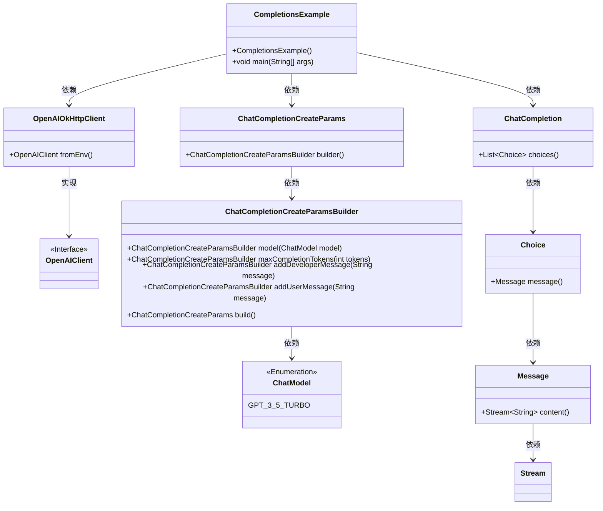
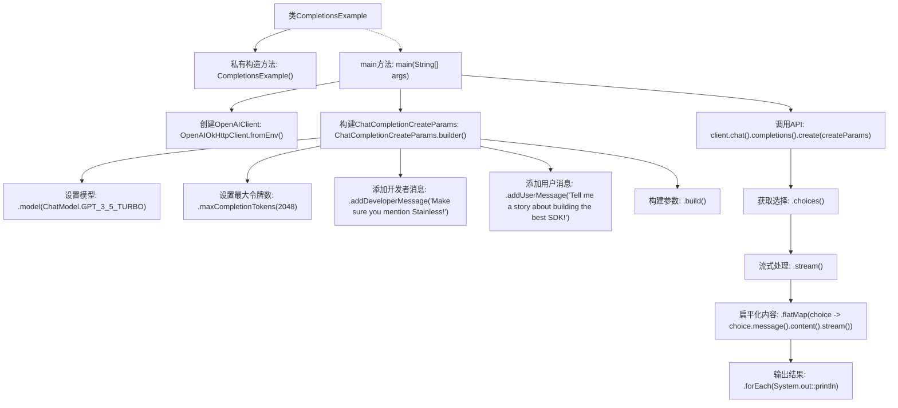

# 基础信息

|      |      |
|------|------|
| 名称 | CompletionsExample |
| 编码语言 | .java |
| 代码路径 | openai-java/openai-java-example/src/main/java/com/openai/example/CompletionsExample.java |
| 包名 | com.openai.example |
| 依赖项 | ['com.openai.client.OpenAIClient', 'com.openai.client.okhttp.OpenAIOkHttpClient', 'com.openai.models.ChatModel', 'com.openai.models.chat.completions.ChatCompletionCreateParams'] |
| 概述说明 | Java代码通过OpenAI客户端生成聊天故事内容。 |

# 说明

该Java示例代码展示了如何使用OpenAI客户端生成聊天完成，并输出故事内容。代码通过调用OpenAI的API接口，传入必要的参数和配置，生成一段连贯的故事文本。整个过程包括初始化客户端、设置请求参数、发送请求并处理返回的响应，最终将生成的文本输出。此示例展示了如何利用OpenAI的强大语言模型进行自动化内容创作。

# 类列表 Class Summary

| 名称   | 类型  | 说明 |
|-------|------|-------------|
| CompletionsExample | class | Java示例代码，使用OpenAI客户端生成聊天完成，输出故事内容。 |

## 类 CompletionsExample

|      |      |
|------|------|
| 访问范围 | public final |
| 类型 | class |
| 名称 | CompletionsExample |
| 说明 | Java示例代码，使用OpenAI客户端生成聊天完成，输出故事内容。 |

### UML类图

这段代码展示了如何使用OpenAI客户端生成聊天补全（Chat Completion）。`CompletionsExample`类通过`OpenAIOkHttpClient`从环境变量中获取OpenAI客户端，并构建聊天补全请求参数`ChatCompletionCreateParams`，最终调用客户端生成补全结果并输出。类图清晰地展示了各个类之间的依赖关系，以及接口与实现类的层级关系。

### 内部方法调用关系图

这段代码是一个使用OpenAI API生成聊天补全的示例。它首先通过环境变量配置OpenAIClient，然后构建一个包含模型、最大令牌数、开发者消息和用户消息的请求参数。接着，它调用API生成补全内容，并将结果流式处理并输出到控制台。

### 字段列表 Field List

| 名称  | 类型  | 说明 |
|-------|-------|------|

### 方法列表 Method List

| 名称  | 类型  | 说明 |
|-------|-------|------|
| main | void | Java代码通过环境变量配置OpenAI客户端，使用GPT-3.5模型生成SDK构建故事。 |

