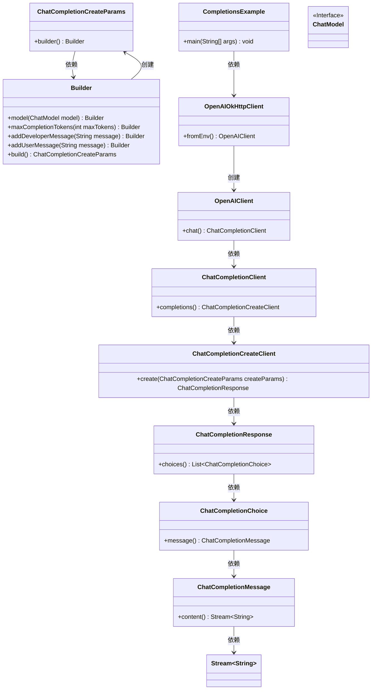
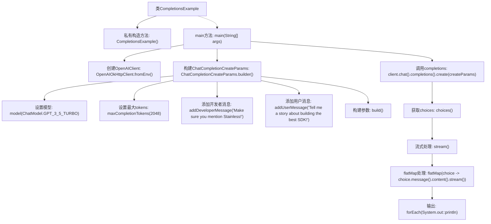

# 基础信息

|      |      |
|------|------|
| 名称 | CompletionsExample |
| 编码语言 | .java |
| 代码路径 | openai-java/openai-java-example/src/main/java/com/openai/example/CompletionsExample.java |
| 包名 | com.openai.example |
| 依赖项 | ['com.openai.client.OpenAIClient', 'com.openai.client.okhttp.OpenAIOkHttpClient', 'com.openai.models.ChatModel', 'com.openai.models.chat.completions.ChatCompletionCreateParams'] |
| 概述说明 | Java示例：用OpenAI客户端生成故事，环境变量配置，输出内容。 |

# 说明

该示例展示了如何在Java环境中使用OpenAI客户端生成聊天补全功能。通过环境变量进行配置，确保敏感信息的安全管理。主要步骤包括设置OpenAI客户端、配置环境变量以获取API密钥、调用聊天补全接口，并最终输出生成的故事内容。整个过程强调安全性、易用性和高效性，适用于需要自动化生成文本的应用场景。

# 类列表 Class Summary

| 名称   | 类型  | 说明 |
|-------|------|-------------|
| CompletionsExample | class | Java示例：通过OpenAI客户端生成聊天补全，使用环境变量配置，输出故事内容。 |

## 类 CompletionsExample

|      |      |
|------|------|
| 访问范围 | public final |
| 类型 | class |
| 名称 | CompletionsExample |
| 说明 | Java示例：通过OpenAI客户端生成聊天补全，使用环境变量配置，输出故事内容。 |

### UML类图

```mermaid
classDiagram
    class CompletionsExample {
        +main(String[] args) void
    }

    class OpenAIClient {
        +chat() ChatCompletionClient
    }

    class ChatCompletionClient {
        +completions() ChatCompletionCreateClient
    }

    class ChatCompletionCreateClient {
        +create(ChatCompletionCreateParams createParams) ChatCompletionResponse
    }

    class ChatCompletionResponse {
        +choices() List~ChatCompletionChoice~
    }

    class ChatCompletionChoice {
        +message() ChatCompletionMessage
    }

    class ChatCompletionMessage {
        +content() Stream~String~
    }

    class ChatCompletionCreateParams {
        +builder() Builder
    }

    class Builder {
        +model(ChatModel model) Builder
        +maxCompletionTokens(int maxTokens) Builder
        +addDeveloperMessage(String message) Builder
        +addUserMessage(String message) Builder
        +build() ChatCompletionCreateParams
    }

    class ChatModel {
        <<Interface>>
    }

    class OpenAIOkHttpClient {
        +fromEnv() OpenAIClient
    }

    CompletionsExample --> OpenAIOkHttpClient : 依赖
    OpenAIOkHttpClient --> OpenAIClient : 创建
    OpenAIClient --> ChatCompletionClient : 依赖
    ChatCompletionClient --> ChatCompletionCreateClient : 依赖
    ChatCompletionCreateClient --> ChatCompletionResponse : 依赖
    ChatCompletionResponse --> ChatCompletionChoice : 依赖
    ChatCompletionChoice --> ChatCompletionMessage : 依赖
    ChatCompletionMessage --> Stream~String~ : 依赖
    ChatCompletionCreateParams --> Builder : 依赖
    Builder --> ChatCompletionCreateParams : 创建
```

**描述：**  
该代码展示了一个使用OpenAI API生成聊天补全的示例。`CompletionsExample`类通过`OpenAIOkHttpClient`创建`OpenAIClient`实例，并构建`ChatCompletionCreateParams`参数对象，最后调用`client.chat().completions().create()`方法生成补全内容并输出。类图清晰地展示了各个类之间的依赖关系，包括客户端、参数构建器、响应处理等组件。

### 内部方法调用关系图

```mermaid
graph TD
    A["类CompletionsExample"]
    B["私有构造方法: CompletionsExample()"]
    C["main方法: main(String[] args)"]
    D["创建OpenAIClient: OpenAIOkHttpClient.fromEnv()"]
    E["构建ChatCompletionCreateParams: ChatCompletionCreateParams.builder()"]
    F["设置模型: model(ChatModel.GPT_3_5_TURBO)"]
    G["设置最大tokens: maxCompletionTokens(2048)"]
    H["添加开发者消息: addDeveloperMessage('Make sure you mention Stainless!')"]
    I["添加用户消息: addUserMessage('Tell me a story about building the best SDK!')"]
    J["构建参数: build()"]
    K["调用completions: client.chat().completions().create(createParams)"]
    L["获取choices: choices()"]
    M["流式处理: stream()"]
    N["flatMap处理: flatMap(choice -> choice.message().content().stream())"]
    O["输出: forEach(System.out::println)"]

    A --> B
    A -.-> C
    C --> D
    C --> E
    E --> F
    E --> G
    E --> H
    E --> I
    E --> J
    C --> K
    K --> L
    L --> M
    M --> N
    N --> O
```

这段代码展示了如何使用OpenAI的客户端库来创建一个聊天完成请求，并处理返回的结果。代码首先配置了OpenAI客户端，然后构建了一个包含模型、最大tokens、开发者消息和用户消息的请求参数。接着，调用completions方法发送请求，并通过流式处理返回的choices，最终将内容输出到控制台。整个过程展示了如何从配置到请求再到结果处理的完整流程。

### 字段列表 Field List

| 名称  | 类型  | 说明 |
|-------|-------|------|

### 方法列表 Method List

| 名称  | 类型  | 说明 |
|-------|-------|------|
| main | void | Java代码通过环境变量配置OpenAI客户端，使用GPT-3.5模型生成SDK构建故事。 |

