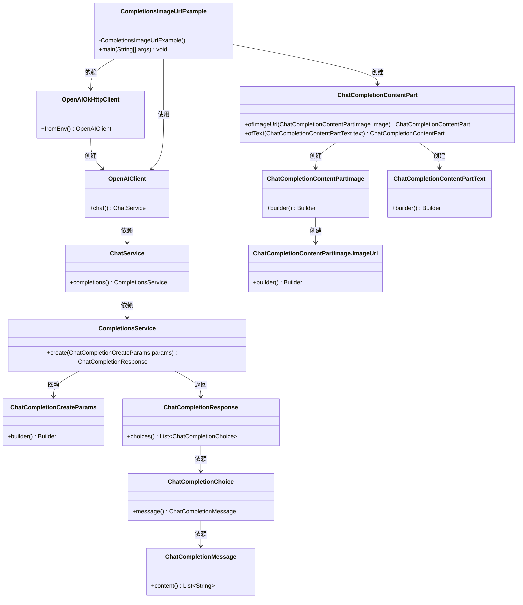
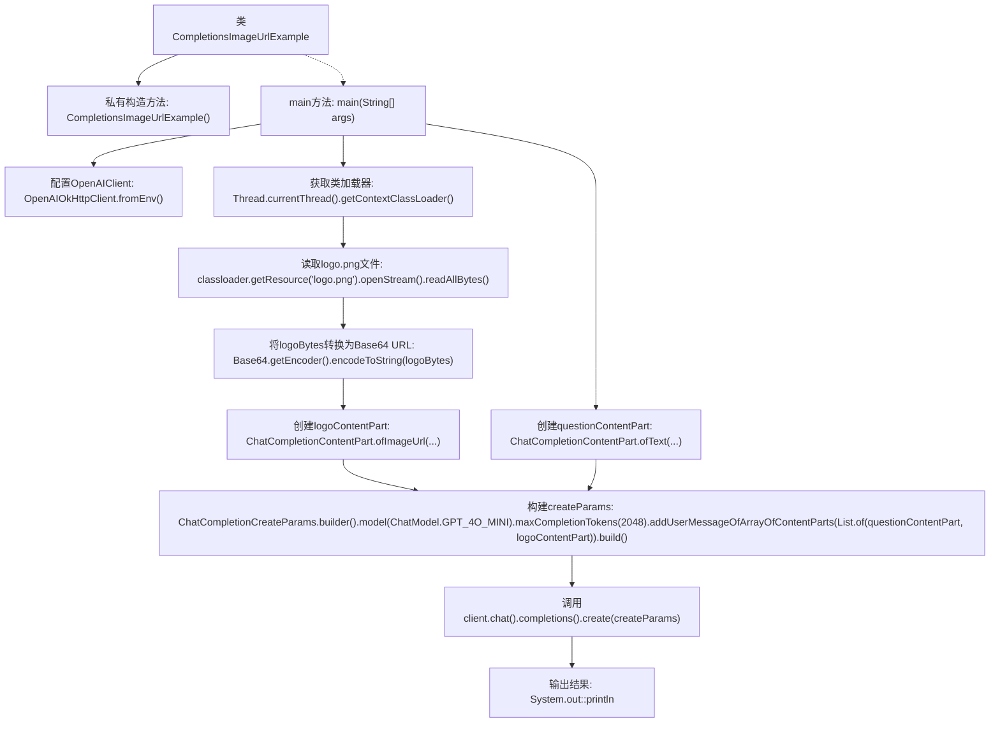

# 基础信息

|      |      |
|------|------|
| 名称 | CompletionsImageUrlExample |
| 编码语言 | .java |
| 代码路径 | openai-java/openai-java-example/src/main/java/com/openai/example/CompletionsImageUrlExample.java |
| 包名 | com.openai.example |
| 依赖项 | ['com.openai.client.OpenAIClient', 'com.openai.client.okhttp.OpenAIOkHttpClient', 'com.openai.models.ChatModel', 'com.openai.models.chat.completions.ChatCompletionContentPart', 'com.openai.models.chat.completions.ChatCompletionContentPartImage', 'com.openai.models.chat.completions.ChatCompletionContentPartText', 'com.openai.models.chat.completions.ChatCompletionCreateParams', 'java.io.IOException', 'java.net.URISyntaxException', 'java.util.Base64', 'java.util.List'] |
| 概述说明 | Java代码调用OpenAI API，处理图片并获取GPT-4响应。 |

# 说明

该Java示例代码展示了如何通过OpenAI API实现图片的加载与编码，并将图片及其描述请求发送至GPT-4模型，最终获取并输出GPT-4的响应。整个过程涉及图片处理、API调用以及响应解析，旨在利用GPT-4的强大能力生成与图片相关的描述或分析。

# 类列表 Class Summary

| 名称   | 类型  | 说明 |
|-------|------|-------------|
| CompletionsImageUrlExample | class | Java示例代码使用OpenAI API，加载并编码图片，发送图片和描述请求，输出GPT-4响应。 |

## 类 CompletionsImageUrlExample

|      |      |
|------|------|
| 访问范围 | public final |
| 类型 | class |
| 名称 | CompletionsImageUrlExample |
| 说明 | Java示例代码使用OpenAI API，加载并编码图片，发送图片和描述请求，输出GPT-4响应。 |

### UML类图

这段代码的主要功能是通过OpenAI API发送一个包含图片和文本的聊天请求，并打印出返回的聊天内容。代码首先从环境变量中获取OpenAI客户端配置，然后加载本地图片并将其转换为Base64编码的URL。接着，代码构建了一个包含图片和文本的聊天请求，并发送给OpenAI的GPT-4模型进行处理。最后，代码将返回的聊天内容打印到控制台。

### 内部方法调用关系图

这段代码的主要功能是通过OpenAI客户端发送一个包含图像和文本的聊天请求，并输出生成的回复。代码首先配置了OpenAI客户端，然后加载了一个图像文件并将其转换为Base64 URL格式。接着，代码创建了包含图像和文本的聊天内容部分，并构建了聊天请求参数。最后，代码调用OpenAI客户端发送请求，并输出生成的回复内容。

### 字段列表 Field List

| 名称  | 类型  | 说明 |
|-------|-------|------|

### 方法列表 Method List

| 名称  | 类型  | 说明 |
|-------|-------|------|
| main | void | Java代码通过环境变量配置OpenAI客户端，加载并编码图片为Base64，发送图片描述请求并输出结果。 |

