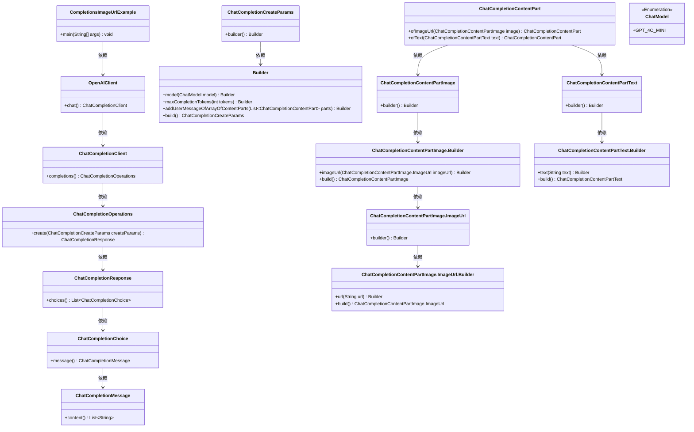
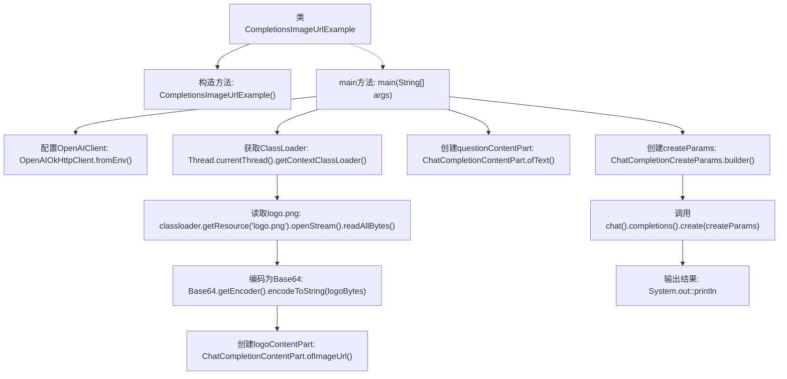

# 基础信息

|      |      |
|------|------|
| 名称 | CompletionsImageUrlExample |
| 编码语言 | .java |
| 代码路径 | openai-java/openai-java-example/src/main/java/com/openai/example/CompletionsImageUrlExample.java |
| 包名 | com.openai.example |
| 依赖项 | ['com.openai.client.OpenAIClient', 'com.openai.client.okhttp.OpenAIOkHttpClient', 'com.openai.models.ChatModel', 'com.openai.models.chat.completions.ChatCompletionContentPart', 'com.openai.models.chat.completions.ChatCompletionContentPartImage', 'com.openai.models.chat.completions.ChatCompletionContentPartText', 'com.openai.models.chat.completions.ChatCompletionCreateParams', 'java.io.IOException', 'java.net.URISyntaxException', 'java.util.Base64', 'java.util.List'] |
| 概述说明 | Java代码通过OpenAI API发送图文聊天请求。 |

# 说明

Java示例代码通过OpenAI API发送一个包含图片和文本的聊天请求。该请求旨在利用OpenAI的多模态能力，将图片和文本内容一并提交，以获取相应的聊天回复。此过程涉及构建请求体，包含图片数据和文本信息，并通过API接口发送请求。代码展示了如何整合多种数据类型，并调用OpenAI API实现多模态交互。

# 类列表 Class Summary

| 名称   | 类型  | 说明 |
|-------|------|-------------|
| CompletionsImageUrlExample | class | Java示例代码通过OpenAI API发送包含图片和文本的聊天请求。 |

## 类 CompletionsImageUrlExample

|      |      |
|------|------|
| 访问范围 | public final |
| 类型 | class |
| 名称 | CompletionsImageUrlExample |
| 说明 | Java示例代码通过OpenAI API发送包含图片和文本的聊天请求。 |

### UML类图

```mermaid
classDiagram
    class CompletionsImageUrlExample {
        +main(String[] args) void
    }
    class OpenAIClient {
        +chat() ChatCompletionClient
    }
    class ChatCompletionClient {
        +completions() ChatCompletionOperations
    }
    class ChatCompletionOperations {
        +create(ChatCompletionCreateParams createParams) ChatCompletionResponse
    }
    class ChatCompletionResponse {
        +choices() List~ChatCompletionChoice~
    }
    class ChatCompletionChoice {
        +message() ChatCompletionMessage
    }
    class ChatCompletionMessage {
        +content() List~String~
    }
    class ChatCompletionCreateParams {
        +builder() Builder
    }
    class Builder {
        +model(ChatModel model) Builder
        +maxCompletionTokens(int tokens) Builder
        +addUserMessageOfArrayOfContentParts(List~ChatCompletionContentPart~ parts) Builder
        +build() ChatCompletionCreateParams
    }
    class ChatCompletionContentPart {
        +ofImageUrl(ChatCompletionContentPartImage image) ChatCompletionContentPart
        +ofText(ChatCompletionContentPartText text) ChatCompletionContentPart
    }
    class ChatCompletionContentPartImage {
        +builder() Builder
    }
    class ChatCompletionContentPartImage.Builder {
        +imageUrl(ChatCompletionContentPartImage.ImageUrl imageUrl) Builder
        +build() ChatCompletionContentPartImage
    }
    class ChatCompletionContentPartImage.ImageUrl {
        +builder() Builder
    }
    class ChatCompletionContentPartImage.ImageUrl.Builder {
        +url(String url) Builder
        +build() ChatCompletionContentPartImage.ImageUrl
    }
    class ChatCompletionContentPartText {
        +builder() Builder
    }
    class ChatCompletionContentPartText.Builder {
        +text(String text) Builder
        +build() ChatCompletionContentPartText
    }
    class ChatModel {
        <<Enumeration>>
        +GPT_4O_MINI
    }
    CompletionsImageUrlExample --> OpenAIClient : 依赖
    OpenAIClient --> ChatCompletionClient : 依赖
    ChatCompletionClient --> ChatCompletionOperations : 依赖
    ChatCompletionOperations --> ChatCompletionResponse : 依赖
    ChatCompletionResponse --> ChatCompletionChoice : 依赖
    ChatCompletionChoice --> ChatCompletionMessage : 依赖
    ChatCompletionCreateParams --> Builder : 依赖
    ChatCompletionContentPart --> ChatCompletionContentPartImage : 依赖
    ChatCompletionContentPart --> ChatCompletionContentPartText : 依赖
    ChatCompletionContentPartImage --> ChatCompletionContentPartImage.Builder : 依赖
    ChatCompletionContentPartImage.Builder --> ChatCompletionContentPartImage.ImageUrl : 依赖
    ChatCompletionContentPartImage.ImageUrl --> ChatCompletionContentPartImage.ImageUrl.Builder : 依赖
    ChatCompletionContentPartText --> ChatCompletionContentPartText.Builder : 依赖
```

**描述：**
该代码展示了一个使用OpenAI API生成图像描述的过程。`CompletionsImageUrlExample`类通过`OpenAIClient`与OpenAI服务进行交互，构造包含图像和文本的聊天内容，并发送请求以获取描述结果。类图中展示了各个类之间的依赖关系，包括客户端、聊天内容构建、请求参数设置等，清晰地反映了代码的结构和流程。

### 内部方法调用关系图

```mermaid
graph TD
    A["类CompletionsImageUrlExample"]
    B["构造方法: CompletionsImageUrlExample()"]
    C["main方法: main(String[] args)"]
    D["配置OpenAIClient: OpenAIOkHttpClient.fromEnv()"]
    E["获取ClassLoader: Thread.currentThread().getContextClassLoader()"]
    F["读取logo.png: classloader.getResource('logo.png').openStream().readAllBytes()"]
    G["编码为Base64: Base64.getEncoder().encodeToString(logoBytes)"]
    H["创建logoContentPart: ChatCompletionContentPart.ofImageUrl()"]
    I["创建questionContentPart: ChatCompletionContentPart.ofText()"]
    J["创建createParams: ChatCompletionCreateParams.builder()"]
    K["调用chat().completions().create(createParams)"]
    L["输出结果: System.out::println"]

    A --> B
    A -.-> C
    C --> D
    C --> E
    E --> F
    F --> G
    G --> H
    C --> I
    C --> J
    J --> K
    K --> L
```

该流程图展示了`CompletionsImageUrlExample`类的执行流程。程序首先配置OpenAIClient，然后通过ClassLoader读取并编码logo.png文件为Base64格式。接着，程序创建了两个内容部分（logoContentPart和questionContentPart），并构建了ChatCompletionCreateParams对象。最后，程序调用OpenAIClient的chat().completions().create方法，并输出结果。整个过程展示了如何将图像和文本内容结合并发送给OpenAI的API进行处理。

### 字段列表 Field List

| 名称  | 类型  | 说明 |
|-------|-------|------|

### 方法列表 Method List

| 名称  | 类型  | 说明 |
|-------|-------|------|
| main | void | Java代码配置OpenAI客户端，加载图片并生成描述请求。 |

