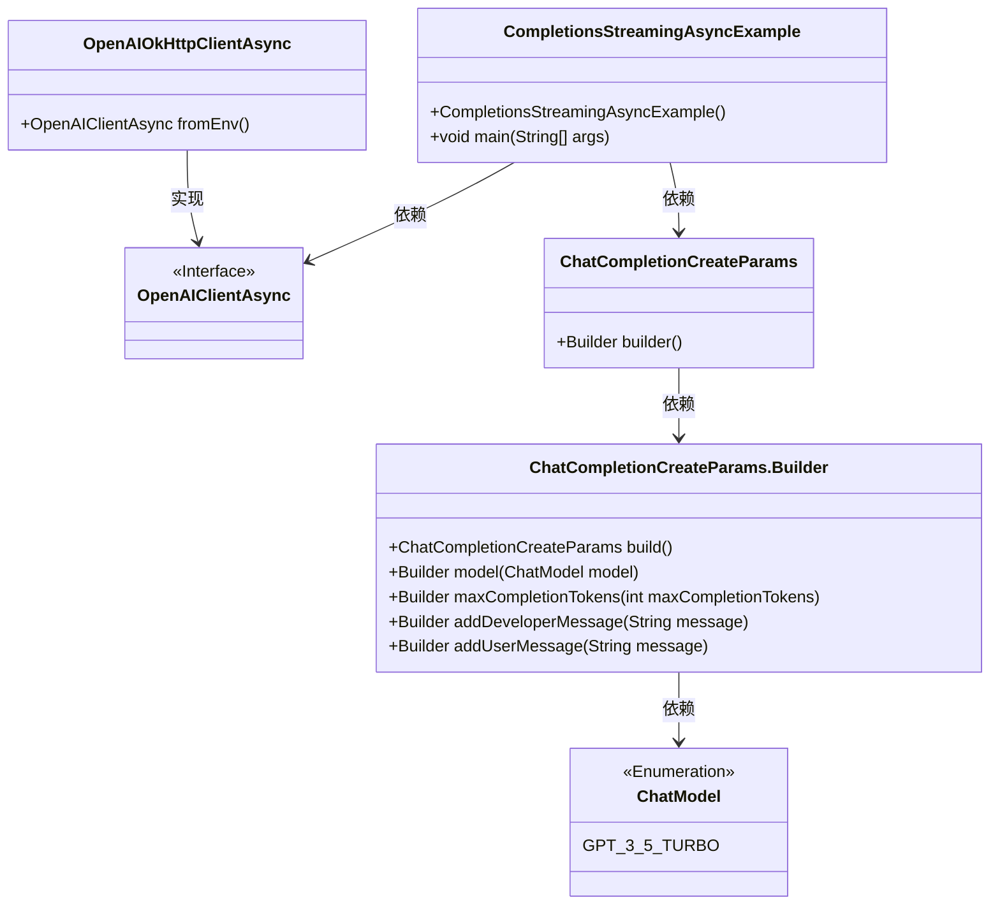
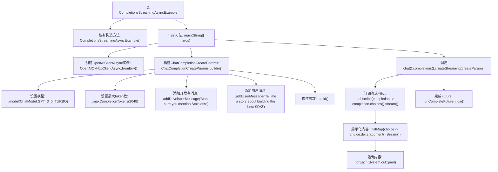

# 基础信息

|      |      |
|------|------|
| 名称 | CompletionsStreamingAsyncExample |
| 编码语言 | .java |
| 代码路径 | openai-java/openai-java-example/src/main/java/com/openai/example/CompletionsStreamingAsyncExample.java |
| 包名 | com.openai.example |
| 依赖项 | ['com.openai.client.OpenAIClientAsync', 'com.openai.client.okhttp.OpenAIOkHttpClientAsync', 'com.openai.models.ChatModel', 'com.openai.models.chat.completions.ChatCompletionCreateParams'] |
| 概述说明 | 异步流式生成GPT-3.5-Turbo对话，通过环境变量配置客户端。 |

# 说明

该内容描述了一个使用环境变量配置客户端的异步流式生成GPT-3.5-Turbo对话完成示例。通过异步流式生成，系统能够逐步输出对话内容，提升用户体验和响应速度。环境变量配置确保了客户端设置的灵活性和安全性，避免硬编码敏感信息。该方法适用于需要高效处理大规模对话请求的应用场景，如智能客服或实时聊天系统。

# 类列表 Class Summary

| 名称   | 类型  | 说明 |
|-------|------|-------------|
| CompletionsStreamingAsyncExample | class | 异步流式生成GPT-3.5-Turbo对话完成示例，使用环境变量配置客户端。 |

## 类 CompletionsStreamingAsyncExample

|      |      |
|------|------|
| 访问范围 | public final |
| 类型 | class |
| 名称 | CompletionsStreamingAsyncExample |
| 说明 | 异步流式生成GPT-3.5-Turbo对话完成示例，使用环境变量配置客户端。 |

### UML类图

这段代码展示了如何使用异步客户端与OpenAI API进行交互，生成流式聊天补全。`CompletionsStreamingAsyncExample`类通过环境变量配置客户端，构建聊天补全请求参数，并订阅流式响应以实时输出生成的内容。代码涉及多个类，包括客户端、请求参数构建器、模型枚举等，展示了异步流式处理的核心流程。

### 内部方法调用关系图

这段代码展示了如何使用异步流式API与OpenAI进行交互。首先，通过环境变量配置客户端，然后构建聊天完成参数，包括模型、最大token数和消息内容。接着，调用流式创建方法并订阅响应，最终将内容输出到控制台。代码通过异步操作处理流式响应，确保在完成时进行同步等待。

### 字段列表 Field List

| 名称  | 类型  | 说明 |
|-------|-------|------|

### 方法列表 Method List

| 名称  | 类型  | 说明 |
|-------|-------|------|
| main | void | Java代码配置OpenAI客户端，使用环境变量，创建聊天参数并流式输出结果。 |

