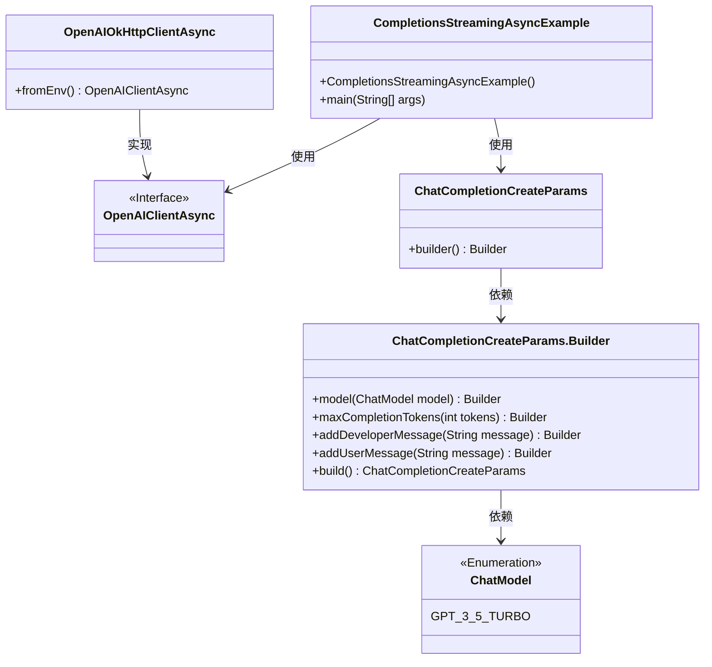
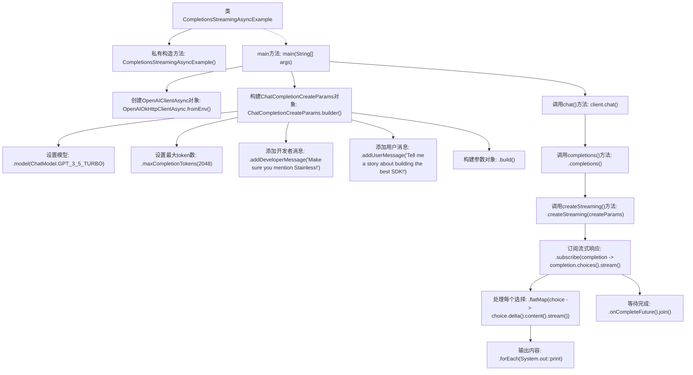

# 基础信息

|      |      |
|------|------|
| 名称 | CompletionsStreamingAsyncExample |
| 编码语言 | .java |
| 代码路径 | openai-java/openai-java-example/src/main/java/com/openai/example/CompletionsStreamingAsyncExample.java |
| 包名 | com.openai.example |
| 依赖项 | ['com.openai.client.OpenAIClientAsync', 'com.openai.client.okhttp.OpenAIOkHttpClientAsync', 'com.openai.models.ChatModel', 'com.openai.models.chat.completions.ChatCompletionCreateParams'] |
| 概述说明 | Java代码示例演示OpenAI API流式生成聊天内容。 |

# 说明

该Java示例代码展示了如何通过OpenAI API实现流式生成聊天完成内容。代码详细描述了如何设置API请求参数，包括模型选择、输入提示和流式响应配置。通过使用流式处理，代码能够实时接收并处理API返回的部分结果，从而在生成完整响应之前逐步显示聊天内容。此外，代码还展示了如何处理API响应中的错误和异常情况，确保程序的健壮性。整体流程包括初始化API客户端、构建请求、发送请求、处理流式响应以及最终结果的整合与输出。

# 类列表 Class Summary

| 名称   | 类型  | 说明 |
|-------|------|-------------|
| CompletionsStreamingAsyncExample | class | Java示例代码展示使用OpenAI API流式生成聊天完成内容。 |

## 类 CompletionsStreamingAsyncExample

|      |      |
|------|------|
| 访问范围 | public final |
| 类型 | class |
| 名称 | CompletionsStreamingAsyncExample |
| 说明 | Java示例代码展示使用OpenAI API流式生成聊天完成内容。 |

### UML类图

```mermaid
classDiagram
    class CompletionsStreamingAsyncExample {
        +CompletionsStreamingAsyncExample()
        +main(String[] args)
    }

    class OpenAIClientAsync {
        <<Interface>>
    }

    class OpenAIOkHttpClientAsync {
        +fromEnv() OpenAIClientAsync
    }

    class ChatCompletionCreateParams {
        +builder() Builder
    }

    class ChatCompletionCreateParams.Builder {
        +model(ChatModel model) Builder
        +maxCompletionTokens(int tokens) Builder
        +addDeveloperMessage(String message) Builder
        +addUserMessage(String message) Builder
        +build() ChatCompletionCreateParams
    }

    class ChatModel {
        <<Enumeration>>
        GPT_3_5_TURBO
    }

    CompletionsStreamingAsyncExample --> OpenAIClientAsync : 使用
    OpenAIOkHttpClientAsync --> OpenAIClientAsync : 实现
    CompletionsStreamingAsyncExample --> ChatCompletionCreateParams : 使用
    ChatCompletionCreateParams --> ChatCompletionCreateParams.Builder : 依赖
    ChatCompletionCreateParams.Builder --> ChatModel : 依赖
```

**描述：**
`CompletionsStreamingAsyncExample` 类是一个示例程序，展示了如何使用异步客户端与OpenAI API进行流式对话。它通过环境变量配置客户端，构建对话参数，并订阅流式响应的完成事件。类图展示了 `CompletionsStreamingAsyncExample` 与 `OpenAIClientAsync`、`OpenAIOkHttpClientAsync`、`ChatCompletionCreateParams` 及其 `Builder` 之间的关系，以及 `ChatModel` 枚举的使用。

### 内部方法调用关系图

```mermaid
graph TD
    A["类CompletionsStreamingAsyncExample"]
    B["私有构造方法: CompletionsStreamingAsyncExample()"]
    C["main方法: main(String[] args)"]
    D["创建OpenAIClientAsync对象: OpenAIOkHttpClientAsync.fromEnv()"]
    E["构建ChatCompletionCreateParams对象: ChatCompletionCreateParams.builder()"]
    F["设置模型: .model(ChatModel.GPT_3_5_TURBO)"]
    G["设置最大token数: .maxCompletionTokens(2048)"]
    H["添加开发者消息: .addDeveloperMessage('Make sure you mention Stainless!')"]
    I["添加用户消息: .addUserMessage('Tell me a story about building the best SDK!')"]
    J["构建参数对象: .build()"]
    K["调用chat()方法: client.chat()"]
    L["调用completions()方法: .completions()"]
    M["调用createStreaming()方法: .createStreaming(createParams)"]
    N["订阅流式响应: .subscribe(completion -> completion.choices().stream()"]
    O["处理每个选择: .flatMap(choice -> choice.delta().content().stream())"]
    P["输出内容: .forEach(System.out::print)"]
    Q["等待完成: .onCompleteFuture().join()"]

    A --> B
    A -.-> C
    C --> D
    C --> E
    E --> F
    E --> G
    E --> H
    E --> I
    E --> J
    C --> K
    K --> L
    L --> M
    M --> N
    N --> O
    O --> P
    N --> Q
```

**描述：**  
这段代码展示了如何使用异步客户端与OpenAI API进行流式聊天补全请求。首先，通过环境变量配置客户端，然后构建包含模型、最大token数和消息内容的请求参数。接着，调用流式补全方法并订阅响应，处理每个选择的内容并输出到控制台。最后，等待任务完成。

### 字段列表 Field List

| 名称  | 类型  | 说明 |
|-------|-------|------|

### 方法列表 Method List

| 名称  | 类型  | 说明 |
|-------|-------|------|
| main | void | Java代码配置OpenAI客户端，发送消息并流式接收GPT-3.5响应。 |

