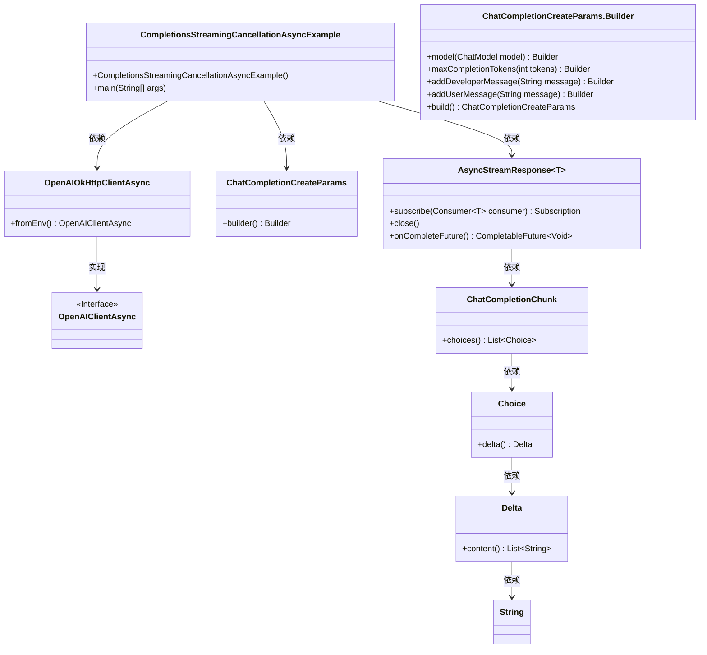
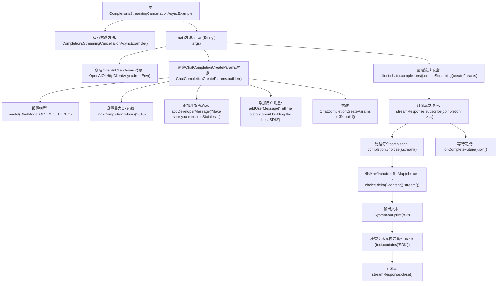

# 基础信息

|      |      |
|------|------|
| 名称 | CompletionsStreamingCancellationAsyncExample |
| 编码语言 | .java |
| 代码路径 | openai-java/openai-java-example/src/main/java/com/openai/example/CompletionsStreamingCancellationAsyncExample.java |
| 包名 | com.openai.example |
| 依赖项 | ['com.openai.client.OpenAIClientAsync', 'com.openai.client.okhttp.OpenAIOkHttpClientAsync', 'com.openai.core.http.AsyncStreamResponse', 'com.openai.models.ChatModel', 'com.openai.models.chat.completions.ChatCompletionChunk', 'com.openai.models.chat.completions.ChatCompletionCreateParams'] |
| 概述说明 | Java示例演示OpenAI API流式响应及提前关闭功能。 |

# 说明

该Java示例展示了如何通过OpenAI API实现流式响应处理，并具备提前关闭功能。流式响应允许逐步接收和处理API返回的数据，而提前关闭功能则能在不需要继续接收数据时主动终止请求，优化资源使用和响应时间。这一实现方式适用于需要实时处理大量数据或需要灵活控制请求时长的场景。

# 类列表 Class Summary

| 名称   | 类型  | 说明 |
|-------|------|-------------|
| CompletionsStreamingCancellationAsyncExample | class | Java示例展示使用OpenAI API流式响应及提前关闭功能。 |

## 类 CompletionsStreamingCancellationAsyncExample

|      |      |
|------|------|
| 访问范围 | public final |
| 类型 | class |
| 名称 | CompletionsStreamingCancellationAsyncExample |
| 说明 | Java示例展示使用OpenAI API流式响应及提前关闭功能。 |

### UML类图

这段代码展示了一个异步流式处理 OpenAI 聊天补全的示例。`CompletionsStreamingCancellationAsyncExample` 类通过 `OpenAIOkHttpClientAsync` 创建异步客户端，并使用 `ChatCompletionCreateParams` 构建请求参数。`AsyncStreamResponse` 用于处理流式响应，当检测到特定内容时提前关闭流。类图清晰地展示了各个类之间的依赖关系和实现关系。

### 内部方法调用关系图

这段代码展示了如何使用异步流式处理来与OpenAI API进行交互，并在特定条件下提前关闭流。首先，代码配置了OpenAI客户端并创建了聊天完成参数。然后，它通过流式请求与API交互，处理每个返回的文本块，并在文本中包含“SDK”时提前关闭流。最后，代码等待所有操作完成。

### 字段列表 Field List

| 名称  | 类型  | 说明 |
|-------|-------|------|

### 方法列表 Method List

| 名称  | 类型  | 说明 |
|-------|-------|------|
| main | void | Java代码通过环境变量配置OpenAI客户端，使用GPT-3.5模型生成故事，并在内容包含SDK时提前关闭流。 |

