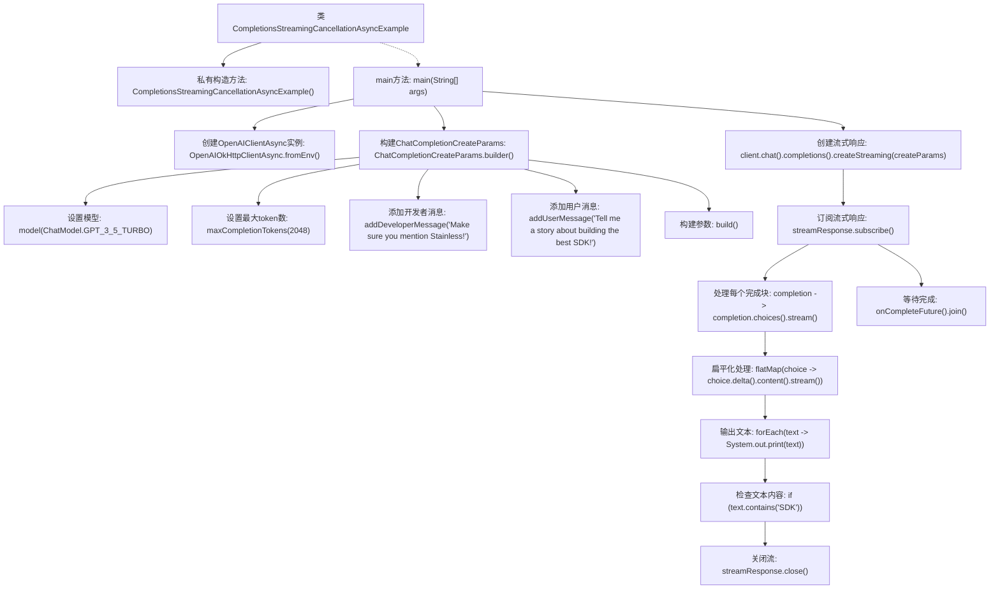

# 基础信息

|      |      |
|------|------|
| 名称 | CompletionsStreamingCancellationAsyncExample |
| 编码语言 | .java |
| 代码路径 | openai-java/openai-java-example/src/main/java/com/openai/example/CompletionsStreamingCancellationAsyncExample.java |
| 包名 | com.openai.example |
| 依赖项 | ['com.openai.client.OpenAIClientAsync', 'com.openai.client.okhttp.OpenAIOkHttpClientAsync', 'com.openai.core.http.AsyncStreamResponse', 'com.openai.models.ChatModel', 'com.openai.models.chat.completions.ChatCompletionChunk', 'com.openai.models.chat.completions.ChatCompletionCreateParams'] |
| 概述说明 | Java示例展示如何异步取消OpenAI聊天请求。 |

# 说明

该内容描述了一个Java示例，展示了如何异步流式取消OpenAI的聊天完成请求。具体来说，该示例涉及在Java环境中处理异步流式请求，并能够在需要时取消与OpenAI的聊天完成操作。这种机制适用于需要动态控制或中断长时间运行的异步任务场景，确保资源的高效利用和操作的灵活性。

# 类列表 Class Summary

| 名称   | 类型  | 说明 |
|-------|------|-------------|
| CompletionsStreamingCancellationAsyncExample | class | Java示例：异步流式取消OpenAI聊天完成请求。 |

## 类 CompletionsStreamingCancellationAsyncExample

|      |      |
|------|------|
| 访问范围 | public final |
| 类型 | class |
| 名称 | CompletionsStreamingCancellationAsyncExample |
| 说明 | Java示例：异步流式取消OpenAI聊天完成请求。 |

### UML类图

```mermaid
classDiagram
    class CompletionsStreamingCancellationAsyncExample {
        +CompletionsStreamingCancellationAsyncExample()
        +void main(String[] args)
    }

    class OpenAIClientAsync {
        <<Interface>>
    }

    class OpenAIOkHttpClientAsync {
        +OpenAIClientAsync fromEnv()
    }

    class ChatCompletionCreateParams {
        +Builder builder()
        +ChatCompletionCreateParams build()
    }

    class ChatCompletionCreateParams$Builder {
        +Builder model(ChatModel model)
        +Builder maxCompletionTokens(int maxCompletionTokens)
        +Builder addDeveloperMessage(String message)
        +Builder addUserMessage(String message)
        +ChatCompletionCreateParams build()
    }

    class ChatModel {
        <<Enumeration>>
        GPT_3_5_TURBO
    }

    class AsyncStreamResponse~T~ {
        +void subscribe(Consumer~T~ consumer)
        +void close()
        +CompletableFuture~Void~ onCompleteFuture()
    }

    class ChatCompletionChunk {
        +List~Choice~ choices()
    }

    class Choice {
        +Delta delta()
    }

    class Delta {
        +Optional~String~ content()
    }

    CompletionsStreamingCancellationAsyncExample --> OpenAIOkHttpClientAsync : 使用
    OpenAIOkHttpClientAsync --> OpenAIClientAsync : 实现
    CompletionsStreamingCancellationAsyncExample --> ChatCompletionCreateParams : 创建
    ChatCompletionCreateParams --> ChatCompletionCreateParams$Builder : 构建
    ChatCompletionCreateParams --> ChatModel : 使用
    CompletionsStreamingCancellationAsyncExample --> AsyncStreamResponse~ChatCompletionChunk~ : 订阅
    AsyncStreamResponse~ChatCompletionChunk~ --> ChatCompletionChunk : 处理
    ChatCompletionChunk --> Choice : 包含
    Choice --> Delta : 包含
    Delta --> Optional~String~ : 包含
```

这段代码展示了一个异步流式处理 OpenAI 聊天补全的示例。`CompletionsStreamingCancellationAsyncExample` 类通过 `OpenAIOkHttpClientAsync` 客户端从环境变量中获取配置，构建 `ChatCompletionCreateParams` 请求参数，并订阅 `AsyncStreamResponse` 流式响应。当流式响应中包含特定关键字时，流会被提前关闭。

### 内部方法调用关系图

```mermaid
graph TD
    A["类CompletionsStreamingCancellationAsyncExample"]
    B["私有构造方法: CompletionsStreamingCancellationAsyncExample()"]
    C["main方法: main(String[] args)"]
    D["创建OpenAIClientAsync实例: OpenAIOkHttpClientAsync.fromEnv()"]
    E["构建ChatCompletionCreateParams: ChatCompletionCreateParams.builder()"]
    F["设置模型: model(ChatModel.GPT_3_5_TURBO)"]
    G["设置最大token数: maxCompletionTokens(2048)"]
    H["添加开发者消息: addDeveloperMessage('Make sure you mention Stainless!')"]
    I["添加用户消息: addUserMessage('Tell me a story about building the best SDK!')"]
    J["构建参数: build()"]
    K["创建流式响应: client.chat().completions().createStreaming(createParams)"]
    L["订阅流式响应: streamResponse.subscribe()"]
    M["处理每个完成块: completion -> completion.choices().stream()"]
    N["扁平化处理: flatMap(choice -> choice.delta().content().stream())"]
    O["输出文本: forEach(text -> System.out.print(text))"]
    P["检查文本内容: if (text.contains('SDK'))"]
    Q["关闭流: streamResponse.close()"]
    R["等待完成: onCompleteFuture().join()"]

    A --> B
    A -.-> C
    C --> D
    C --> E
    E --> F
    E --> G
    E --> H
    E --> I
    E --> J
    C --> K
    K --> L
    L --> M
    M --> N
    N --> O
    O --> P
    P --> Q
    L --> R
```

这段代码展示了如何使用异步流式API与OpenAI进行交互，并在特定条件下提前关闭流。首先，配置OpenAI客户端并构建聊天完成参数，然后创建流式响应并订阅处理每个完成块。在输出文本时，如果检测到特定内容（如"SDK"），则提前关闭流并等待所有操作完成。

### 字段列表 Field List

| 名称  | 类型  | 说明 |
|-------|-------|------|

### 方法列表 Method List

| 名称  | 类型  | 说明 |
|-------|-------|------|
| main | void | Java代码通过环境变量配置OpenAI客户端，使用GPT-3.5模型生成SDK故事，并在输出包含SDK时提前关闭流。 |

