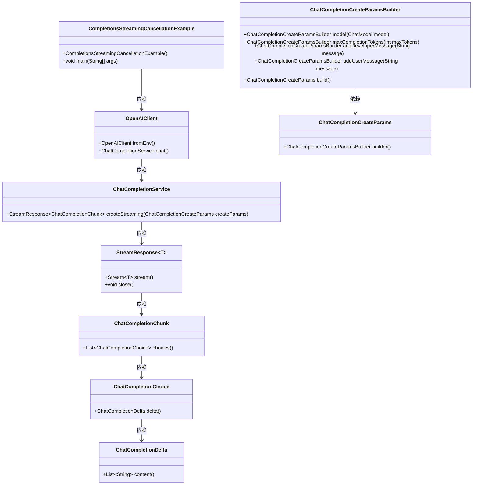
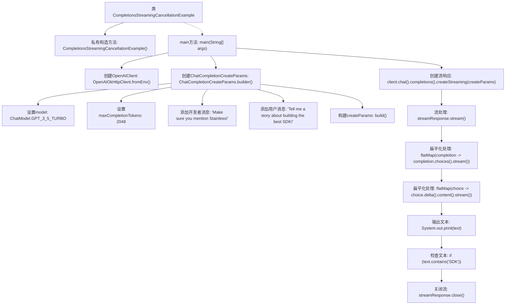

# 基础信息

|      |      |
|------|------|
| 名称 | CompletionsStreamingCancellationExample |
| 编码语言 | .java |
| 代码路径 | openai-java/openai-java-example/src/main/java/com/openai/example/CompletionsStreamingCancellationExample.java |
| 包名 | com.openai.example |
| 依赖项 | ['com.openai.client.OpenAIClient', 'com.openai.client.okhttp.OpenAIOkHttpClient', 'com.openai.core.http.StreamResponse', 'com.openai.models.ChatModel', 'com.openai.models.chat.completions.ChatCompletionChunk', 'com.openai.models.chat.completions.ChatCompletionCreateParams'] |
| 概述说明 | Java示例：OpenAI客户端流式处理聊天，支持条件提前关闭。 |

# 说明

该示例展示了如何在Java中使用OpenAI客户端进行流式处理聊天完成的操作，并在满足特定条件时提前关闭流。通过这种方式，开发者可以在处理大量数据或需要实时响应的场景中，动态控制数据流的开启与关闭，从而提高程序的效率和响应速度。此方法适用于需要精细控制数据流处理的应用程序，确保在特定条件下能够及时终止不必要的处理过程。

# 类列表 Class Summary

| 名称   | 类型  | 说明 |
|-------|------|-------------|
| CompletionsStreamingCancellationExample | class | Java示例：使用OpenAI客户端流式处理聊天完成，并在特定条件下提前关闭流。 |

## 类 CompletionsStreamingCancellationExample

|      |      |
|------|------|
| 访问范围 | public final |
| 类型 | class |
| 名称 | CompletionsStreamingCancellationExample |
| 说明 | Java示例：使用OpenAI客户端流式处理聊天完成，并在特定条件下提前关闭流。 |

### UML类图

这段代码展示了一个流式处理聊天完成请求的示例，允许在特定条件下提前关闭流。`CompletionsStreamingCancellationExample`类通过`OpenAIClient`与OpenAI API进行交互，创建并处理流式响应。`ChatCompletionCreateParams`用于配置请求参数，`StreamResponse`负责处理流式响应，并在检测到特定内容时提前关闭流。整个流程涉及多个类之间的协作，确保请求的创建、处理和终止都能顺利进行。

### 内部方法调用关系图

这段代码展示了一个流式取消的示例，主要用于与OpenAI API进行交互。代码首先配置了OpenAI客户端，然后构建了聊天完成参数，并通过流式响应处理返回的文本。如果在流式响应中检测到包含“SDK”的文本，流将被提前关闭。整个过程展示了如何通过流式处理来动态控制API响应的接收与终止。

### 字段列表 Field List

| 名称  | 类型  | 说明 |
|-------|-------|------|

### 方法列表 Method List

| 名称  | 类型  | 说明 |
|-------|-------|------|
| main | void | Java代码通过环境变量配置OpenAI客户端，使用GPT-3.5模型生成故事，并提前关闭流式响应。 |

