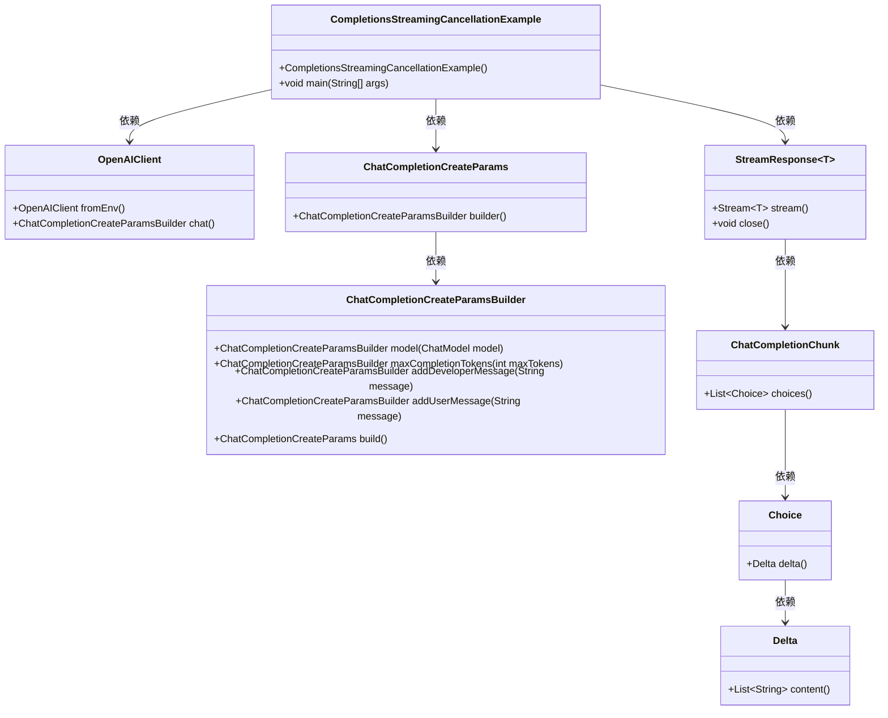
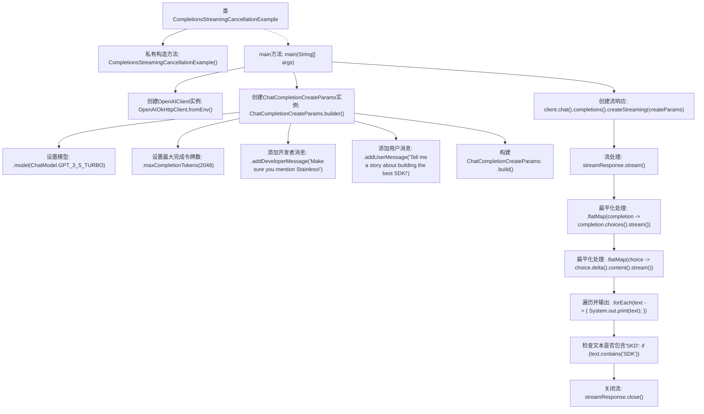

# 基础信息

|      |      |
|------|------|
| 名称 | CompletionsStreamingCancellationExample |
| 编码语言 | .java |
| 代码路径 | openai-java/openai-java-example/src/main/java/com/openai/example/CompletionsStreamingCancellationExample.java |
| 包名 | com.openai.example |
| 依赖项 | ['com.openai.client.OpenAIClient', 'com.openai.client.okhttp.OpenAIOkHttpClient', 'com.openai.core.http.StreamResponse', 'com.openai.models.ChatModel', 'com.openai.models.chat.completions.ChatCompletionChunk', 'com.openai.models.chat.completions.ChatCompletionCreateParams'] |
| 概述说明 | Java示例通过OpenAI流式API生成聊天内容，支持关键词检测并提前终止流。 |

# 说明

该Java示例展示了如何利用OpenAI的流式API生成聊天内容。通过流式处理，系统能够实时接收并处理生成的文本。示例中特别加入了关键词检测机制，当检测到预设的关键词时，流式处理会提前关闭，以优化资源使用和响应效率。这一功能适用于需要实时监控和中断生成内容的场景，确保系统在满足特定条件时能够及时停止处理。

# 类列表 Class Summary

| 名称   | 类型  | 说明 |
|-------|------|-------------|
| CompletionsStreamingCancellationExample | class | Java示例展示使用OpenAI流式API生成聊天内容，并在检测到关键词时提前关闭流。 |

## 类 CompletionsStreamingCancellationExample

|      |      |
|------|------|
| 访问范围 | public final |
| 类型 | class |
| 名称 | CompletionsStreamingCancellationExample |
| 说明 | Java示例展示使用OpenAI流式API生成聊天内容，并在检测到关键词时提前关闭流。 |

### UML类图

```mermaid
classDiagram
    class CompletionsStreamingCancellationExample {
        +CompletionsStreamingCancellationExample()
        +void main(String[] args)
    }
    class OpenAIClient {
        +OpenAIClient fromEnv()
        +ChatCompletionCreateParamsBuilder chat()
    }
    class ChatCompletionCreateParams {
        +ChatCompletionCreateParamsBuilder builder()
    }
    class ChatCompletionCreateParamsBuilder {
        +ChatCompletionCreateParamsBuilder model(ChatModel model)
        +ChatCompletionCreateParamsBuilder maxCompletionTokens(int maxTokens)
        +ChatCompletionCreateParamsBuilder addDeveloperMessage(String message)
        +ChatCompletionCreateParamsBuilder addUserMessage(String message)
        +ChatCompletionCreateParams build()
    }
    class StreamResponse~T~ {
        +Stream~T~ stream()
        +void close()
    }
    class ChatCompletionChunk {
        +List~Choice~ choices()
    }
    class Choice {
        +Delta delta()
    }
    class Delta {
        +List~String~ content()
    }

    CompletionsStreamingCancellationExample --> OpenAIClient : 依赖
    CompletionsStreamingCancellationExample --> ChatCompletionCreateParams : 依赖
    CompletionsStreamingCancellationExample --> StreamResponse~ChatCompletionChunk~ : 依赖
    ChatCompletionCreateParams --> ChatCompletionCreateParamsBuilder : 依赖
    StreamResponse~ChatCompletionChunk~ --> ChatCompletionChunk : 依赖
    ChatCompletionChunk --> Choice : 依赖
    Choice --> Delta : 依赖
```

**描述：**  
`CompletionsStreamingCancellationExample` 类展示了如何使用 OpenAI 客户端进行流式聊天补全，并在特定条件下提前关闭流。它通过 `OpenAIClient` 创建聊天请求，使用 `ChatCompletionCreateParams` 配置请求参数，并通过 `StreamResponse` 处理流式响应。当流式响应中包含特定关键字时，流将被提前关闭。

### 内部方法调用关系图

```mermaid
graph TD
    A["类CompletionsStreamingCancellationExample"]
    B["私有构造方法: CompletionsStreamingCancellationExample()"]
    C["main方法: main(String[] args)"]
    D["创建OpenAIClient实例: OpenAIOkHttpClient.fromEnv()"]
    E["创建ChatCompletionCreateParams实例: ChatCompletionCreateParams.builder()"]
    F["设置模型: .model(ChatModel.GPT_3_5_TURBO)"]
    G["设置最大完成令牌数: .maxCompletionTokens(2048)"]
    H["添加开发者消息: .addDeveloperMessage('Make sure you mention Stainless!')"]
    I["添加用户消息: .addUserMessage('Tell me a story about building the best SDK!')"]
    J["构建ChatCompletionCreateParams: .build()"]
    K["创建流响应: client.chat().completions().createStreaming(createParams)"]
    L["流处理: streamResponse.stream()"]
    M["扁平化处理: .flatMap(completion -> completion.choices().stream())"]
    N["扁平化处理: .flatMap(choice -> choice.delta().content().stream())"]
    O["遍历并输出: .forEach(text -> { System.out.print(text); })"]
    P["检查文本是否包含'SKD': if (text.contains('SDK'))"]
    Q["关闭流: streamResponse.close()"]

    A --> B
    A -.-> C
    C --> D
    C --> E
    E --> F
    E --> G
    E --> H
    E --> I
    E --> J
    C --> K
    K --> L
    L --> M
    M --> N
    N --> O
    O --> P
    P --> Q
```

这段代码展示了如何使用OpenAI的流式API进行聊天补全，并在特定条件下提前关闭流。代码首先配置了OpenAI客户端，然后构建了聊天补全请求参数，接着通过流式API获取响应并处理返回的文本内容。如果文本中包含“SDK”，则提前关闭流以停止进一步的处理。

### 字段列表 Field List

| 名称  | 类型  | 说明 |
|-------|-------|------|

### 方法列表 Method List

| 名称  | 类型  | 说明 |
|-------|-------|------|
| main | void | Java代码通过环境变量配置OpenAI客户端，调用GPT-3.5模型生成SDK相关故事，并在检测到关键词时提前关闭流。 |

