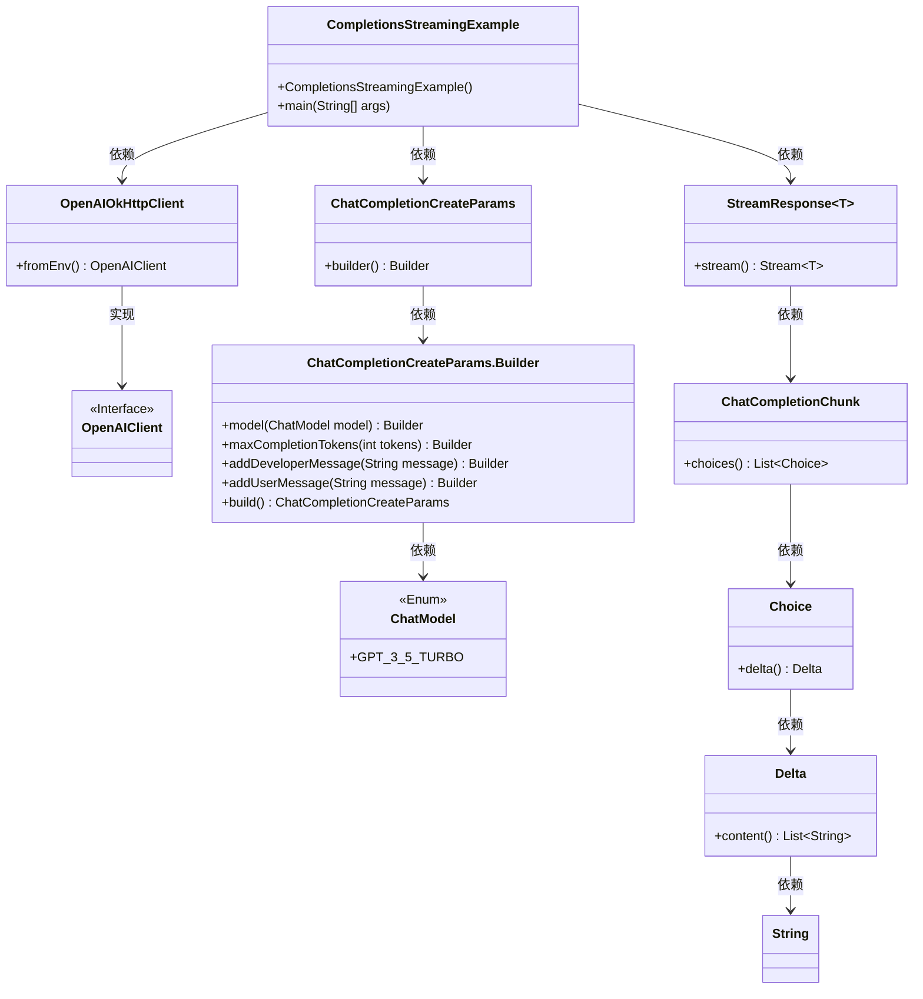
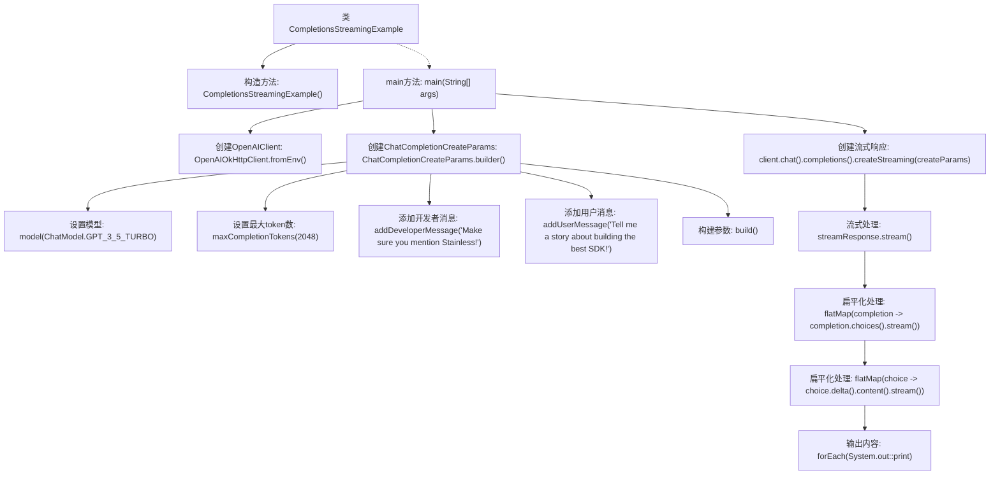

# 基础信息

|      |      |
|------|------|
| 名称 | CompletionsStreamingExample |
| 编码语言 | .java |
| 代码路径 | openai-java/openai-java-example/src/main/java/com/openai/example/CompletionsStreamingExample.java |
| 包名 | com.openai.example |
| 依赖项 | ['com.openai.client.OpenAIClient', 'com.openai.client.okhttp.OpenAIOkHttpClient', 'com.openai.core.http.StreamResponse', 'com.openai.models.ChatModel', 'com.openai.models.chat.completions.ChatCompletionChunk', 'com.openai.models.chat.completions.ChatCompletionCreateParams'] |
| 概述说明 | Java示例演示如何通过OpenAI客户端流式生成GPT-3.5对话。 |

# 说明

该内容描述了一个使用Java编写的示例，展示了如何通过OpenAI客户端实现流式生成GPT-3.5对话。示例中可能涉及配置OpenAI客户端、建立与GPT-3.5模型的连接，并通过流式处理技术逐步生成对话内容。此示例适用于需要实时或逐步获取GPT-3.5生成响应的应用场景，如聊天机器人或交互式对话系统。通过流式生成，可以优化用户体验，减少等待时间，并支持更自然的对话流程。

# 类列表 Class Summary

| 名称   | 类型  | 说明 |
|-------|------|-------------|
| CompletionsStreamingExample | class | Java示例：使用OpenAI客户端流式生成GPT-3.5对话。 |

## 类 CompletionsStreamingExample

|      |      |
|------|------|
| 访问范围 | public final |
| 类型 | class |
| 名称 | CompletionsStreamingExample |
| 说明 | Java示例：使用OpenAI客户端流式生成GPT-3.5对话。 |

### UML类图

这段代码展示了如何使用OpenAI的API进行流式聊天补全。`CompletionsStreamingExample`类通过`OpenAIOkHttpClient`从环境变量中配置客户端，并构建聊天补全请求参数。然后，它使用客户端创建流式响应，处理并打印每个补全块的内容。代码涉及多个类和接口，包括`OpenAIClient`、`ChatCompletionCreateParams`、`StreamResponse`等，展示了复杂的依赖关系。

### 内部方法调用关系图

这段代码展示了如何使用OpenAI客户端进行流式聊天补全的示例。首先，代码通过环境变量配置OpenAI客户端，然后构建聊天补全的请求参数，包括模型、最大token数和消息内容。接着，代码创建流式响应并处理返回的数据，最终将内容输出到控制台。整个过程展示了如何从配置到流式处理的完整流程。

### 字段列表 Field List

| 名称  | 类型  | 说明 |
|-------|-------|------|

### 方法列表 Method List

| 名称  | 类型  | 说明 |
|-------|-------|------|
| main | void | Java代码通过环境变量配置OpenAI客户端，使用GPT-3.5模型生成故事。 |

