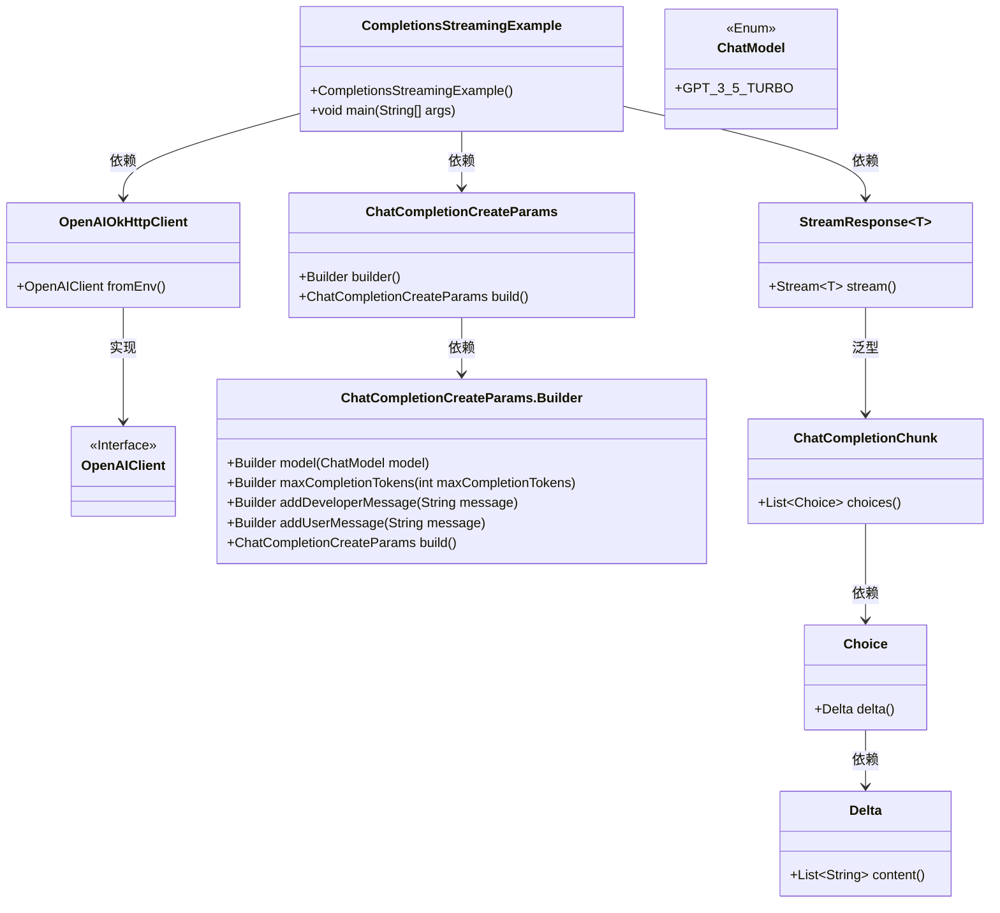
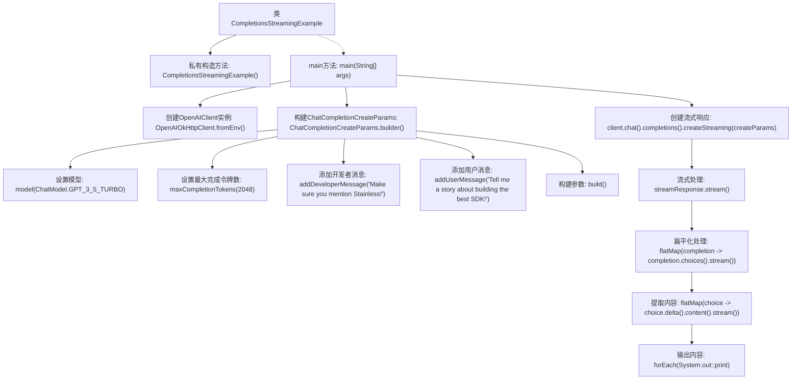

# 基础信息

|      |      |
|------|------|
| 名称 | CompletionsStreamingExample |
| 编码语言 | .java |
| 代码路径 | openai-java/openai-java-example/src/main/java/com/openai/example/CompletionsStreamingExample.java |
| 包名 | com.openai.example |
| 依赖项 | ['com.openai.client.OpenAIClient', 'com.openai.client.okhttp.OpenAIOkHttpClient', 'com.openai.core.http.StreamResponse', 'com.openai.models.ChatModel', 'com.openai.models.chat.completions.ChatCompletionChunk', 'com.openai.models.chat.completions.ChatCompletionCreateParams'] |
| 概述说明 | Java示例：通过OpenAI API流式生成GPT-3.5聊天补全。 |

# 说明

该内容描述了一个使用Java编程语言实现的示例，展示了如何通过OpenAI API进行流式生成GPT-3.5聊天补全。具体来说，该示例演示了如何利用OpenAI的API接口，以流式方式逐步获取GPT-3.5模型的聊天补全结果。这一过程涉及API的调用、数据流的处理以及结果的逐步生成，适用于需要实时交互或逐步输出的场景。

# 类列表 Class Summary

| 名称   | 类型  | 说明 |
|-------|------|-------------|
| CompletionsStreamingExample | class | Java示例：使用OpenAI API流式生成GPT-3.5聊天补全。 |

## 类 CompletionsStreamingExample

|      |      |
|------|------|
| 访问范围 | public final |
| 类型 | class |
| 名称 | CompletionsStreamingExample |
| 说明 | Java示例：使用OpenAI API流式生成GPT-3.5聊天补全。 |

### UML类图

```mermaid
classDiagram
    class CompletionsStreamingExample {
        +CompletionsStreamingExample()
        +void main(String[] args)
    }

    class OpenAIClient {
        <<Interface>>
    }

    class OpenAIOkHttpClient {
        +OpenAIClient fromEnv()
    }

    class ChatCompletionCreateParams {
        +Builder builder()
        +ChatCompletionCreateParams build()
    }

    class ChatCompletionCreateParams.Builder {
        +Builder model(ChatModel model)
        +Builder maxCompletionTokens(int maxCompletionTokens)
        +Builder addDeveloperMessage(String message)
        +Builder addUserMessage(String message)
        +ChatCompletionCreateParams build()
    }

    class ChatModel {
        <<Enum>>
        +GPT_3_5_TURBO
    }

    class StreamResponse~T~ {
        +Stream~T~ stream()
    }

    class ChatCompletionChunk {
        +List~Choice~ choices()
    }

    class Choice {
        +Delta delta()
    }

    class Delta {
        +List~String~ content()
    }

    CompletionsStreamingExample --> OpenAIOkHttpClient : 依赖
    CompletionsStreamingExample --> ChatCompletionCreateParams : 依赖
    CompletionsStreamingExample --> StreamResponse : 依赖
    OpenAIOkHttpClient --> OpenAIClient : 实现
    ChatCompletionCreateParams --> ChatCompletionCreateParams.Builder : 依赖
    StreamResponse --> ChatCompletionChunk : 泛型
    ChatCompletionChunk --> Choice : 依赖
    Choice --> Delta : 依赖
```

这段代码展示了一个使用OpenAI API进行流式聊天补全的示例。`CompletionsStreamingExample`类通过`OpenAIOkHttpClient`从环境变量中获取配置，并构建`ChatCompletionCreateParams`对象来设置聊天模型和消息内容。然后，它使用`StreamResponse`来流式处理聊天补全结果，并打印每个补全块的内容。代码中涉及的类包括配置、参数构建、流式响应处理等，展示了如何通过流式API处理聊天补全请求。

### 内部方法调用关系图

```mermaid
graph TD
    A["类CompletionsStreamingExample"]
    B["私有构造方法: CompletionsStreamingExample()"]
    C["main方法: main(String[] args)"]
    D["创建OpenAIClient实例: OpenAIOkHttpClient.fromEnv()"]
    E["构建ChatCompletionCreateParams: ChatCompletionCreateParams.builder()"]
    F["设置模型: model(ChatModel.GPT_3_5_TURBO)"]
    G["设置最大完成令牌数: maxCompletionTokens(2048)"]
    H["添加开发者消息: addDeveloperMessage('Make sure you mention Stainless!')"]
    I["添加用户消息: addUserMessage('Tell me a story about building the best SDK!')"]
    J["构建参数: build()"]
    K["创建流式响应: client.chat().completions().createStreaming(createParams)"]
    L["流式处理: streamResponse.stream()"]
    M["扁平化处理: flatMap(completion -> completion.choices().stream())"]
    N["提取内容: flatMap(choice -> choice.delta().content().stream())"]
    O["输出内容: forEach(System.out::print)"]

    A --> B
    A -.-> C
    C --> D
    C --> E
    E --> F
    E --> G
    E --> H
    E --> I
    E --> J
    C --> K
    K --> L
    L --> M
    M --> N
    N --> O
```

这段代码展示了如何使用OpenAI客户端进行流式聊天补全。首先，代码通过环境变量配置OpenAI客户端，然后构建聊天补全请求参数，包括模型、最大令牌数和消息内容。接着，代码创建流式响应并处理返回的聊天补全块，最终将内容输出到控制台。整个过程展示了从配置到流式处理再到输出的完整流程。

### 字段列表 Field List

| 名称  | 类型  | 说明 |
|-------|-------|------|

### 方法列表 Method List

| 名称  | 类型  | 说明 |
|-------|-------|------|
| main | void | Java代码配置OpenAI客户端，使用环境变量，创建聊天参数，流式输出GPT-3.5响应。 |

