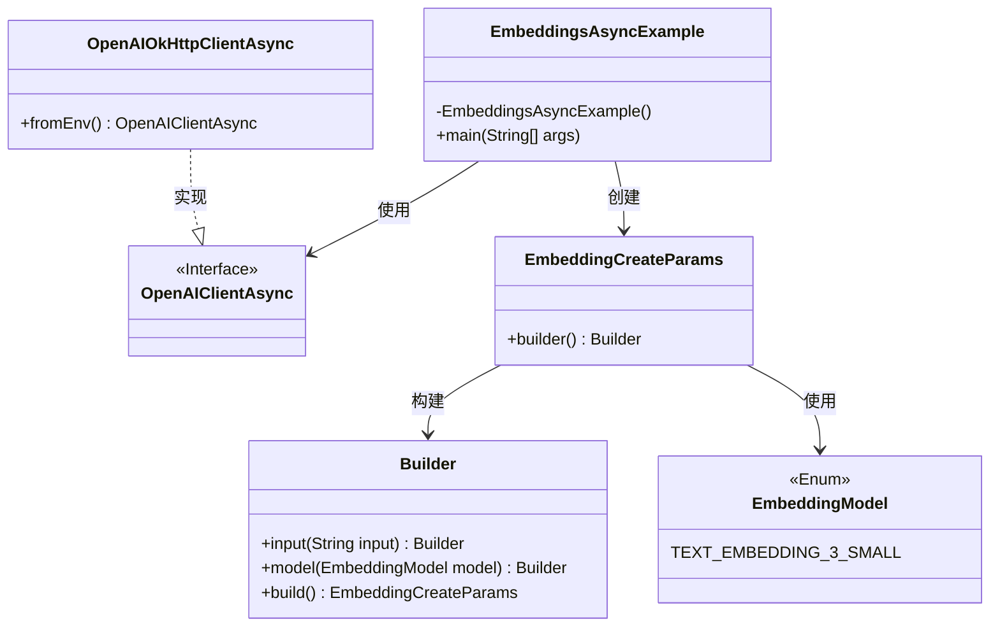
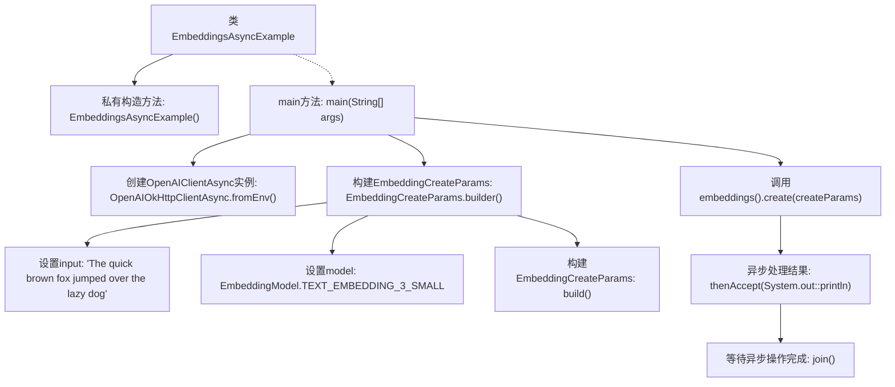

# 基础信息

|      |      |
|------|------|
| 名称 | EmbeddingsAsyncExample |
| 编码语言 | .java |
| 代码路径 | openai-java/openai-java-example/src/main/java/com/openai/example/EmbeddingsAsyncExample.java |
| 包名 | com.openai.example |
| 依赖项 | ['com.openai.client.OpenAIClientAsync', 'com.openai.client.okhttp.OpenAIOkHttpClientAsync', 'com.openai.models.embeddings.EmbeddingCreateParams', 'com.openai.models.embeddings.EmbeddingModel'] |
| 概述说明 | 配置OpenAI客户端，生成文本嵌入并输出结果。 |

# 说明

该异步示例展示了如何配置OpenAI客户端，以便生成文本嵌入并输出结果。首先，需要正确设置OpenAI客户端的相关参数，确保与OpenAI API的连接和认证。接着，通过调用适当的API方法，生成文本嵌入，即将文本转换为数值向量表示。最后，将生成的嵌入结果进行输出，以便后续使用或分析。整个过程旨在高效利用异步编程的优势，提升处理速度和资源利用率。

# 类列表 Class Summary

| 名称   | 类型  | 说明 |
|-------|------|-------------|
| EmbeddingsAsyncExample | class | 异步示例：配置OpenAI客户端，生成文本嵌入并输出结果。 |

## 类 EmbeddingsAsyncExample

|      |      |
|------|------|
| 访问范围 | public final |
| 类型 | class |
| 名称 | EmbeddingsAsyncExample |
| 说明 | 异步示例：配置OpenAI客户端，生成文本嵌入并输出结果。 |

### UML类图

类图描述：  
`EmbeddingsAsyncExample` 是一个不可继承的类，包含一个私有的构造函数和一个公有的 `main` 方法。它依赖于 `OpenAIClientAsync` 接口，该接口由 `OpenAIOkHttpClientAsync` 类实现。`EmbeddingCreateParams` 类用于创建嵌入参数，通过 `Builder` 模式构建，并使用了 `EmbeddingModel` 枚举类来指定模型类型。整个代码展示了如何使用异步客户端生成文本嵌入。

### 内部方法调用关系图

这段代码展示了如何使用异步客户端调用OpenAI的嵌入模型生成文本的嵌入向量。首先，通过环境变量配置客户端，然后构建嵌入创建参数，指定输入文本和模型类型。接着，异步调用嵌入生成方法，并在完成后打印结果，最后等待异步操作完成。

### 字段列表 Field List

| 名称  | 类型  | 说明 |
|-------|-------|------|

### 方法列表 Method List

| 名称  | 类型  | 说明 |
|-------|-------|------|
| main | void | Java代码通过环境变量配置OpenAI客户端，生成文本嵌入并输出结果。 |

