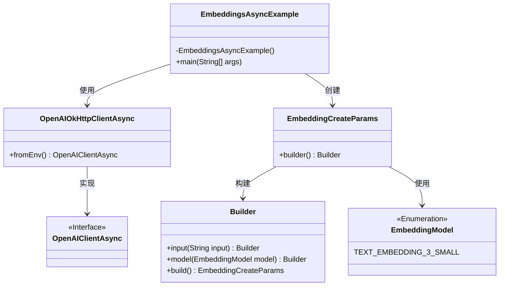
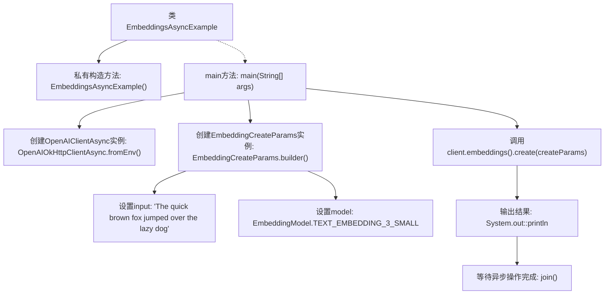

# 基础信息

|      |      |
|------|------|
| 名称 | EmbeddingsAsyncExample |
| 编码语言 | .java |
| 代码路径 | openai-java/openai-java-example/src/main/java/com/openai/example/EmbeddingsAsyncExample.java |
| 包名 | com.openai.example |
| 依赖项 | ['com.openai.client.OpenAIClientAsync', 'com.openai.client.okhttp.OpenAIOkHttpClientAsync', 'com.openai.models.embeddings.EmbeddingCreateParams', 'com.openai.models.embeddings.EmbeddingModel'] |
| 概述说明 | 异步调用OpenAI嵌入模型生成文本嵌入。 |

# 说明

该内容描述了一个示例，展示了如何通过异步调用OpenAI的嵌入模型来生成文本嵌入。文本嵌入是将文本转换为数值向量的过程，通常用于自然语言处理任务中，如语义分析、文本相似度计算等。异步调用意味着操作在后台执行，不会阻塞主线程，适用于需要高效处理大量请求的场景。此示例可能涉及设置API请求参数、发送请求并处理返回的嵌入向量，以便后续应用。

# 类列表 Class Summary

| 名称   | 类型  | 说明 |
|-------|------|-------------|
| EmbeddingsAsyncExample | class | 异步调用OpenAI嵌入模型生成文本嵌入示例。 |

## 类 EmbeddingsAsyncExample

|      |      |
|------|------|
| 访问范围 | public final |
| 类型 | class |
| 名称 | EmbeddingsAsyncExample |
| 说明 | 异步调用OpenAI嵌入模型生成文本嵌入示例。 |

### UML类图

```mermaid
classDiagram
    class EmbeddingsAsyncExample {
        -EmbeddingsAsyncExample()
        +main(String[] args)
    }

    class OpenAIClientAsync {
        <<Interface>>
    }

    class OpenAIOkHttpClientAsync {
        +fromEnv() OpenAIClientAsync
    }

    class EmbeddingCreateParams {
        +builder() Builder
    }

    class Builder {
        +input(String input) Builder
        +model(EmbeddingModel model) Builder
        +build() EmbeddingCreateParams
    }

    class EmbeddingModel {
        <<Enumeration>>
        TEXT_EMBEDDING_3_SMALL
    }

    EmbeddingsAsyncExample --> OpenAIOkHttpClientAsync : 使用
    EmbeddingsAsyncExample --> EmbeddingCreateParams : 创建
    EmbeddingCreateParams --> Builder : 构建
    EmbeddingCreateParams --> EmbeddingModel : 使用
    OpenAIOkHttpClientAsync --> OpenAIClientAsync : 实现
```

这段代码展示了一个异步生成嵌入向量的示例。`EmbeddingsAsyncExample`类通过`OpenAIOkHttpClientAsync`创建了一个异步的OpenAI客户端，并使用`EmbeddingCreateParams`构建了嵌入请求的参数。最终，客户端异步地执行嵌入生成任务，并打印结果。代码通过环境变量配置客户端，并使用了`EmbeddingModel.TEXT_EMBEDDING_3_SMALL`模型来处理输入文本。

### 内部方法调用关系图

```mermaid
graph TD
    A["类EmbeddingsAsyncExample"]
    B["私有构造方法: EmbeddingsAsyncExample()"]
    C["main方法: main(String[] args)"]
    D["创建OpenAIClientAsync实例: OpenAIOkHttpClientAsync.fromEnv()"]
    E["创建EmbeddingCreateParams实例: EmbeddingCreateParams.builder()"]
    F["设置input: 'The quick brown fox jumped over the lazy dog'"]
    G["设置model: EmbeddingModel.TEXT_EMBEDDING_3_SMALL"]
    H["调用client.embeddings().create(createParams)"]
    I["输出结果: System.out::println"]
    J["等待异步操作完成: join()"]

    A --> B
    A -.-> C
    C --> D
    C --> E
    E --> F
    E --> G
    C --> H
    H --> I
    I --> J
```

这段代码展示了如何使用异步客户端与OpenAI API进行交互，生成文本的嵌入向量。首先，通过环境变量配置客户端，然后构建嵌入创建参数，指定输入文本和模型类型。接着，调用异步方法生成嵌入向量，并在完成后打印结果，最后等待异步操作完成。

### 字段列表 Field List

| 名称  | 类型  | 说明 |
|-------|-------|------|

### 方法列表 Method List

| 名称  | 类型  | 说明 |
|-------|-------|------|
| main | void | Java代码通过环境变量配置OpenAI客户端，生成文本嵌入并输出结果。 |

