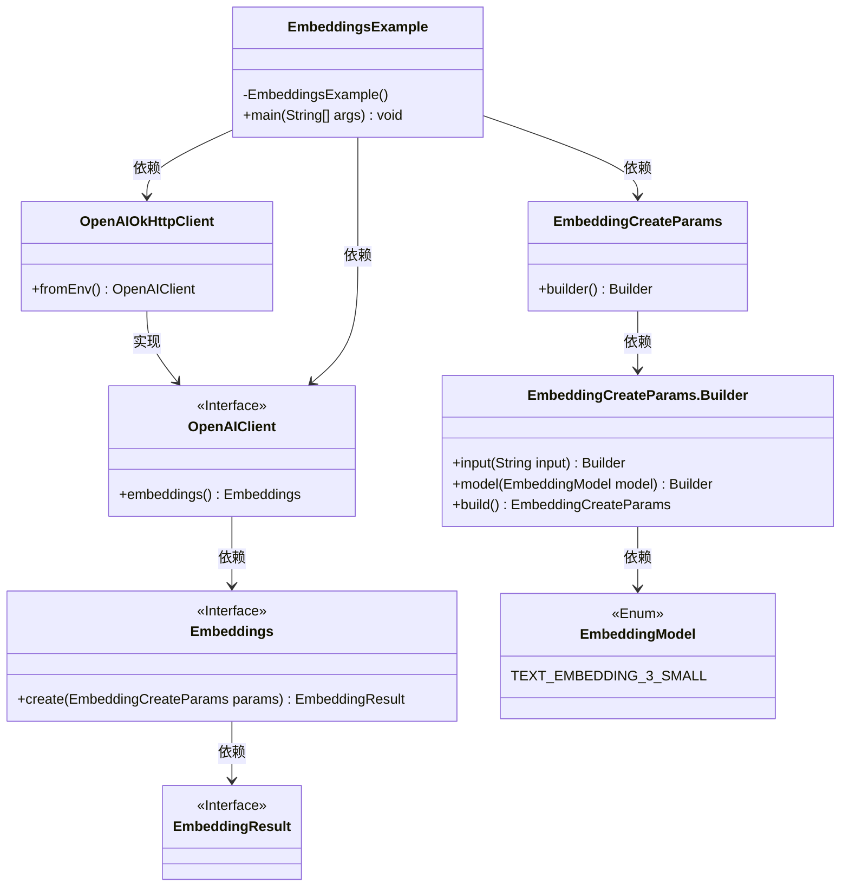
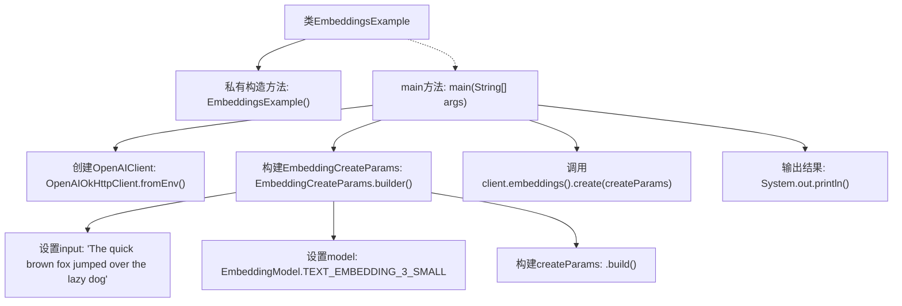

# 基础信息

|      |      |
|------|------|
| 名称 | EmbeddingsExample |
| 编码语言 | .java |
| 代码路径 | openai-java/openai-java-example/src/main/java/com/openai/example/EmbeddingsExample.java |
| 包名 | com.openai.example |
| 依赖项 | ['com.openai.client.OpenAIClient', 'com.openai.client.okhttp.OpenAIOkHttpClient', 'com.openai.models.embeddings.EmbeddingCreateParams', 'com.openai.models.embeddings.EmbeddingModel'] |
| 概述说明 | Java示例：利用OpenAI API生成文本嵌入，支持环境变量配置。 |

# 说明

该Java示例展示了如何利用OpenAI API生成文本嵌入，并支持通过环境变量进行配置。示例中详细说明了如何设置和调用API，以确保生成高质量的文本嵌入。通过环境变量配置，用户可以灵活调整API密钥和其他相关参数，从而实现更高效的集成和部署。此示例适用于需要在Java应用中嵌入OpenAI API功能的开发者，提供了清晰的指导和实现路径。

# 类列表 Class Summary

| 名称   | 类型  | 说明 |
|-------|------|-------------|
| EmbeddingsExample | class | Java示例：使用OpenAI API生成文本嵌入，支持环境变量配置。 |

## 类 EmbeddingsExample

|      |      |
|------|------|
| 访问范围 | public final |
| 类型 | class |
| 名称 | EmbeddingsExample |
| 说明 | Java示例：使用OpenAI API生成文本嵌入，支持环境变量配置。 |

### UML类图

这段代码展示了一个使用OpenAI API生成文本嵌入的示例。`EmbeddingsExample`类通过`OpenAIOkHttpClient`获取`OpenAIClient`实例，并构建`EmbeddingCreateParams`参数来调用`embeddings().create()`方法生成嵌入结果。类图清晰地展示了各个类之间的依赖关系和接口实现，帮助理解代码的结构和功能。

### 内部方法调用关系图

这段代码展示了如何使用OpenAI的客户端库来创建文本嵌入。首先，通过环境变量配置OpenAIClient，然后构建一个包含输入文本和模型的EmbeddingCreateParams对象。最后，调用客户端的embeddings().create方法生成嵌入，并将结果打印到控制台。

### 字段列表 Field List

| 名称  | 类型  | 说明 |
|-------|-------|------|

### 方法列表 Method List

| 名称  | 类型  | 说明 |
|-------|-------|------|
| main | void | Java代码通过环境变量配置OpenAI客户端，创建并输出文本嵌入。 |

