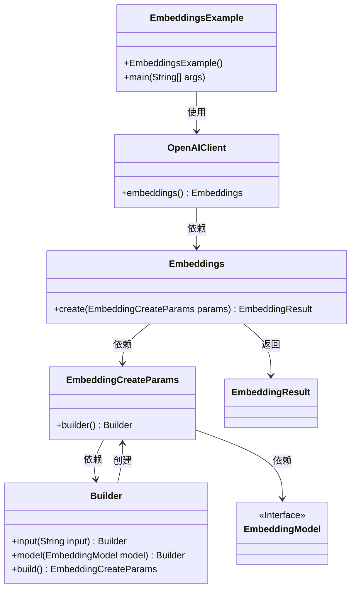
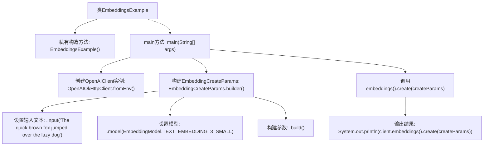

# 基础信息

|      |      |
|------|------|
| 名称 | EmbeddingsExample |
| 编码语言 | .java |
| 代码路径 | openai-java/openai-java-example/src/main/java/com/openai/example/EmbeddingsExample.java |
| 包名 | com.openai.example |
| 依赖项 | ['com.openai.client.OpenAIClient', 'com.openai.client.okhttp.OpenAIOkHttpClient', 'com.openai.models.embeddings.EmbeddingCreateParams', 'com.openai.models.embeddings.EmbeddingModel'] |
| 概述说明 | Java示例：通过环境变量配置OpenAI客户端，生成并输出文本嵌入。 |

# 说明

该内容描述了一个Java示例，展示了如何通过环境变量配置OpenAI客户端，并利用该客户端生成文本嵌入，最后输出结果。整个过程涉及环境变量的使用、客户端的配置、文本嵌入的生成以及结果的输出，涵盖了从配置到执行的全流程。

# 类列表 Class Summary

| 名称   | 类型  | 说明 |
|-------|------|-------------|
| EmbeddingsExample | class | Java示例：通过环境变量配置OpenAI客户端，生成文本嵌入并输出结果。 |

## 类 EmbeddingsExample

|      |      |
|------|------|
| 访问范围 | public final |
| 类型 | class |
| 名称 | EmbeddingsExample |
| 说明 | Java示例：通过环境变量配置OpenAI客户端，生成文本嵌入并输出结果。 |

### UML类图

```mermaid
classDiagram
    class EmbeddingsExample {
        +EmbeddingsExample()
        +main(String[] args)
    }

    class OpenAIClient {
        +embeddings() Embeddings
    }

    class Embeddings {
        +create(EmbeddingCreateParams params) EmbeddingResult
    }

    class EmbeddingCreateParams {
        +builder() Builder
    }

    class Builder {
        +input(String input) Builder
        +model(EmbeddingModel model) Builder
        +build() EmbeddingCreateParams
    }

    class EmbeddingModel {
        <<Interface>>
    }

    class EmbeddingResult {
    }

    EmbeddingsExample --> OpenAIClient : 使用
    OpenAIClient --> Embeddings : 依赖
    Embeddings --> EmbeddingCreateParams : 依赖
    EmbeddingCreateParams --> Builder : 依赖
    Builder --> EmbeddingCreateParams : 创建
    EmbeddingCreateParams --> EmbeddingModel : 依赖
    Embeddings --> EmbeddingResult : 返回
```

这段代码描述了一个用于生成文本嵌入的示例程序。`EmbeddingsExample`类通过`OpenAIClient`与OpenAI服务进行交互，使用`EmbeddingCreateParams`构建嵌入请求参数，并调用`embeddings().create()`方法生成嵌入结果。代码中涉及多个类，包括`OpenAIClient`、`Embeddings`、`EmbeddingCreateParams`、`Builder`、`EmbeddingModel`和`EmbeddingResult`，它们通过依赖关系协同工作，最终输出嵌入结果。

### 内部方法调用关系图

```mermaid
graph TD
    A["类EmbeddingsExample"]
    B["私有构造方法: EmbeddingsExample()"]
    C["main方法: main(String[] args)"]
    D["创建OpenAIClient实例: OpenAIOkHttpClient.fromEnv()"]
    E["构建EmbeddingCreateParams: EmbeddingCreateParams.builder()"]
    F["设置输入文本: .input('The quick brown fox jumped over the lazy dog')"]
    G["设置模型: .model(EmbeddingModel.TEXT_EMBEDDING_3_SMALL)"]
    H["构建参数: .build()"]
    I["调用embeddings().create(createParams)"]
    J["输出结果: System.out.println(client.embeddings().create(createParams))"]

    A --> B
    A -.-> C
    C --> D
    C --> E
    E --> F
    E --> G
    E --> H
    C --> I
    I --> J
```

这段代码展示了一个`EmbeddingsExample`类，用于生成文本嵌入。代码首先通过环境变量配置OpenAI客户端，然后构建嵌入创建参数，包括输入文本和模型类型。最后，调用客户端的嵌入生成方法并输出结果。流程图清晰地展示了从客户端初始化到参数构建再到嵌入生成和输出的完整流程。

### 字段列表 Field List

| 名称  | 类型  | 说明 |
|-------|-------|------|

### 方法列表 Method List

| 名称  | 类型  | 说明 |
|-------|-------|------|
| main | void | Java代码配置OpenAI客户端并生成文本嵌入。 |

