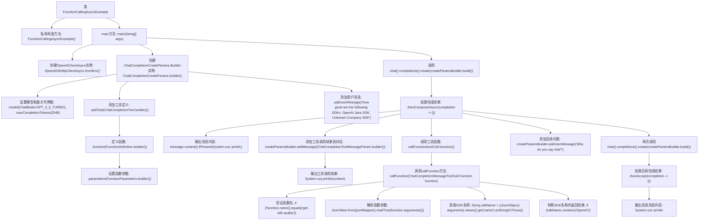

# 基础信息

|      |      |
|------|------|
| 名称 | FunctionCallingAsyncExample |
| 编码语言 | .java |
| 代码路径 | openai-java/openai-java-example/src/main/java/com/openai/example/FunctionCallingAsyncExample.java |
| 包名 | com.openai.example |
| 依赖项 | ['com.openai.core.ObjectMappers.jsonMapper', 'com.fasterxml.jackson.core.JsonProcessingException', 'com.openai.client.OpenAIClientAsync', 'com.openai.client.okhttp.OpenAIOkHttpClientAsync', 'com.openai.core.JsonObject', 'com.openai.core.JsonValue', 'com.openai.models.ChatModel', 'com.openai.models.FunctionDefinition', 'com.openai.models.FunctionParameters', 'com.openai.models.chat.completions', 'java.util.Collection', 'java.util.List', 'java.util.Map'] |
| 概述说明 | Java异步调用OpenAI API，评估SDK质量并分析原因。 |

# 说明

该示例展示了在Java环境中进行异步调用OpenAI API的过程，重点在于评估所使用的SDK的质量。通过异步调用的方式，可以提升应用的响应速度和效率。在评估过程中，开发者会深入分析SDK的性能、稳定性和易用性，并进一步追问可能导致问题的原因，以确保所选用的SDK能够满足项目需求并优化整体开发体验。

# 类列表 Class Summary

| 名称   | 类型  | 说明 |
|-------|------|-------------|
| FunctionCallingAsyncExample | class | Java示例：异步调用OpenAI API，评估SDK质量并追问原因。 |

## 类 FunctionCallingAsyncExample

|      |      |
|------|------|
| 访问范围 | public final |
| 类型 | class |
| 名称 | FunctionCallingAsyncExample |
| 说明 | Java示例：异步调用OpenAI API，评估SDK质量并追问原因。 |

### UML类图

```mermaid
classDiagram
    class FunctionCallingAsyncExample {
        -FunctionCallingAsyncExample()
        +main(String[] args)
        -callFunction(ChatCompletionMessageToolCall.Function function) String
    }

    class OpenAIClientAsync {
        <<Interface>>
    }

    class OpenAIOkHttpClientAsync {
        +fromEnv() OpenAIClientAsync
    }

    class ChatCompletionCreateParams {
        +builder() Builder
    }

    class ChatCompletionCreateParams.Builder {
        +model(ChatModel model) Builder
        +maxCompletionTokens(int tokens) Builder
        +addTool(ChatCompletionTool tool) Builder
        +addUserMessage(String message) Builder
        +addMessage(ChatCompletionMessage message) Builder
        +build() ChatCompletionCreateParams
    }

    class ChatCompletionTool {
        +builder() Builder
    }

    class ChatCompletionTool.Builder {
        +function(FunctionDefinition function) Builder
        +build() ChatCompletionTool
    }

    class FunctionDefinition {
        +builder() Builder
    }

    class FunctionDefinition.Builder {
        +name(String name) Builder
        +description(String description) Builder
        +parameters(FunctionParameters parameters) Builder
        +build() FunctionDefinition
    }

    class FunctionParameters {
        +builder() Builder
    }

    class FunctionParameters.Builder {
        +putAdditionalProperty(String key, JsonValue value) Builder
        +build() FunctionParameters
    }

    class ChatCompletion {
        +choices() List~Choice~
    }

    class ChatCompletion.Choice {
        +message() ChatCompletionMessage
    }

    class ChatCompletionMessage {
        +content() Optional~String~
        +toolCalls() List~ChatCompletionMessageToolCall~
    }

    class ChatCompletionMessageToolCall {
        +id() String
        +function() ChatCompletionMessageToolCall.Function
    }

    class ChatCompletionMessageToolCall.Function {
        +name() String
        +arguments() String
    }

    class ChatCompletionToolMessageParam {
        +builder() Builder
    }

    class ChatCompletionToolMessageParam.Builder {
        +toolCallId(String id) Builder
        +content(String content) Builder
        +build() ChatCompletionToolMessageParam
    }

    FunctionCallingAsyncExample --> OpenAIClientAsync : 依赖
    OpenAIOkHttpClientAsync ..|> OpenAIClientAsync : 实现
    FunctionCallingAsyncExample --> ChatCompletionCreateParams : 依赖
    FunctionCallingAsyncExample --> ChatCompletionTool : 依赖
    FunctionCallingAsyncExample --> FunctionDefinition : 依赖
    FunctionCallingAsyncExample --> FunctionParameters : 依赖
    FunctionCallingAsyncExample --> ChatCompletion : 依赖
    FunctionCallingAsyncExample --> ChatCompletionMessageToolCall : 依赖
    FunctionCallingAsyncExample --> ChatCompletionToolMessageParam : 依赖
```

### 描述
该代码展示了一个异步调用OpenAI API的示例，主要用于生成聊天补全并处理函数调用。`FunctionCallingAsyncExample`类通过`OpenAIClientAsync`接口与OpenAI服务交互，构建聊天补全请求并处理返回结果。代码中涉及多个构建器类，如`ChatCompletionCreateParams.Builder`和`FunctionDefinition.Builder`，用于配置请求参数。`callFunction`方法用于处理函数调用，并根据SDK名称返回相应的评价。

### 内部方法调用关系图

这段代码展示了一个异步调用OpenAI API的示例，主要功能是通过OpenAI的ChatCompletion API进行对话，并调用自定义函数来评估SDK的质量。代码首先配置了OpenAI客户端，然后构建了对话参数，包括模型、最大令牌数和自定义函数定义。接着，它发送用户消息并处理返回的完成结果，调用自定义函数并输出结果。最后，代码添加了后续问题并再次调用API以获取更多信息。整个过程展示了如何通过异步编程与OpenAI API进行交互，并处理复杂的函数调用和对话管理。

### 字段列表 Field List

| 名称  | 类型  | 说明 |
|-------|-------|------|

### 方法列表 Method List

| 名称  | 类型  | 说明 |
|-------|-------|------|
| callFunction | String | 检查函数名，解析参数，返回SDK名称及评价。 |
| main | void | Java代码使用OpenAI客户端配置，调用GPT-3.5模型评估SDK质量并生成对话。 |

