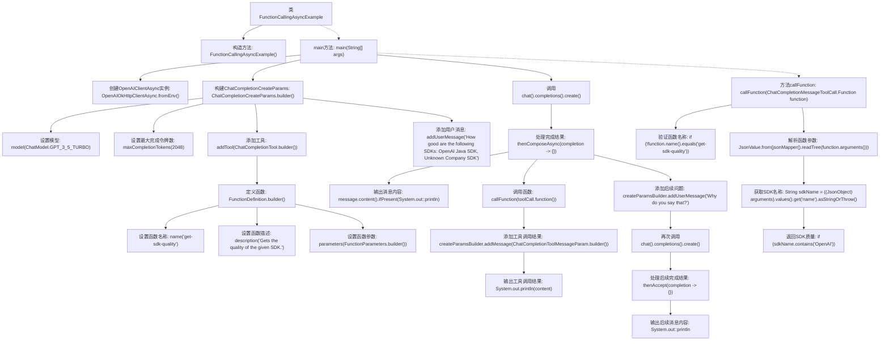

# 基础信息

|      |      |
|------|------|
| 名称 | FunctionCallingAsyncExample |
| 编码语言 | .java |
| 代码路径 | openai-java/openai-java-example/src/main/java/com/openai/example/FunctionCallingAsyncExample.java |
| 包名 | com.openai.example |
| 依赖项 | ['com.openai.core.ObjectMappers.jsonMapper', 'com.fasterxml.jackson.core.JsonProcessingException', 'com.openai.client.OpenAIClientAsync', 'com.openai.client.okhttp.OpenAIOkHttpClientAsync', 'com.openai.core.JsonObject', 'com.openai.core.JsonValue', 'com.openai.models.ChatModel', 'com.openai.models.FunctionDefinition', 'com.openai.models.FunctionParameters', 'com.openai.models.chat.completions', 'java.util.Collection', 'java.util.List', 'java.util.Map'] |
| 概述说明 | Java异步调用OpenAI SDK，评估质量并跟进原因。 |

# 说明

该内容描述了使用Java进行异步调用OpenAI SDK的过程，并进一步评估了该SDK的质量。在评估过程中，可能发现了某些问题或需要改进的地方，因此进行了跟进询问，以了解具体原因。这一过程涉及技术实现、性能评估和问题分析，旨在确保SDK的稳定性和高效性。

# 类列表 Class Summary

| 名称   | 类型  | 说明 |
|-------|------|-------------|
| FunctionCallingAsyncExample | class | Java异步调用OpenAI SDK，评估SDK质量并跟进询问原因。 |

## 类 FunctionCallingAsyncExample

|      |      |
|------|------|
| 访问范围 | public final |
| 类型 | class |
| 名称 | FunctionCallingAsyncExample |
| 说明 | Java异步调用OpenAI SDK，评估SDK质量并跟进询问原因。 |

### UML类图

```mermaid
classDiagram
    class FunctionCallingAsyncExample {
        -FunctionCallingAsyncExample()
        +main(String[] args)
        -callFunction(ChatCompletionMessageToolCall~Function~ function) String
    }

    class OpenAIClientAsync {
        <<Interface>>
    }

    class OpenAIOkHttpClientAsync {
        +fromEnv() OpenAIClientAsync
    }

    class ChatCompletionCreateParams {
        +builder() Builder
    }

    class ChatCompletionCreateParams~Builder~ {
        +model(ChatModel model) Builder
        +maxCompletionTokens(int tokens) Builder
        +addTool(ChatCompletionTool tool) Builder
        +addUserMessage(String message) Builder
        +addMessage(ChatCompletionMessage message) Builder
        +build() ChatCompletionCreateParams
    }

    class ChatCompletionTool {
        +builder() Builder
    }

    class ChatCompletionTool~Builder~ {
        +function(FunctionDefinition function) Builder
        +build() ChatCompletionTool
    }

    class FunctionDefinition {
        +builder() Builder
    }

    class FunctionDefinition~Builder~ {
        +name(String name) Builder
        +description(String description) Builder
        +parameters(FunctionParameters parameters) Builder
        +build() FunctionDefinition
    }

    class FunctionParameters {
        +builder() Builder
    }

    class FunctionParameters~Builder~ {
        +putAdditionalProperty(String key, JsonValue value) Builder
        +build() FunctionParameters
    }

    class ChatCompletion {
        +choices() List~Choice~
    }

    class ChatCompletion~Choice~ {
        +message() ChatCompletionMessage
    }

    class ChatCompletionMessage {
        +content() Optional~String~
        +toolCalls() List~ChatCompletionMessageToolCall~
    }

    class ChatCompletionMessageToolCall {
        +function() Function
        +id() String
    }

    class ChatCompletionMessageToolCall~Function~ {
        +name() String
        +arguments() String
    }

    class ChatCompletionToolMessageParam {
        +builder() Builder
    }

    class ChatCompletionToolMessageParam~Builder~ {
        +toolCallId(String id) Builder
        +content(String content) Builder
        +build() ChatCompletionToolMessageParam
    }

    class JsonValue {
        +from(Object value) JsonValue
    }

    class JsonObject {
        +values() Map~String, JsonValue~
    }

    class JsonProcessingException {
    }

    class IllegalArgumentException {
    }

    FunctionCallingAsyncExample --> OpenAIClientAsync : 依赖
    OpenAIOkHttpClientAsync ..|> OpenAIClientAsync : 实现
    FunctionCallingAsyncExample --> ChatCompletionCreateParams : 依赖
    FunctionCallingAsyncExample --> ChatCompletionTool : 依赖
    FunctionCallingAsyncExample --> FunctionDefinition : 依赖
    FunctionCallingAsyncExample --> FunctionParameters : 依赖
    FunctionCallingAsyncExample --> ChatCompletion : 依赖
    FunctionCallingAsyncExample --> ChatCompletionMessageToolCall : 依赖
    FunctionCallingAsyncExample --> ChatCompletionToolMessageParam : 依赖
    FunctionCallingAsyncExample --> JsonValue : 依赖
    FunctionCallingAsyncExample --> JsonObject : 依赖
    FunctionCallingAsyncExample --> JsonProcessingException : 依赖
    FunctionCallingAsyncExample --> IllegalArgumentException : 依赖
```

**描述：**  
`FunctionCallingAsyncExample` 是一个用于异步调用函数并与 OpenAI 模型进行交互的示例类。它通过 `OpenAIClientAsync` 接口与 OpenAI 服务通信，使用 `ChatCompletionCreateParams` 构建对话参数，并通过 `ChatCompletionTool` 和 `FunctionDefinition` 定义工具和函数。代码还处理了 JSON 数据的解析和异常情况，确保在异步环境中正确处理函数调用和对话流程。

### 内部方法调用关系图

```mermaid
graph TD
    A["类FunctionCallingAsyncExample"]
    B["构造方法: FunctionCallingAsyncExample()"]
    C["main方法: main(String[] args)"]
    D["创建OpenAIClientAsync实例: OpenAIOkHttpClientAsync.fromEnv()"]
    E["构建ChatCompletionCreateParams: ChatCompletionCreateParams.builder()"]
    F["设置模型: model(ChatModel.GPT_3_5_TURBO)"]
    G["设置最大完成令牌数: maxCompletionTokens(2048)"]
    H["添加工具: addTool(ChatCompletionTool.builder())"]
    I["定义函数: FunctionDefinition.builder()"]
    J["设置函数名称: name('get-sdk-quality')"]
    K["设置函数描述: description('Gets the quality of the given SDK.')"]
    L["设置函数参数: parameters(FunctionParameters.builder())"]
    M["添加用户消息: addUserMessage('How good are the following SDKs: OpenAI Java SDK, Unknown Company SDK')"]
    N["调用chat().completions().create()"]
    O["处理完成结果: thenComposeAsync(completion -> {})"]
    P["输出消息内容: message.content().ifPresent(System.out::println)"]
    Q["调用函数: callFunction(toolCall.function())"]
    R["添加工具调用结果: createParamsBuilder.addMessage(ChatCompletionToolMessageParam.builder())"]
    S["输出工具调用结果: System.out.println(content)"]
    T["添加后续问题: createParamsBuilder.addUserMessage('Why do you say that?')"]
    U["再次调用chat().completions().create()"]
    V["处理后续完成结果: thenAccept(completion -> {})"]
    W["输出后续消息内容: System.out::println"]
    X["方法callFunction: callFunction(ChatCompletionMessageToolCall.Function function)"]
    Y["验证函数名称: if (!function.name().equals('get-sdk-quality'))"]
    Z["解析函数参数: JsonValue.from(jsonMapper().readTree(function.arguments()))"]
    AA["获取SDK名称: String sdkName = ((JsonObject) arguments).values().get('name').asStringOrThrow()"]
    AB["返回SDK质量: if (sdkName.contains('OpenAI'))"]

    A --> B
    A -.-> C
    C --> D
    C --> E
    E --> F
    E --> G
    E --> H
    H --> I
    I --> J
    I --> K
    I --> L
    E --> M
    C --> N
    N --> O
    O --> P
    O --> Q
    Q --> R
    R --> S
    O --> T
    T --> U
    U --> V
    V --> W
    C -.-> X
    X --> Y
    X --> Z
    Z --> AA
    AA --> AB
```

这段代码展示了一个异步调用OpenAI API的示例，通过构建聊天完成参数并调用相关函数来获取SDK的质量。代码首先创建了一个OpenAIClientAsync实例，然后构建了包含模型、最大完成令牌数和自定义函数的聊天完成参数。在处理完成结果时，代码会输出消息内容并调用自定义函数来获取SDK质量，最后添加后续问题并再次调用API以获取进一步的分析结果。

### 字段列表 Field List

| 名称  | 类型  | 说明 |
|-------|-------|------|

### 方法列表 Method List

| 名称  | 类型  | 说明 |
|-------|-------|------|
| main | void | Java代码使用OpenAI客户端异步评估SDK质量并跟踪对话。 |
| callFunction | String | 该方法验证函数名，解析参数，返回SDK名称及其质量评价。 |

