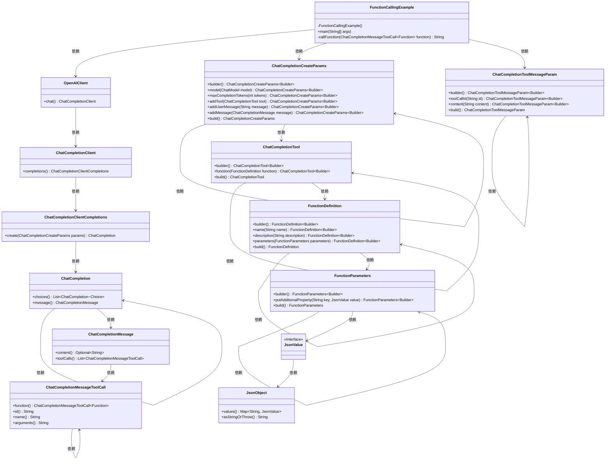
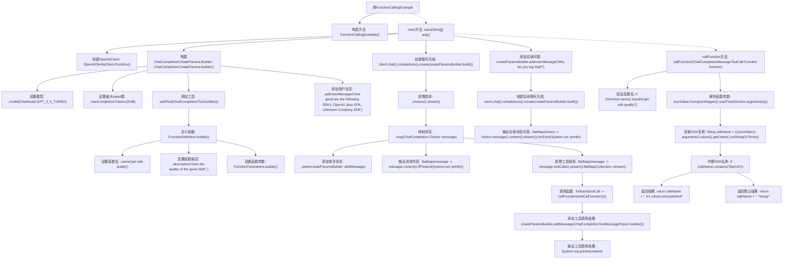

# 基础信息

|      |      |
|------|------|
| 名称 | FunctionCallingExample |
| 编码语言 | .java |
| 代码路径 | openai-java/openai-java-example/src/main/java/com/openai/example/FunctionCallingExample.java |
| 包名 | com.openai.example |
| 依赖项 | ['com.openai.core.ObjectMappers.jsonMapper', 'com.fasterxml.jackson.core.JsonProcessingException', 'com.openai.client.OpenAIClient', 'com.openai.client.okhttp.OpenAIOkHttpClient', 'com.openai.core.JsonObject', 'com.openai.core.JsonValue', 'com.openai.models.ChatModel', 'com.openai.models.FunctionDefinition', 'com.openai.models.FunctionParameters', 'com.openai.models.chat.completions', 'java.util.Collection', 'java.util.List', 'java.util.Map'] |
| 概述说明 | Java示例代码演示调用OpenAI API、配置客户端、定义函数及处理对话和工具调用。 |

# 说明

该内容展示了如何使用Java调用OpenAI API，包括配置客户端、定义函数、处理对话和工具调用。通过详细的步骤，用户能够了解如何设置API客户端，编写必要的函数来与OpenAI服务进行交互，以及如何处理对话和工具调用的响应。整个过程涵盖了从初始化客户端到实际调用的完整流程，确保用户能够顺利集成OpenAI API到Java应用程序中。

# 类列表 Class Summary

| 名称   | 类型  | 说明 |
|-------|------|-------------|
| FunctionCallingExample | class | Java示例代码展示如何调用OpenAI API，配置客户端，定义函数，处理对话和工具调用。 |

## 类 FunctionCallingExample

|      |      |
|------|------|
| 访问范围 | public final |
| 类型 | class |
| 名称 | FunctionCallingExample |
| 说明 | Java示例代码展示如何调用OpenAI API，配置客户端，定义函数，处理对话和工具调用。 |

### UML类图

**描述**：该代码展示了如何使用OpenAI的Java SDK进行函数调用。`FunctionCallingExample`类通过`OpenAIClient`与OpenAI的API进行交互，构建聊天完成请求，并处理返回的消息。代码中使用了多个构建器模式来创建复杂的参数对象，并通过函数调用获取SDK的质量评估。类图展示了各个类之间的依赖关系，包括客户端、消息、工具调用等组件的交互。

### 内部方法调用关系图

这段代码展示了一个使用OpenAI API进行对话和函数调用的示例。首先，代码通过环境变量配置OpenAIClient，然后构建了一个包含模型、最大token数和自定义函数的聊天请求。接着，代码处理聊天完成的结果，调用自定义函数并输出结果。最后，代码添加了一个后续问题并输出结果。整个过程展示了如何使用OpenAI API进行复杂的对话和函数调用。

### 字段列表 Field List

| 名称  | 类型  | 说明 |
|-------|-------|------|

### 方法列表 Method List

| 名称  | 类型  | 说明 |
|-------|-------|------|
| callFunction | String | 调用函数检查SDK质量，若为OpenAI则返回优质评价，否则返回不确定。 |
| main | void | Java代码配置OpenAI客户端，构建聊天参数，调用函数并输出结果。 |

