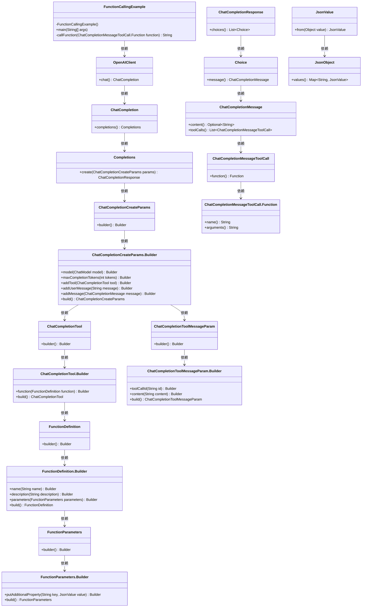
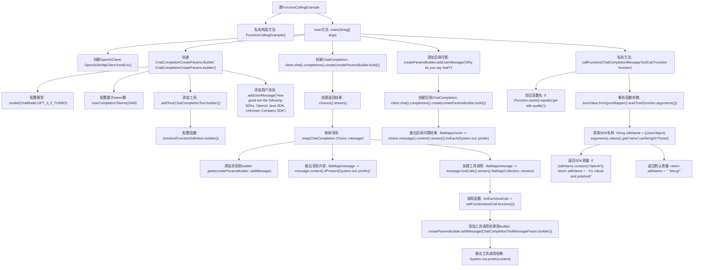

# 基础信息

|      |      |
|------|------|
| 名称 | FunctionCallingExample |
| 编码语言 | .java |
| 代码路径 | openai-java/openai-java-example/src/main/java/com/openai/example/FunctionCallingExample.java |
| 包名 | com.openai.example |
| 依赖项 | ['com.openai.core.ObjectMappers.jsonMapper', 'com.fasterxml.jackson.core.JsonProcessingException', 'com.openai.client.OpenAIClient', 'com.openai.client.okhttp.OpenAIOkHttpClient', 'com.openai.core.JsonObject', 'com.openai.core.JsonValue', 'com.openai.models.ChatModel', 'com.openai.models.FunctionDefinition', 'com.openai.models.FunctionParameters', 'com.openai.models.chat.completions', 'java.util.Collection', 'java.util.List', 'java.util.Map'] |
| 概述说明 | Java示例演示通过OpenAI API调用自定义函数评估SDK质量。 |

# 说明

该Java示例展示了如何通过OpenAI API调用自定义函数来评估SDK的质量。示例中详细描述了如何设置API请求，包括必要的参数和配置，以及如何处理API响应以获取评估结果。整个过程强调了如何使用OpenAI的强大功能来自动化和优化SDK的质量评估流程，确保开发者能够高效地识别和解决潜在问题。

# 类列表 Class Summary

| 名称   | 类型  | 说明 |
|-------|------|-------------|
| FunctionCallingExample | class | Java示例展示如何使用OpenAI API调用自定义函数评估SDK质量。 |

## 类 FunctionCallingExample

|      |      |
|------|------|
| 访问范围 | public final |
| 类型 | class |
| 名称 | FunctionCallingExample |
| 说明 | Java示例展示如何使用OpenAI API调用自定义函数评估SDK质量。 |

### UML类图

```mermaid
classDiagram
    class FunctionCallingExample {
        -FunctionCallingExample()
        +main(String[] args)
        -callFunction(ChatCompletionMessageToolCall.Function function) String
    }

    class OpenAIClient {
        +chat() ChatCompletion
    }

    class ChatCompletion {
        +completions() Completions
    }

    class Completions {
        +create(ChatCompletionCreateParams params) ChatCompletionResponse
    }

    class ChatCompletionCreateParams {
        +builder() Builder
    }

    class ChatCompletionCreateParams.Builder {
        +model(ChatModel model) Builder
        +maxCompletionTokens(int tokens) Builder
        +addTool(ChatCompletionTool tool) Builder
        +addUserMessage(String message) Builder
        +addMessage(ChatCompletionMessage message) Builder
        +build() ChatCompletionCreateParams
    }

    class ChatCompletionTool {
        +builder() Builder
    }

    class ChatCompletionTool.Builder {
        +function(FunctionDefinition function) Builder
        +build() ChatCompletionTool
    }

    class FunctionDefinition {
        +builder() Builder
    }

    class FunctionDefinition.Builder {
        +name(String name) Builder
        +description(String description) Builder
        +parameters(FunctionParameters parameters) Builder
        +build() FunctionDefinition
    }

    class FunctionParameters {
        +builder() Builder
    }

    class FunctionParameters.Builder {
        +putAdditionalProperty(String key, JsonValue value) Builder
        +build() FunctionParameters
    }

    class ChatCompletionToolMessageParam {
        +builder() Builder
    }

    class ChatCompletionToolMessageParam.Builder {
        +toolCallId(String id) Builder
        +content(String content) Builder
        +build() ChatCompletionToolMessageParam
    }

    class ChatCompletionMessageToolCall {
        +function() Function
    }

    class ChatCompletionMessageToolCall.Function {
        +name() String
        +arguments() String
    }

    class ChatCompletionResponse {
        +choices() List~Choice~
    }

    class Choice {
        +message() ChatCompletionMessage
    }

    class ChatCompletionMessage {
        +content() Optional~String~
        +toolCalls() List~ChatCompletionMessageToolCall~
    }

    class JsonValue {
        +from(Object value) JsonValue
    }

    class JsonObject {
        +values() Map~String, JsonValue~
    }

    FunctionCallingExample --> OpenAIClient : 依赖
    OpenAIClient --> ChatCompletion : 依赖
    ChatCompletion --> Completions : 依赖
    Completions --> ChatCompletionCreateParams : 依赖
    ChatCompletionCreateParams --> ChatCompletionCreateParams.Builder : 依赖
    ChatCompletionCreateParams.Builder --> ChatCompletionTool : 依赖
    ChatCompletionTool --> ChatCompletionTool.Builder : 依赖
    ChatCompletionTool.Builder --> FunctionDefinition : 依赖
    FunctionDefinition --> FunctionDefinition.Builder : 依赖
    FunctionDefinition.Builder --> FunctionParameters : 依赖
    FunctionParameters --> FunctionParameters.Builder : 依赖
    ChatCompletionCreateParams.Builder --> ChatCompletionToolMessageParam : 依赖
    ChatCompletionToolMessageParam --> ChatCompletionToolMessageParam.Builder : 依赖
    ChatCompletionMessageToolCall --> ChatCompletionMessageToolCall.Function : 依赖
    ChatCompletionResponse --> Choice : 依赖
    Choice --> ChatCompletionMessage : 依赖
    ChatCompletionMessage --> ChatCompletionMessageToolCall : 依赖
    JsonValue --> JsonObject : 依赖
```

### 描述
该代码展示了一个通过OpenAI API进行对话和函数调用的示例。`FunctionCallingExample`类通过`OpenAIClient`与OpenAI API进行交互，使用`ChatCompletionCreateParams.Builder`构建请求参数，并通过`callFunction`方法处理函数调用。代码通过链式调用构建请求，处理响应，并在对话中追加消息以保持上下文。

### 内部方法调用关系图

```mermaid
graph TD
    A["类FunctionCallingExample"]
    B["私有构造方法: FunctionCallingExample()"]
    C["main方法: main(String[] args)"]
    D["创建OpenAIClient: OpenAIOkHttpClient.fromEnv()"]
    E["创建ChatCompletionCreateParams.Builder: ChatCompletionCreateParams.builder()"]
    F["配置模型: .model(ChatModel.GPT_3_5_TURBO)"]
    G["配置最大token数: .maxCompletionTokens(2048)"]
    H["添加工具: .addTool(ChatCompletionTool.builder())"]
    I["配置函数: .function(FunctionDefinition.builder())"]
    J["添加用户消息: .addUserMessage('How good are the following SDKs: OpenAI Java SDK, Unknown Company SDK')"]
    K["创建ChatCompletion: client.chat().completions().create(createParamsBuilder.build())"]
    L["处理返回结果: .choices().stream()"]
    M["映射消息: .map(ChatCompletion.Choice::message)"]
    N["添加消息到builder: .peek(createParamsBuilder::addMessage)"]
    O["输出消息内容: .flatMap(message -> message.content().ifPresent(System.out::println))"]
    P["处理工具调用: .flatMap(message -> message.toolCalls().stream().flatMap(Collection::stream))"]
    Q["调用函数: .forEach(toolCall -> callFunction(toolCall.function()))"]
    R["添加工具调用结果到builder: createParamsBuilder.addMessage(ChatCompletionToolMessageParam.builder())"]
    S["输出工具调用结果: System.out.println(content)"]
    T["添加后续问题: createParamsBuilder.addUserMessage('Why do you say that?')"]
    U["创建后续ChatCompletion: client.chat().completions().create(createParamsBuilder.build())"]
    V["输出后续问题结果: .flatMap(choice -> choice.message().content().stream()).forEach(System.out::println)"]
    W["私有方法: callFunction(ChatCompletionMessageToolCall.Function function)"]
    X["验证函数名: if (!function.name().equals('get-sdk-quality'))"]
    Y["解析函数参数: JsonValue.from(jsonMapper().readTree(function.arguments()))"]
    Z["获取SDK名称: String sdkName = ((JsonObject) arguments).values().get('name').asStringOrThrow()"]
    AA["返回SDK质量: if (sdkName.contains('OpenAI')) return sdkName + ': It's robust and polished!'"]
    AB["返回默认质量: return sdkName + ': *shrug*'"]

    A --> B
    A --> C
    C --> D
    C --> E
    E --> F
    E --> G
    E --> H
    H --> I
    E --> J
    C --> K
    K --> L
    L --> M
    M --> N
    M --> O
    M --> P
    P --> Q
    Q --> R
    R --> S
    C --> T
    T --> U
    U --> V
    C --> W
    W --> X
    W --> Y
    Y --> Z
    Z --> AA
    Z --> AB
```

这段代码展示了一个使用OpenAI API进行对话和函数调用的示例。首先，它配置了一个OpenAIClient，并构建了一个包含模型、最大token数和工具调用的ChatCompletionCreateParams。然后，它发送用户消息并处理返回的结果，包括调用自定义函数并输出结果。最后，它添加了一个后续问题并输出其回答。整个过程展示了如何通过API进行对话和函数调用的完整流程。

### 字段列表 Field List

| 名称  | 类型  | 说明 |
|-------|-------|------|

### 方法列表 Method List

| 名称  | 类型  | 说明 |
|-------|-------|------|
| callFunction | String | 调用函数验证SDK名称，若为OpenAI则返回高质量评价，否则返回不确定。 |
| main | void | Java代码通过环境变量配置OpenAI客户端，使用GPT-3.5模型生成对话，调用自定义函数评估SDK质量，并支持后续提问。 |

