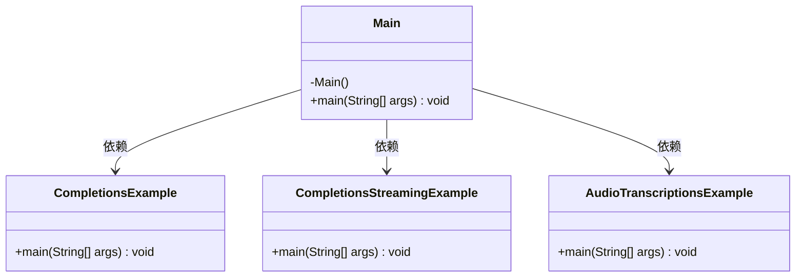
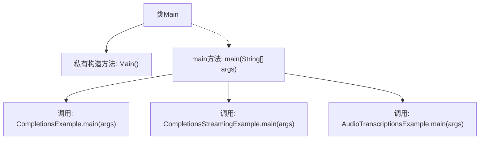

# 基础信息

|      |      |
|------|------|
| 名称 | Main |
| 编码语言 | .java |
| 代码路径 | openai-java/openai-java-example/src/main/java/com/openai/example/Main.java |
| 包名 | com.openai.example |
| 依赖项 | [] |
| 概述说明 | Main类执行Completions、CompletionsStreaming和AudioTranscriptions示例。 |

# 说明

Main类负责执行Completions、CompletionsStreaming和AudioTranscriptions的示例功能。Completions用于生成文本补全，CompletionsStreaming则支持流式文本补全，而AudioTranscriptions用于将音频转录为文本。这些功能通过Main类进行调用和演示，展示了文本生成和音频处理的核心能力。

# 类列表 Class Summary

| 名称   | 类型  | 说明 |
|-------|------|-------------|
| Main | class | Main类执行Completions、CompletionsStreaming和AudioTranscriptions示例。 |

## 类 Main

|      |      |
|------|------|
| 访问范围 | public final |
| 类型 | class |
| 名称 | Main |
| 说明 | Main类执行Completions、CompletionsStreaming和AudioTranscriptions示例。 |

### UML类图

**描述：**  
`Main` 类是一个不可继承的类，包含一个私有的构造函数和一个公有的 `main` 方法。`main` 方法调用了 `CompletionsExample`、`CompletionsStreamingExample` 和 `AudioTranscriptionsExample` 三个类的 `main` 方法，展示了 `Main` 类对这三个类的依赖关系。这段代码主要用于启动并执行这三个示例类的功能。

### 内部方法调用关系图

这段代码定义了一个名为 `Main` 的类，该类包含一个私有的构造方法和一个 `main` 方法。`main` 方法依次调用了三个其他类的 `main` 方法：`CompletionsExample.main(args)`、`CompletionsStreamingExample.main(args)` 和 `AudioTranscriptionsExample.main(args)`。流程图展示了类 `Main` 的结构及其 `main` 方法中的调用顺序，清晰地反映了程序的执行流程。

### 字段列表 Field List

| 名称  | 类型  | 说明 |
|-------|-------|------|

### 方法列表 Method List

| 名称  | 类型  | 说明 |
|-------|-------|------|
| main | void | Java主方法调用三个示例类执行任务。 |

