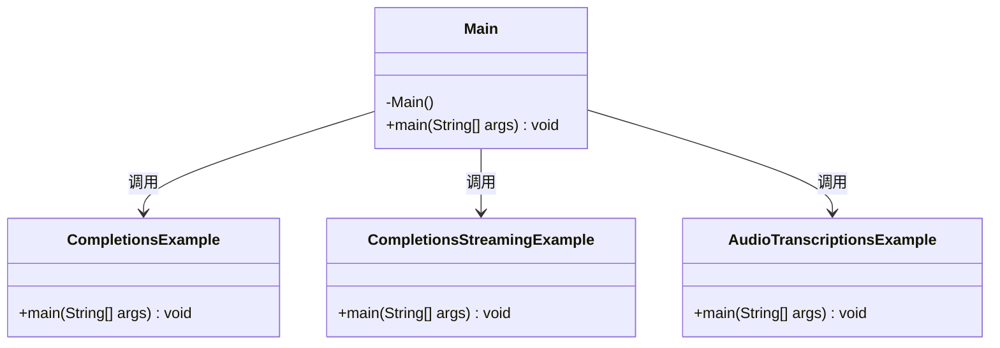
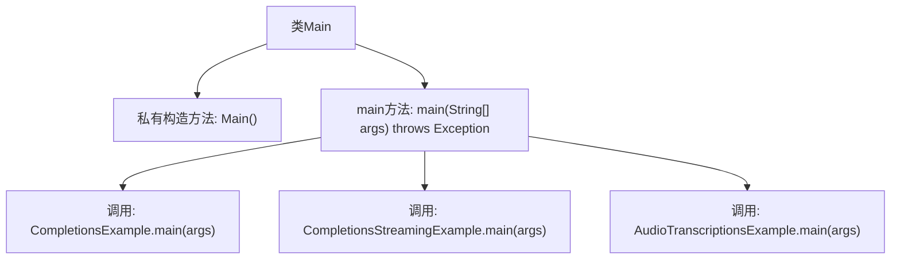

# 基础信息

|      |      |
|------|------|
| 名称 | Main |
| 编码语言 | .java |
| 代码路径 | openai-java/openai-java-example/src/main/java/com/openai/example/Main.java |
| 包名 | com.openai.example |
| 依赖项 | [] |
| 概述说明 | Java主类调用多个示例程序实现功能。 |

# 说明

Java主类通过调用多个示例程序来实现功能集成。这些示例程序各自独立执行特定任务，主类负责协调和整合它们的执行流程。通过这种方式，主类能够高效地管理和调度多个功能模块，确保程序整体的运行效率和逻辑清晰性。这种设计模式适用于复杂系统，能够提升代码的可维护性和扩展性。

# 类列表 Class Summary

| 名称   | 类型  | 说明 |
|-------|------|-------------|
| Main | class | Java主类调用多个示例程序。 |

## 类 Main

|      |      |
|------|------|
| 访问范围 | public final |
| 类型 | class |
| 名称 | Main |
| 说明 | Java主类调用多个示例程序。 |

### UML类图

```mermaid
classDiagram
    class Main {
        -Main()
        +main(String[] args) void
    }

    class CompletionsExample {
        +main(String[] args) void
    }

    class CompletionsStreamingExample {
        +main(String[] args) void
    }

    class AudioTranscriptionsExample {
        +main(String[] args) void
    }

    Main --> CompletionsExample : 调用
    Main --> CompletionsStreamingExample : 调用
    Main --> AudioTranscriptionsExample : 调用
```

这段代码定义了一个名为 `Main` 的类，该类包含一个私有的构造函数和一个公有的静态 `main` 方法。`Main` 类的 `main` 方法依次调用了 `CompletionsExample`、`CompletionsStreamingExample` 和 `AudioTranscriptionsExample` 类的 `main` 方法。这些调用展示了 `Main` 类对其他类的依赖关系，`Main` 类本身不包含任何状态或属性，仅作为一个入口点来启动其他类的功能。

### 内部方法调用关系图

```mermaid
graph TD
    A["类Main"]
    B["私有构造方法: Main()"]
    C["main方法: main(String[] args) throws Exception"]
    D["调用: CompletionsExample.main(args)"]
    E["调用: CompletionsStreamingExample.main(args)"]
    F["调用: AudioTranscriptionsExample.main(args)"]

    A --> B
    A --> C
    C --> D
    C --> E
    C --> F
```

这段代码定义了一个名为 `Main` 的不可继承的类，其中包含一个私有的构造方法，防止外部实例化。`main` 方法是程序的入口点，依次调用了 `CompletionsExample.main(args)`、`CompletionsStreamingExample.main(args)` 和 `AudioTranscriptionsExample.main(args)` 三个方法，分别执行不同的示例任务。流程图展示了类的结构和方法调用的顺序。

### 字段列表 Field List

| 名称  | 类型  | 说明 |
|-------|-------|------|

### 方法列表 Method List

| 名称  | 类型  | 说明 |
|-------|-------|------|
| main | void | Java主方法调用三个示例类执行任务。 |

