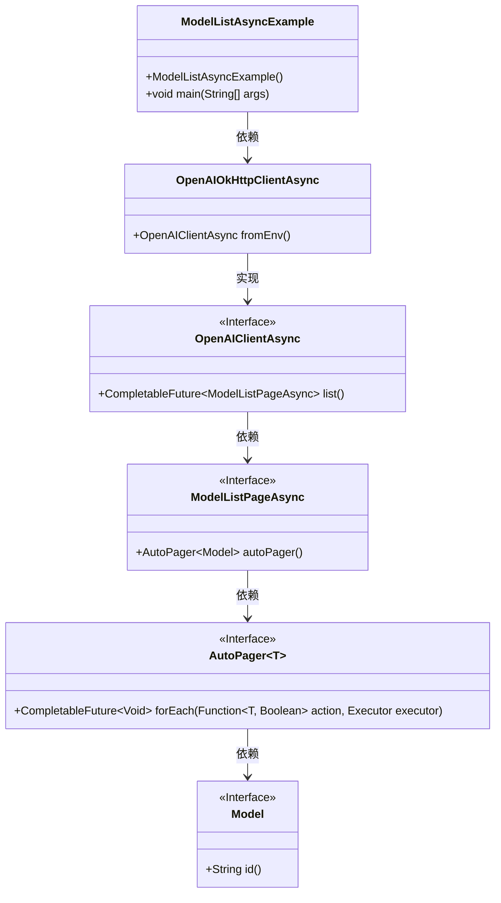
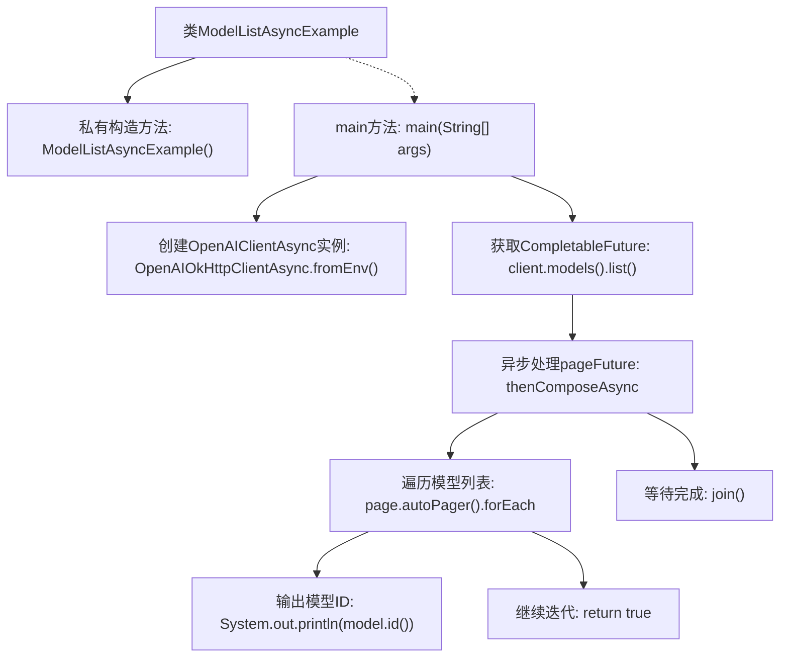

# 基础信息

|      |      |
|------|------|
| 名称 | ModelListAsyncExample |
| 编码语言 | .java |
| 代码路径 | openai-java/openai-java-example/src/main/java/com/openai/example/ModelListAsyncExample.java |
| 包名 | com.openai.example |
| 依赖项 | ['com.openai.client.OpenAIClientAsync', 'com.openai.client.okhttp.OpenAIOkHttpClientAsync', 'com.openai.models.models.ModelListPageAsync', 'java.util.concurrent.CompletableFuture'] |
| 概述说明 | Java异步获取OpenAI模型并输出ID。 |

# 说明

该内容描述了一个Java示例，展示了如何异步列出OpenAI模型并打印它们的ID。具体步骤包括使用异步编程技术，调用OpenAI提供的API接口，获取模型列表，并逐一提取每个模型的ID进行打印。整个过程旨在演示如何在Java环境中高效处理异步任务，并与OpenAI的API进行交互。

# 类列表 Class Summary

| 名称   | 类型  | 说明 |
|-------|------|-------------|
| ModelListAsyncExample | class | Java示例：异步列出OpenAI模型并打印ID。 |

## 类 ModelListAsyncExample

|      |      |
|------|------|
| 访问范围 | public final |
| 类型 | class |
| 名称 | ModelListAsyncExample |
| 说明 | Java示例：异步列出OpenAI模型并打印ID。 |

### UML类图

### 描述
这段代码展示了一个异步获取模型列表的示例。`ModelListAsyncExample`类通过`OpenAIOkHttpClientAsync`创建了一个`OpenAIClientAsync`客户端，并调用其`list`方法获取模型列表页。通过`autoPager`方法，代码实现了异步分页遍历模型列表，并打印每个模型的ID。整个流程依赖于多个接口和实现类，包括`ModelListPageAsync`、`AutoPager`和`Model`，展示了异步编程和分页处理的典型模式。

### 内部方法调用关系图

这段代码展示了如何使用异步客户端获取并遍历OpenAI模型列表。首先，通过环境变量配置OpenAIClientAsync实例，然后异步获取模型列表页面。接着，使用`thenComposeAsync`方法异步处理页面，并通过`autoPager`遍历每个模型，输出其ID。最后，使用`join`方法等待所有操作完成。整个流程展示了异步编程模型在处理远程API调用时的典型应用。

### 字段列表 Field List

| 名称  | 类型  | 说明 |
|-------|-------|------|

### 方法列表 Method List

| 名称  | 类型  | 说明 |
|-------|-------|------|
| main | void | Java代码配置OpenAI客户端，列出模型ID。 |

