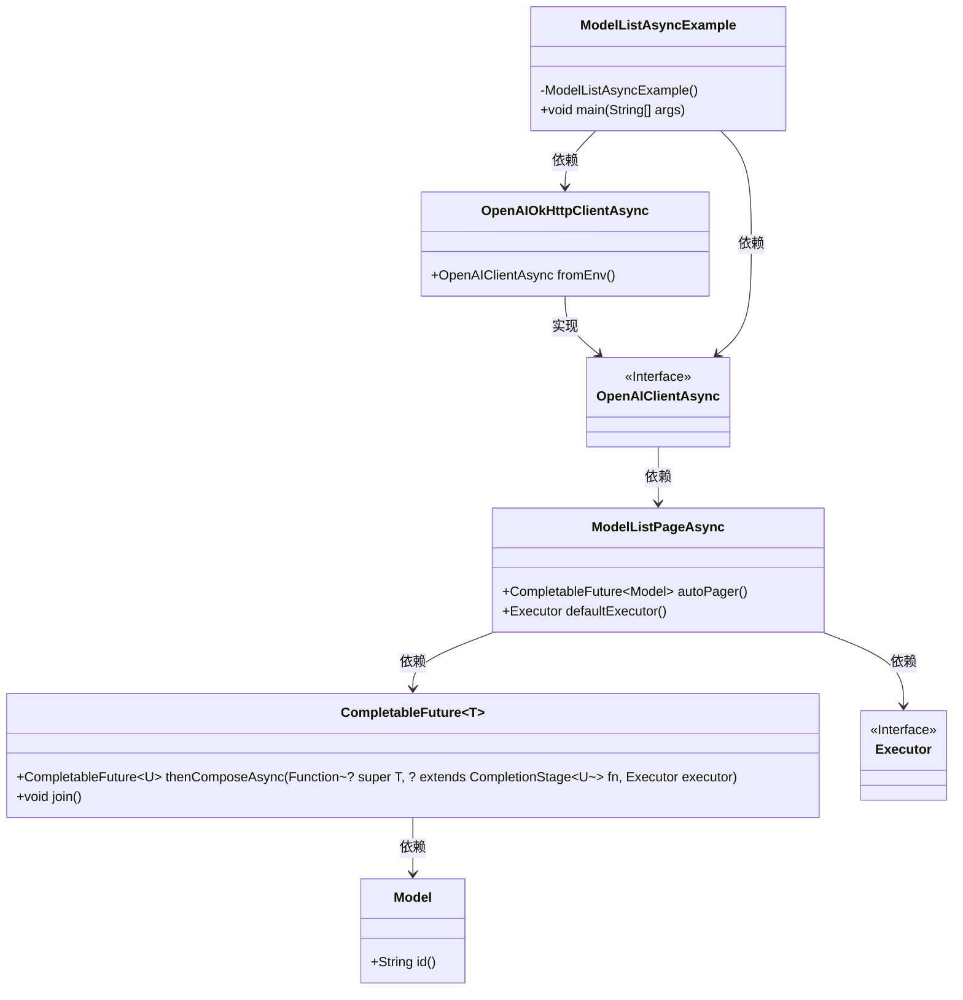
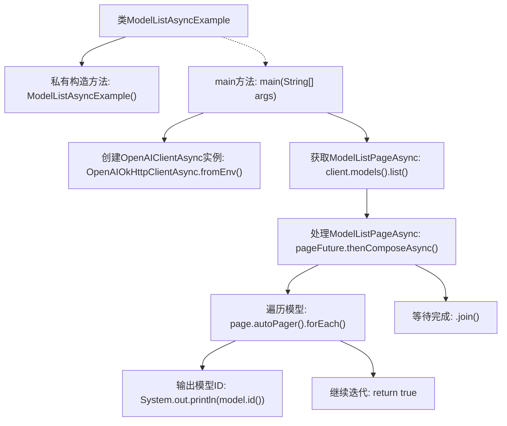

# 基础信息

|      |      |
|------|------|
| 名称 | ModelListAsyncExample |
| 编码语言 | .java |
| 代码路径 | openai-java/openai-java-example/src/main/java/com/openai/example/ModelListAsyncExample.java |
| 包名 | com.openai.example |
| 依赖项 | ['com.openai.client.OpenAIClientAsync', 'com.openai.client.okhttp.OpenAIOkHttpClientAsync', 'com.openai.models.models.ModelListPageAsync', 'java.util.concurrent.CompletableFuture'] |
| 概述说明 | Java示例代码异步列出OpenAI模型并打印ID。 |

# 说明

该内容描述了一个Java示例代码，用于异步列出OpenAI模型并打印它们的ID。代码的主要功能是通过异步操作获取OpenAI模型的列表，并逐一输出每个模型的唯一标识符（ID）。此示例展示了如何在Java中处理异步任务，并与OpenAI的API进行交互，以实现模型信息的获取和展示。

# 类列表 Class Summary

| 名称   | 类型  | 说明 |
|-------|------|-------------|
| ModelListAsyncExample | class | 异步列出OpenAI模型并打印ID的Java示例代码。 |

## 类 ModelListAsyncExample

|      |      |
|------|------|
| 访问范围 | public final |
| 类型 | class |
| 名称 | ModelListAsyncExample |
| 说明 | 异步列出OpenAI模型并打印ID的Java示例代码。 |

### UML类图

```mermaid
classDiagram
    class ModelListAsyncExample {
        -ModelListAsyncExample()
        +void main(String[] args)
    }
    class OpenAIClientAsync {
        <<Interface>>
    }
    class OpenAIOkHttpClientAsync {
        +OpenAIClientAsync fromEnv()
    }
    class ModelListPageAsync {
        +CompletableFuture~Model~ autoPager()
        +Executor defaultExecutor()
    }
    class CompletableFuture~T~ {
        +CompletableFuture~U~ thenComposeAsync(Function~? super T, ? extends CompletionStage~U~~ fn, Executor executor)
        +void join()
    }
    class Model {
        +String id()
    }
    class Executor {
        <<Interface>>
    }

    ModelListAsyncExample --> OpenAIOkHttpClientAsync : 依赖
    OpenAIOkHttpClientAsync --> OpenAIClientAsync : 实现
    ModelListAsyncExample --> OpenAIClientAsync : 依赖
    OpenAIClientAsync --> ModelListPageAsync : 依赖
    ModelListPageAsync --> CompletableFuture~Model~ : 依赖
    CompletableFuture~Model~ --> Model : 依赖
    ModelListPageAsync --> Executor : 依赖
```

这段代码展示了一个异步的模型列表示例，使用了OpenAI的异步客户端来获取模型列表，并通过自动分页器逐个打印模型ID。`ModelListAsyncExample`类通过`OpenAIOkHttpClientAsync`创建异步客户端，并调用`list`方法获取模型列表页，然后使用`CompletableFuture`进行异步处理，确保在默认执行器上完成所有操作。

### 内部方法调用关系图

```mermaid
graph TD
    A["类ModelListAsyncExample"]
    B["私有构造方法: ModelListAsyncExample()"]
    C["main方法: main(String[] args)"]
    D["创建OpenAIClientAsync实例: OpenAIOkHttpClientAsync.fromEnv()"]
    E["获取ModelListPageAsync: client.models().list()"]
    F["处理ModelListPageAsync: pageFuture.thenComposeAsync()"]
    G["遍历模型: page.autoPager().forEach()"]
    H["输出模型ID: System.out.println(model.id())"]
    I["继续迭代: return true"]
    J["等待完成: .join()"]

    A --> B
    A -.-> C
    C --> D
    C --> E
    E --> F
    F --> G
    G --> H
    G --> I
    F --> J
```

这段代码定义了一个名为 `ModelListAsyncExample` 的类，该类通过异步方式从 OpenAI 或 Azure OpenAI 服务获取模型列表，并遍历输出每个模型的 ID。代码首先通过环境变量配置客户端，然后异步获取模型列表页面，接着使用自动分页器遍历每个模型并输出其 ID，最后等待所有操作完成。整个过程展示了异步编程和分页处理的典型用法。

### 字段列表 Field List

| 名称  | 类型  | 说明 |
|-------|-------|------|

### 方法列表 Method List

| 名称  | 类型  | 说明 |
|-------|-------|------|
| main | void | Java代码配置OpenAI客户端，列出模型并打印ID。 |

