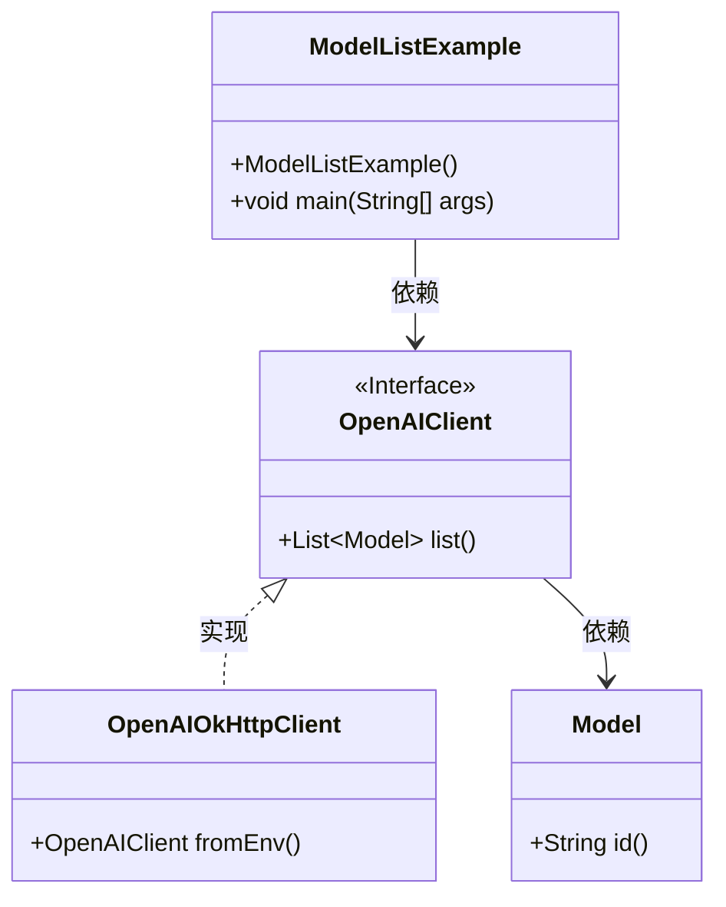
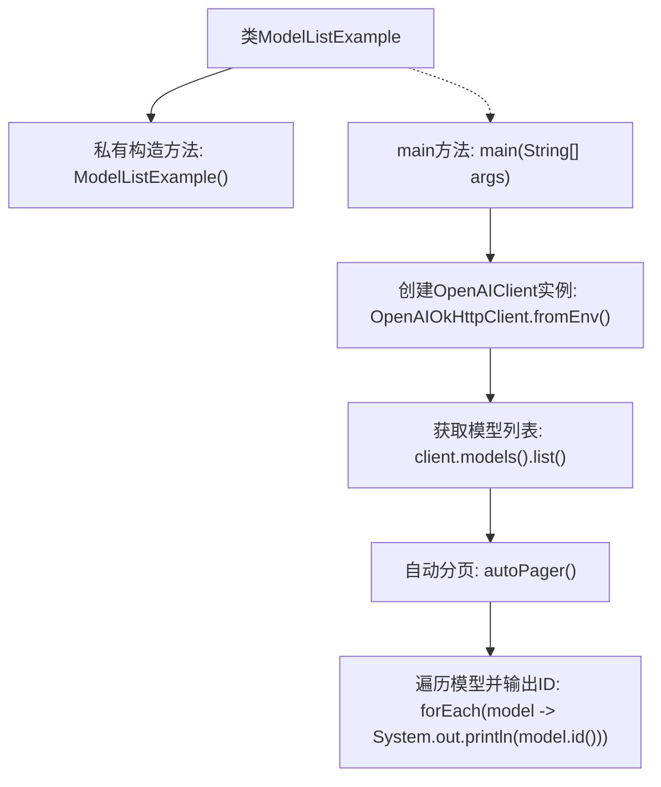

# 基础信息

|      |      |
|------|------|
| 名称 | ModelListExample |
| 编码语言 | .java |
| 代码路径 | openai-java/openai-java-example/src/main/java/com/openai/example/ModelListExample.java |
| 包名 | com.openai.example |
| 依赖项 | ['com.openai.client.OpenAIClient', 'com.openai.client.okhttp.OpenAIOkHttpClient'] |
| 概述说明 | Java代码通过环境变量配置OpenAI客户端并列出模型ID。 |

# 说明

该内容涉及通过环境变量配置OpenAI客户端并列出模型ID的Java示例代码。具体步骤包括从系统环境变量中获取必要的配置信息，如API密钥和端点URL，然后使用这些配置初始化OpenAI客户端。接着，代码调用客户端的方法获取可用的模型列表，并提取每个模型的唯一标识符（ID）。整个过程展示了如何在Java中集成OpenAI服务，并通过环境变量实现灵活的配置管理。

# 类列表 Class Summary

| 名称   | 类型  | 说明 |
|-------|------|-------------|
| ModelListExample | class | Java示例代码，通过环境变量配置OpenAI客户端并列出模型ID。 |

## 类 ModelListExample

|      |      |
|------|------|
| 访问范围 | public final |
| 类型 | class |
| 名称 | ModelListExample |
| 说明 | Java示例代码，通过环境变量配置OpenAI客户端并列出模型ID。 |

### UML类图

类图描述：  
`ModelListExample` 类是一个不可继承的类，包含一个私有的构造函数和一个公有的 `main` 方法。`main` 方法通过 `OpenAIOkHttpClient` 类从环境变量中获取配置并创建 `OpenAIClient` 实例。`OpenAIClient` 是一个接口，提供了 `list` 方法，返回一个 `Model` 对象的列表。`Model` 类包含一个 `id` 方法，用于获取模型的唯一标识。`OpenAIOkHttpClient` 类实现了 `OpenAIClient` 接口，提供了 `fromEnv` 方法来创建客户端实例。

### 内部方法调用关系图

该流程图展示了`ModelListExample`类的执行流程。首先，类通过私有构造方法`ModelListExample()`防止实例化。在`main`方法中，程序通过`OpenAIOkHttpClient.fromEnv()`创建`OpenAIClient`实例，然后获取模型列表并启用自动分页功能，最后遍历模型列表并输出每个模型的ID。整个过程清晰地展示了从环境配置到模型ID输出的完整流程。

### 字段列表 Field List

| 名称  | 类型  | 说明 |
|-------|-------|------|

### 方法列表 Method List

| 名称  | 类型  | 说明 |
|-------|-------|------|
| main | void | Java代码通过环境变量配置OpenAI客户端并列出所有模型ID。 |

