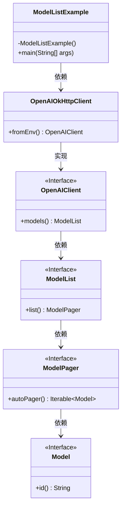
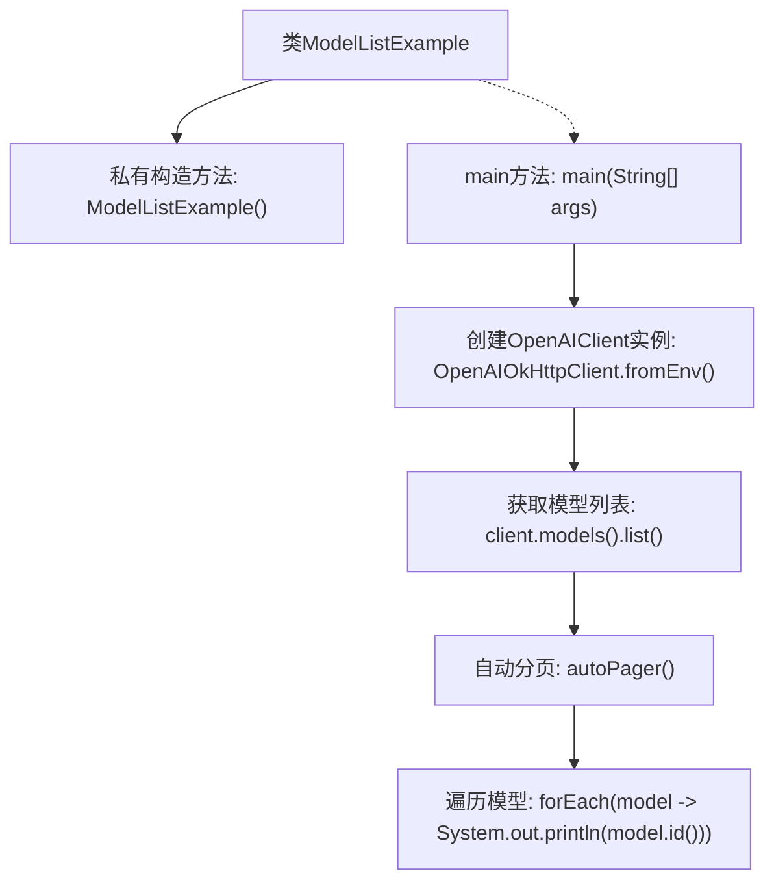

# 基础信息

|      |      |
|------|------|
| 名称 | ModelListExample |
| 编码语言 | .java |
| 代码路径 | openai-java/openai-java-example/src/main/java/com/openai/example/ModelListExample.java |
| 包名 | com.openai.example |
| 依赖项 | ['com.openai.client.OpenAIClient', 'com.openai.client.okhttp.OpenAIOkHttpClient'] |
| 概述说明 | Java代码示例：通过环境变量配置OpenAI客户端并获取模型ID。 |

# 说明

该内容描述了如何在Java中使用环境变量配置OpenAI客户端，并列出可用的模型ID。通过环境变量，开发者可以动态设置OpenAI客户端的配置参数，如API密钥和端点地址。配置完成后，客户端可以访问OpenAI的API，并获取当前可用的模型ID列表。这种方法使得配置管理更加灵活，便于在不同环境中部署和测试应用程序。整个过程无需硬编码敏感信息，提高了代码的安全性和可维护性。

# 类列表 Class Summary

| 名称   | 类型  | 说明 |
|-------|------|-------------|
| ModelListExample | class | Java示例代码：使用环境变量配置OpenAI客户端并列出模型ID。 |

## 类 ModelListExample

|      |      |
|------|------|
| 访问范围 | public final |
| 类型 | class |
| 名称 | ModelListExample |
| 说明 | Java示例代码：使用环境变量配置OpenAI客户端并列出模型ID。 |

### UML类图

```mermaid
classDiagram
    class ModelListExample {
        -ModelListExample()
        +main(String[] args)
    }

    class OpenAIClient {
        <<Interface>>
        +models() ModelList
    }

    class OpenAIOkHttpClient {
        +fromEnv() OpenAIClient
    }

    class ModelList {
        <<Interface>>
        +list() ModelPager
    }

    class ModelPager {
        <<Interface>>
        +autoPager() Iterable~Model~
    }

    class Model {
        <<Interface>>
        +id() String
    }

    ModelListExample --> OpenAIOkHttpClient : 依赖
    OpenAIOkHttpClient --> OpenAIClient : 实现
    OpenAIClient --> ModelList : 依赖
    ModelList --> ModelPager : 依赖
    ModelPager --> Model : 依赖
```

这段代码展示了一个简单的Java程序，`ModelListExample`类通过调用`OpenAIOkHttpClient.fromEnv()`方法获取`OpenAIClient`实例，并使用该客户端列出所有模型并打印它们的ID。类图清晰地展示了各个类之间的依赖关系和接口实现关系，帮助理解代码的结构和功能。

### 内部方法调用关系图

```mermaid
graph TD
    A["类ModelListExample"]
    B["私有构造方法: ModelListExample()"]
    C["main方法: main(String[] args)"]
    D["创建OpenAIClient实例: OpenAIOkHttpClient.fromEnv()"]
    E["获取模型列表: client.models().list()"]
    F["自动分页: autoPager()"]
    G["遍历模型: forEach(model -> System.out.println(model.id()))"]

    A --> B
    A -.-> C
    C --> D
    D --> E
    E --> F
    F --> G
```

这段代码定义了一个名为`ModelListExample`的类，该类包含一个私有的构造方法和一个`main`方法。`main`方法通过环境变量配置`OpenAIClient`实例，获取模型列表并进行自动分页处理，最后遍历模型列表并输出每个模型的ID。流程图清晰地展示了从类定义到最终输出的各个步骤及其调用关系。

### 字段列表 Field List

| 名称  | 类型  | 说明 |
|-------|-------|------|

### 方法列表 Method List

| 名称  | 类型  | 说明 |
|-------|-------|------|
| main | void | Java代码通过环境变量配置OpenAI客户端并列出模型ID。 |

