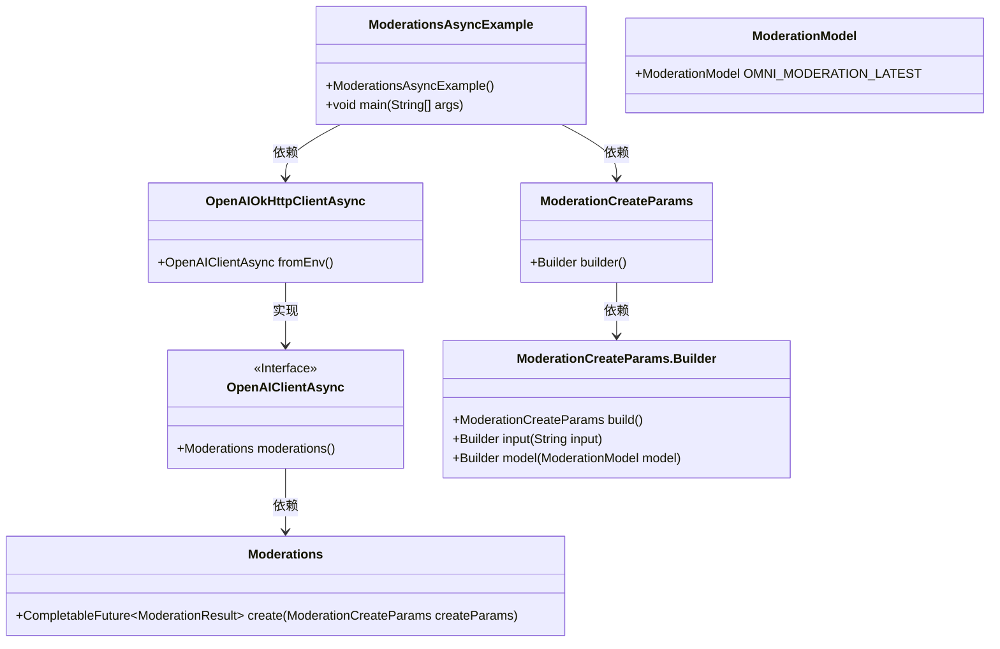
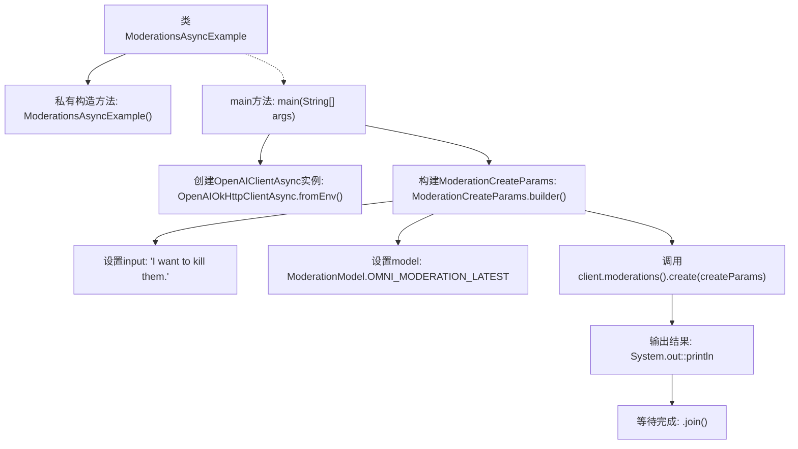

# 基础信息

|      |      |
|------|------|
| 名称 | ModerationsAsyncExample |
| 编码语言 | .java |
| 代码路径 | openai-java/openai-java-example/src/main/java/com/openai/example/ModerationsAsyncExample.java |
| 包名 | com.openai.example |
| 依赖项 | ['com.openai.client.OpenAIClientAsync', 'com.openai.client.okhttp.OpenAIOkHttpClientAsync', 'com.openai.models.moderations.ModerationCreateParams', 'com.openai.models.moderations.ModerationModel'] |
| 概述说明 | Java示例展示如何使用OpenAI异步客户端进行内容审核。 |

# 说明

Java示例展示了如何使用OpenAI的异步客户端进行内容审核。该示例通过异步调用的方式，利用OpenAI的API对输入内容进行审核，确保其符合特定标准或规范。异步客户端的使用提高了处理效率，允许在等待审核结果的同时执行其他任务。此方法适用于需要快速响应和高并发处理的场景，如社交媒体平台或内容管理系统。通过这种方式，开发者可以有效地集成OpenAI的内容审核功能，提升系统的整体性能和用户体验。

# 类列表 Class Summary

| 名称   | 类型  | 说明 |
|-------|------|-------------|
| ModerationsAsyncExample | class | Java示例使用OpenAI异步客户端进行内容审核。 |

## 类 ModerationsAsyncExample

|      |      |
|------|------|
| 访问范围 | public final |
| 类型 | class |
| 名称 | ModerationsAsyncExample |
| 说明 | Java示例使用OpenAI异步客户端进行内容审核。 |

### UML类图

类图描述：`ModerationsAsyncExample` 类是一个示例类，展示了如何使用 `OpenAIClientAsync` 接口进行异步内容审核。它依赖于 `OpenAIOkHttpClientAsync` 类来创建客户端实例，并使用 `ModerationCreateParams` 类构建审核请求参数。`OpenAIClientAsync` 接口定义了 `moderations` 方法，返回 `Moderations` 接口，用于执行审核操作。`ModerationCreateParams` 类通过其内部 `Builder` 类来构建审核请求参数。

### 内部方法调用关系图

这段代码展示了一个异步的Moderation示例，通过配置环境变量来初始化OpenAIClientAsync实例，然后构建ModerationCreateParams对象，设置输入内容和模型，最后调用moderations().create()方法进行内容审核，并输出结果。整个过程是异步的，通过.thenAccept()处理结果，并使用.join()等待操作完成。

### 字段列表 Field List

| 名称  | 类型  | 说明 |
|-------|-------|------|

### 方法列表 Method List

| 名称  | 类型  | 说明 |
|-------|-------|------|
| main | void | Java代码示例：通过环境变量配置OpenAI客户端，创建并执行内容审核请求。 |

