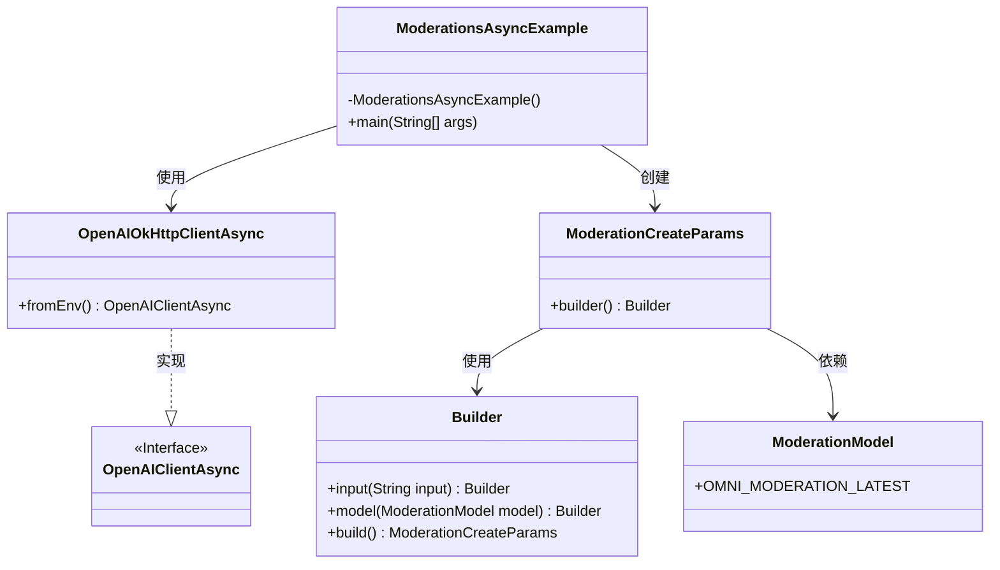
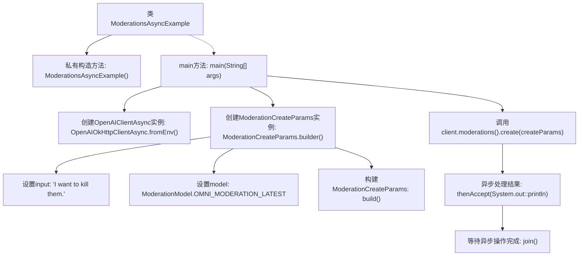

# 基础信息

|      |      |
|------|------|
| 名称 | ModerationsAsyncExample |
| 编码语言 | .java |
| 代码路径 | openai-java/openai-java-example/src/main/java/com/openai/example/ModerationsAsyncExample.java |
| 包名 | com.openai.example |
| 依赖项 | ['com.openai.client.OpenAIClientAsync', 'com.openai.client.okhttp.OpenAIOkHttpClientAsync', 'com.openai.models.moderations.ModerationCreateParams', 'com.openai.models.moderations.ModerationModel'] |
| 概述说明 | Java示例：利用OpenAI异步客户端实现内容审核。 |

# 说明

该示例展示了如何在Java中使用OpenAI的异步客户端进行内容审核。通过异步客户端，开发者可以高效地处理内容审核请求，确保应用程序能够快速响应并处理大量数据。此方法适用于需要实时或近实时审核内容的场景，如社交媒体平台或在线论坛。使用异步客户端还可以提高系统的吞吐量和性能，减少因等待审核结果而导致的延迟。

# 类列表 Class Summary

| 名称   | 类型  | 说明 |
|-------|------|-------------|
| ModerationsAsyncExample | class | Java示例：使用OpenAI异步客户端进行内容审核。 |

## 类 ModerationsAsyncExample

|      |      |
|------|------|
| 访问范围 | public final |
| 类型 | class |
| 名称 | ModerationsAsyncExample |
| 说明 | Java示例：使用OpenAI异步客户端进行内容审核。 |

### UML类图

```mermaid
classDiagram
    class ModerationsAsyncExample {
        -ModerationsAsyncExample()
        +main(String[] args)
    }

    class OpenAIClientAsync {
        <<Interface>>
    }

    class OpenAIOkHttpClientAsync {
        +fromEnv() OpenAIClientAsync
    }

    class ModerationCreateParams {
        +builder() Builder
    }

    class Builder {
        +input(String input) Builder
        +model(ModerationModel model) Builder
        +build() ModerationCreateParams
    }

    class ModerationModel {
        +OMNI_MODERATION_LATEST
    }

    ModerationsAsyncExample --> OpenAIOkHttpClientAsync : 使用
    OpenAIOkHttpClientAsync ..|> OpenAIClientAsync : 实现
    ModerationsAsyncExample --> ModerationCreateParams : 创建
    ModerationCreateParams --> Builder : 使用
    ModerationCreateParams --> ModerationModel : 依赖
```

类图描述：  
`ModerationsAsyncExample` 是一个不可继承的类，包含一个私有的构造函数和一个公有的 `main` 方法。它依赖于 `OpenAIOkHttpClientAsync` 来获取 `OpenAIClientAsync` 实例，并使用 `ModerationCreateParams` 来构建请求参数。`ModerationCreateParams` 通过 `Builder` 模式进行构建，并依赖于 `ModerationModel` 来指定模型。`OpenAIOkHttpClientAsync` 实现了 `OpenAIClientAsync` 接口，提供了从环境变量中获取配置的方法。

### 内部方法调用关系图

```mermaid
graph TD
    A["类ModerationsAsyncExample"]
    B["私有构造方法: ModerationsAsyncExample()"]
    C["main方法: main(String[] args)"]
    D["创建OpenAIClientAsync实例: OpenAIOkHttpClientAsync.fromEnv()"]
    E["创建ModerationCreateParams实例: ModerationCreateParams.builder()"]
    F["设置input: 'I want to kill them.'"]
    G["设置model: ModerationModel.OMNI_MODERATION_LATEST"]
    H["构建ModerationCreateParams: build()"]
    I["调用client.moderations().create(createParams)"]
    J["异步处理结果: thenAccept(System.out::println)"]
    K["等待异步操作完成: join()"]

    A --> B
    A -.-> C
    C --> D
    C --> E
    E --> F
    E --> G
    E --> H
    C --> I
    I --> J
    J --> K
```

这段代码展示了一个异步的OpenAI内容审核示例。首先，通过环境变量配置OpenAIClientAsync客户端，然后构建一个包含输入内容和模型的ModerationCreateParams对象。接着，调用客户端的moderations().create方法进行异步审核，并通过thenAccept方法处理结果，最后使用join方法等待异步操作完成。整个过程展示了如何异步调用OpenAI的审核API并处理结果。

### 字段列表 Field List

| 名称  | 类型  | 说明 |
|-------|-------|------|

### 方法列表 Method List

| 名称  | 类型  | 说明 |
|-------|-------|------|
| main | void | Java代码通过环境变量配置OpenAI客户端，调用内容审核接口并输出结果。 |

