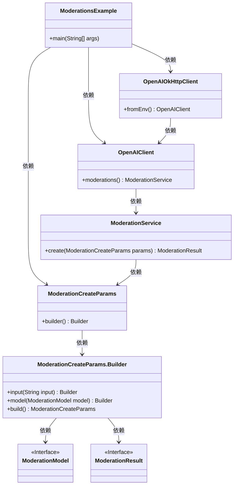
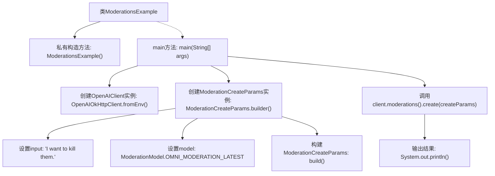

# 基础信息

|      |      |
|------|------|
| 名称 | ModerationsExample |
| 编码语言 | .java |
| 代码路径 | openai-java/openai-java-example/src/main/java/com/openai/example/ModerationsExample.java |
| 包名 | com.openai.example |
| 依赖项 | ['com.openai.client.OpenAIClient', 'com.openai.client.okhttp.OpenAIOkHttpClient', 'com.openai.models.moderations.ModerationCreateParams', 'com.openai.models.moderations.ModerationModel'] |
| 概述说明 | Java示例展示如何利用OpenAI API进行内容审核。 |

# 说明

该Java示例展示了如何利用OpenAI API进行内容审核。通过调用OpenAI的API，开发者可以将待审核的文本发送至服务器，并接收返回的审核结果。该过程涉及API密钥的配置、请求参数的设置以及响应的解析。内容审核功能可用于检测文本中的不当内容，如暴力、仇恨言论或敏感信息，从而帮助维护平台的内容安全性和合规性。此示例为开发者提供了一个实用的参考，帮助他们快速集成OpenAI的内容审核功能到Java应用程序中。

# 类列表 Class Summary

| 名称   | 类型  | 说明 |
|-------|------|-------------|
| ModerationsExample | class | Java示例：使用OpenAI API进行内容审核。 |

## 类 ModerationsExample

|      |      |
|------|------|
| 访问范围 | public final |
| 类型 | class |
| 名称 | ModerationsExample |
| 说明 | Java示例：使用OpenAI API进行内容审核。 |

### UML类图

这段代码展示了一个使用OpenAI API进行内容审核的示例。`ModerationsExample`类通过`OpenAIOkHttpClient`从环境变量中获取配置并创建`OpenAIClient`实例。然后，它构建了一个`ModerationCreateParams`对象，指定了输入内容和模型类型，并通过`OpenAIClient`的`moderations`方法提交审核请求。最终，审核结果被打印到控制台。类图清晰地展示了各个类之间的关系和依赖。

### 内部方法调用关系图

这段代码展示了一个使用OpenAI客户端进行内容审核的示例。首先，通过环境变量配置OpenAIClient实例，然后构建一个ModerationCreateParams对象，设置输入内容和模型，最后调用客户端的moderations().create方法进行审核，并输出结果。流程图清晰地展示了从配置客户端到输出结果的整个流程。

### 字段列表 Field List

| 名称  | 类型  | 说明 |
|-------|-------|------|

### 方法列表 Method List

| 名称  | 类型  | 说明 |
|-------|-------|------|
| main | void | Java代码配置OpenAI客户端，使用环境变量认证，创建内容审核请求并输出结果。 |

