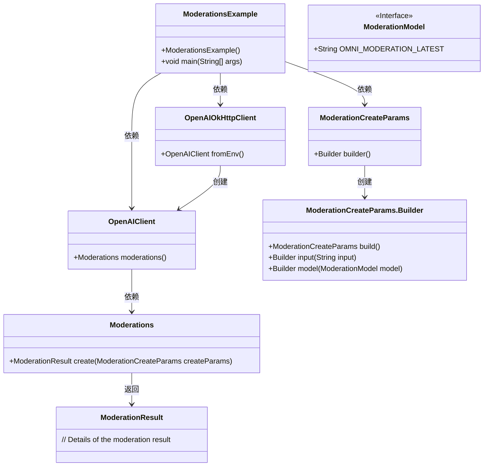
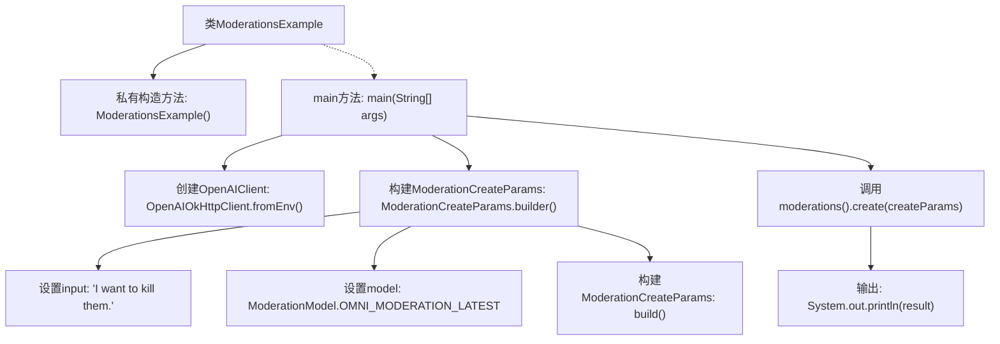

# 基础信息

|      |      |
|------|------|
| 名称 | ModerationsExample |
| 编码语言 | .java |
| 代码路径 | openai-java/openai-java-example/src/main/java/com/openai/example/ModerationsExample.java |
| 包名 | com.openai.example |
| 依赖项 | ['com.openai.client.OpenAIClient', 'com.openai.client.okhttp.OpenAIOkHttpClient', 'com.openai.models.moderations.ModerationCreateParams', 'com.openai.models.moderations.ModerationModel'] |
| 概述说明 | Java示例：配置OpenAI API密钥并调用内容审核接口。 |

# 说明

该示例展示了如何在Java环境中使用OpenAI客户端进行内容审核。首先，需要配置API密钥以确保与OpenAI服务的认证和连接。接着，通过调用OpenAI提供的审核接口，对指定内容进行审核。整个过程涉及API密钥的设置和审核接口的调用，旨在实现对内容的自动化审核功能。

# 类列表 Class Summary

| 名称   | 类型  | 说明 |
|-------|------|-------------|
| ModerationsExample | class | Java示例：使用OpenAI客户端进行内容审核，配置API密钥并调用审核接口。 |

## 类 ModerationsExample

|      |      |
|------|------|
| 访问范围 | public final |
| 类型 | class |
| 名称 | ModerationsExample |
| 说明 | Java示例：使用OpenAI客户端进行内容审核，配置API密钥并调用审核接口。 |

### UML类图

```mermaid
classDiagram
    class ModerationsExample {
        +ModerationsExample()
        +void main(String[] args)
    }
    class OpenAIClient {
        +Moderations moderations()
    }
    class OpenAIOkHttpClient {
        +OpenAIClient fromEnv()
    }
    class ModerationCreateParams {
        +Builder builder()
    }
    class ModerationCreateParams.Builder {
        +ModerationCreateParams build()
        +Builder input(String input)
        +Builder model(ModerationModel model)
    }
    class ModerationModel {
        <<Interface>>
        +String OMNI_MODERATION_LATEST
    }
    class Moderations {
        +ModerationResult create(ModerationCreateParams createParams)
    }
    class ModerationResult {
        // Details of the moderation result
    }

    ModerationsExample --> OpenAIOkHttpClient : 依赖
    ModerationsExample --> ModerationCreateParams : 依赖
    ModerationsExample --> OpenAIClient : 依赖
    OpenAIOkHttpClient --> OpenAIClient : 创建
    ModerationCreateParams --> ModerationCreateParams.Builder : 创建
    OpenAIClient --> Moderations : 依赖
    Moderations --> ModerationResult : 返回
```

这段代码展示了一个名为 `ModerationsExample` 的类，其主要功能是通过 OpenAI 的 API 进行内容审核。代码首先通过 `OpenAIOkHttpClient.fromEnv()` 方法创建一个 `OpenAIClient` 实例，然后构建一个 `ModerationCreateParams` 对象，指定输入内容和审核模型。最后，调用 `OpenAIClient` 的 `moderations().create()` 方法执行审核，并输出审核结果。代码通过环境变量配置 API 密钥，支持 OpenAI 和 Azure OpenAI 两种方式。

### 内部方法调用关系图

```mermaid
graph TD
    A["类ModerationsExample"]
    B["私有构造方法: ModerationsExample()"]
    C["main方法: main(String[] args)"]
    D["创建OpenAIClient: OpenAIOkHttpClient.fromEnv()"]
    E["构建ModerationCreateParams: ModerationCreateParams.builder()"]
    F["设置input: 'I want to kill them.'"]
    G["设置model: ModerationModel.OMNI_MODERATION_LATEST"]
    H["构建ModerationCreateParams: build()"]
    I["调用moderations().create(createParams)"]
    J["输出: System.out.println(result)"]

    A --> B
    A -.-> C
    C --> D
    C --> E
    E --> F
    E --> G
    E --> H
    C --> I
    I --> J
```

这段代码展示了一个名为`ModerationsExample`的类，该类用于调用OpenAI的审核API。代码首先通过环境变量配置OpenAI客户端，然后构建一个包含输入文本和模型的审核请求参数，最后调用API并输出结果。流程图清晰地展示了从客户端创建到请求构建、执行和输出的完整流程。

### 字段列表 Field List

| 名称  | 类型  | 说明 |
|-------|-------|------|

### 方法列表 Method List

| 名称  | 类型  | 说明 |
|-------|-------|------|
| main | void | Java代码通过环境变量配置OpenAI客户端，创建并执行文本审核请求。 |

