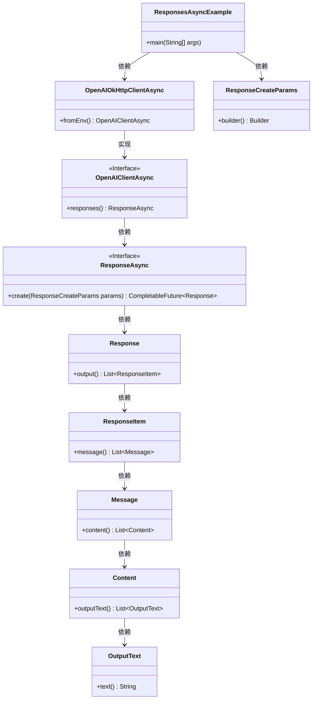
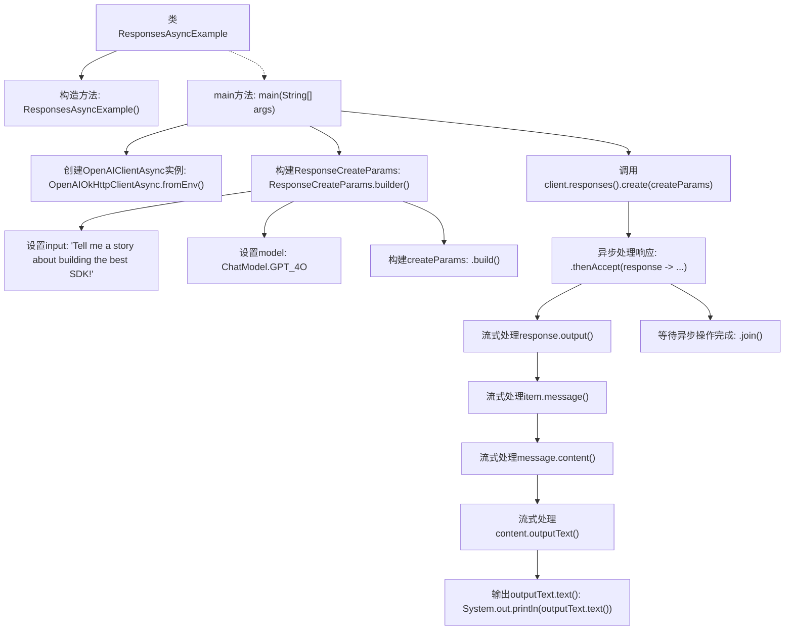

# 基础信息

|      |      |
|------|------|
| 名称 | ResponsesAsyncExample |
| 编码语言 | .java |
| 代码路径 | openai-java/openai-java-example/src/main/java/com/openai/example/ResponsesAsyncExample.java |
| 包名 | com.openai.example |
| 依赖项 | ['com.openai.client.OpenAIClientAsync', 'com.openai.client.okhttp.OpenAIOkHttpClientAsync', 'com.openai.models.ChatModel', 'com.openai.models.responses.ResponseCreateParams'] |
| 概述说明 | Java异步调用OpenAI API生成故事并输出。 |

# 说明

Java异步调用OpenAI API生成故事并输出的过程涉及使用Java编程语言，通过异步编程模型与OpenAI的API进行交互。首先，Java程序会异步发送请求到OpenAI API，请求生成一个故事。OpenAI API接收到请求后，会处理并生成相应的故事内容。生成的故事内容随后会被异步返回给Java程序。Java程序在接收到故事内容后，会将其输出到指定的目标，如控制台、文件或其他输出流。整个过程充分利用了异步编程的优势，确保程序在等待API响应时不会阻塞，提高了程序的效率和响应速度。

# 类列表 Class Summary

| 名称   | 类型  | 说明 |
|-------|------|-------------|
| ResponsesAsyncExample | class | Java异步调用OpenAI API生成故事并输出。 |

## 类 ResponsesAsyncExample

|      |      |
|------|------|
| 访问范围 | public final |
| 类型 | class |
| 名称 | ResponsesAsyncExample |
| 说明 | Java异步调用OpenAI API生成故事并输出。 |

### UML类图

这段代码展示了一个异步调用OpenAI API的示例。`ResponsesAsyncExample`类通过`OpenAIOkHttpClientAsync`创建了一个异步客户端，并使用`ResponseCreateParams`构建请求参数。客户端调用`responses().create()`方法发送请求，并通过`CompletableFuture`处理响应，最终输出响应中的文本内容。代码中涉及多个类，包括请求参数的构建、异步客户端的创建以及响应的处理和输出。

### 内部方法调用关系图

这段代码定义了一个名为 `ResponsesAsyncExample` 的类，该类包含一个私有的构造方法和一个 `main` 方法。`main` 方法首先通过环境变量配置 `OpenAIClientAsync` 实例，然后构建一个包含输入和模型的 `ResponseCreateParams` 对象。接着，它异步调用 `client.responses().create(createParams)` 方法，对流式处理后的响应内容进行输出，并等待异步操作完成。整个过程展示了如何使用异步方式处理 OpenAI 客户端的请求和响应。

### 字段列表 Field List

| 名称  | 类型  | 说明 |
|-------|-------|------|

### 方法列表 Method List

| 名称  | 类型  | 说明 |
|-------|-------|------|
| main | void | Java代码使用环境变量配置OpenAI客户端，调用GPT-4模型生成故事并输出。 |

