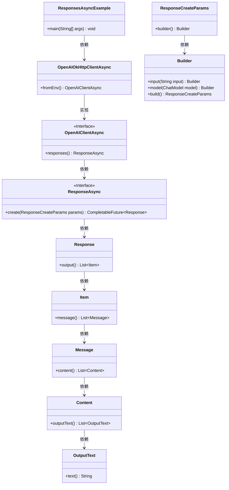
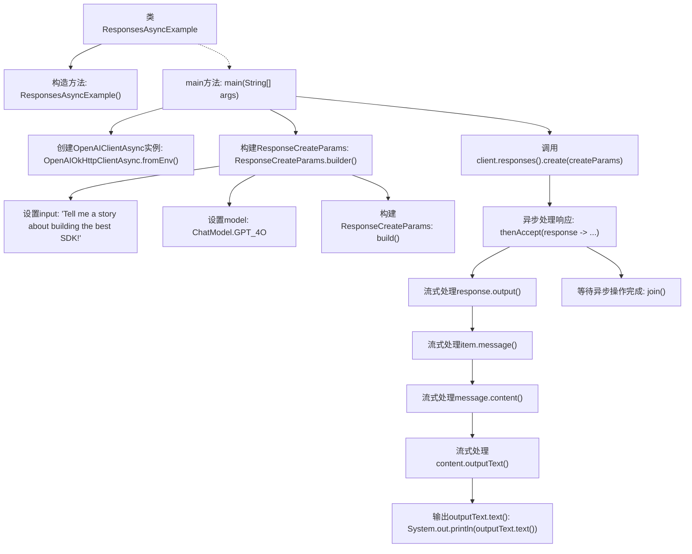

# 基础信息

|      |      |
|------|------|
| 名称 | ResponsesAsyncExample |
| 编码语言 | .java |
| 代码路径 | openai-java/openai-java-example/src/main/java/com/openai/example/ResponsesAsyncExample.java |
| 包名 | com.openai.example |
| 依赖项 | ['com.openai.client.OpenAIClientAsync', 'com.openai.client.okhttp.OpenAIOkHttpClientAsync', 'com.openai.models.ChatModel', 'com.openai.models.responses.ResponseCreateParams'] |
| 概述说明 | Java异步调用OpenAI API生成故事并输出结果。 |

# 说明

Java通过异步调用OpenAI API生成故事并输出结果。该过程涉及使用Java的异步编程模型，通过API请求与OpenAI服务进行交互，获取生成的故事内容。异步调用确保程序在等待API响应时不会阻塞，提高了效率。生成的故事情节通过Java程序进行处理和输出，最终展示给用户。整个流程结合了Java的异步处理能力和OpenAI的文本生成技术，实现了高效、流畅的故事生成与输出。

# 类列表 Class Summary

| 名称   | 类型  | 说明 |
|-------|------|-------------|
| ResponsesAsyncExample | class | Java异步调用OpenAI API生成故事并输出结果。 |

## 类 ResponsesAsyncExample

|      |      |
|------|------|
| 访问范围 | public final |
| 类型 | class |
| 名称 | ResponsesAsyncExample |
| 说明 | Java异步调用OpenAI API生成故事并输出结果。 |

### UML类图

```mermaid
classDiagram
    class ResponsesAsyncExample {
        +main(String[] args) void
    }

    class OpenAIClientAsync {
        <<Interface>>
        +responses() ResponseAsync
    }

    class OpenAIOkHttpClientAsync {
        +fromEnv() OpenAIClientAsync
    }

    class ResponseAsync {
        <<Interface>>
        +create(ResponseCreateParams params) CompletableFuture~Response~
    }

    class ResponseCreateParams {
        +builder() Builder
    }

    class Builder {
        +input(String input) Builder
        +model(ChatModel model) Builder
        +build() ResponseCreateParams
    }

    class Response {
        +output() List~Item~
    }

    class Item {
        +message() List~Message~
    }

    class Message {
        +content() List~Content~
    }

    class Content {
        +outputText() List~OutputText~
    }

    class OutputText {
        +text() String
    }

    ResponsesAsyncExample --> OpenAIOkHttpClientAsync : 依赖
    OpenAIOkHttpClientAsync --> OpenAIClientAsync : 实现
    OpenAIClientAsync --> ResponseAsync : 依赖
    ResponseAsync --> Response : 依赖
    Response --> Item : 依赖
    Item --> Message : 依赖
    Message --> Content : 依赖
    Content --> OutputText : 依赖
    ResponseCreateParams --> Builder : 依赖
```

### 描述
该代码展示了一个异步响应的示例，使用OpenAI客户端从环境中获取配置并创建请求参数。`ResponsesAsyncExample`类通过`OpenAIOkHttpClientAsync`获取异步客户端，并使用`ResponseCreateParams`构建请求参数。客户端通过`ResponseAsync`接口发送请求，并处理返回的响应，最终输出文本内容。类图清晰地展示了各个类之间的依赖关系和实现关系。

### 内部方法调用关系图

```mermaid
graph TD
    A["类ResponsesAsyncExample"]
    B["构造方法: ResponsesAsyncExample()"]
    C["main方法: main(String[] args)"]
    D["创建OpenAIClientAsync实例: OpenAIOkHttpClientAsync.fromEnv()"]
    E["构建ResponseCreateParams: ResponseCreateParams.builder()"]
    F["设置input: 'Tell me a story about building the best SDK!'"]
    G["设置model: ChatModel.GPT_4O"]
    H["构建ResponseCreateParams: build()"]
    I["调用client.responses().create(createParams)"]
    J["异步处理响应: thenAccept(response -> ...)"]
    K["流式处理response.output()"]
    L["流式处理item.message()"]
    M["流式处理message.content()"]
    N["流式处理content.outputText()"]
    O["输出outputText.text(): System.out.println(outputText.text())"]
    P["等待异步操作完成: join()"]

    A --> B
    A -.-> C
    C --> D
    C --> E
    E --> F
    E --> G
    E --> H
    C --> I
    I --> J
    J --> K
    K --> L
    L --> M
    M --> N
    N --> O
    J --> P
```

这段代码展示了如何使用异步方式与OpenAI API进行交互。首先，通过环境变量配置OpenAIClientAsync实例，然后构建请求参数ResponseCreateParams，指定输入文本和模型类型。接着，异步发送请求并处理响应，最终将响应的文本内容输出到控制台。整个过程通过流式处理和异步操作实现，确保高效且灵活地处理API响应。

### 字段列表 Field List

| 名称  | 类型  | 说明 |
|-------|-------|------|

### 方法列表 Method List

| 名称  | 类型  | 说明 |
|-------|-------|------|
| main | void | Java代码通过环境变量配置OpenAI客户端，调用GPT-4模型生成故事并输出。 |

